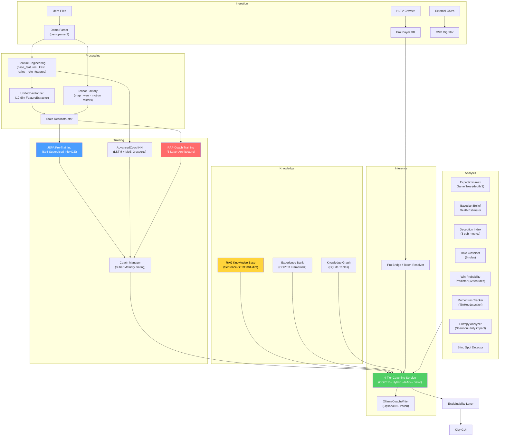
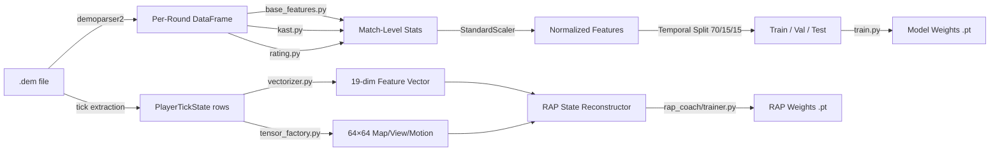
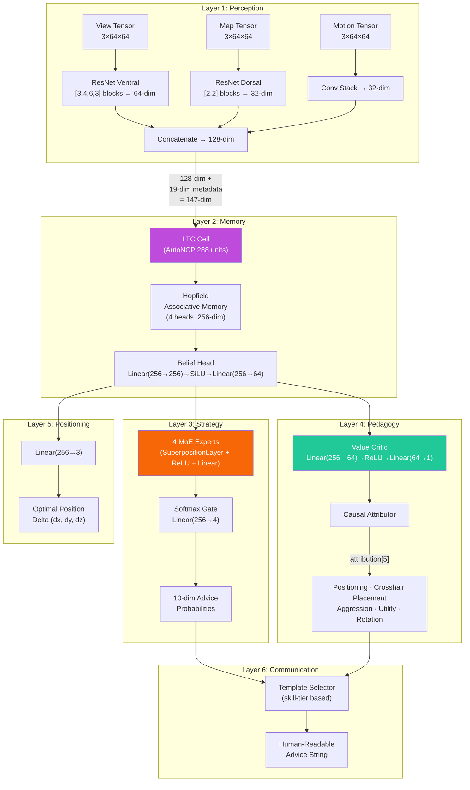
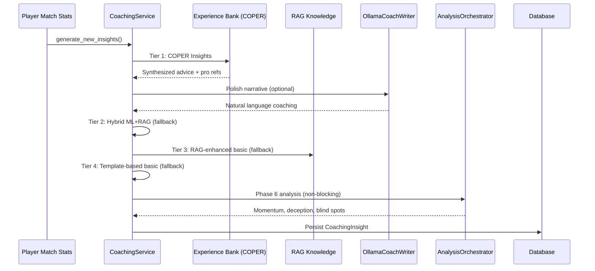
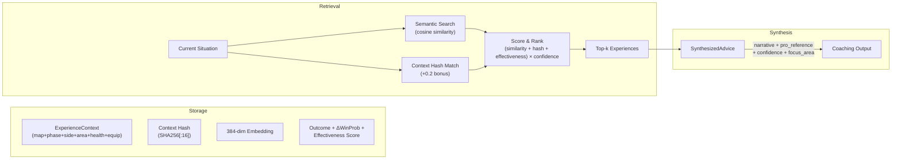
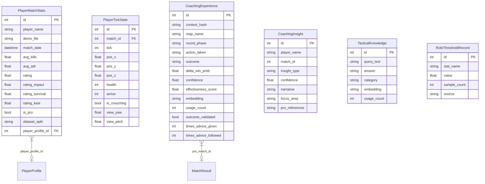
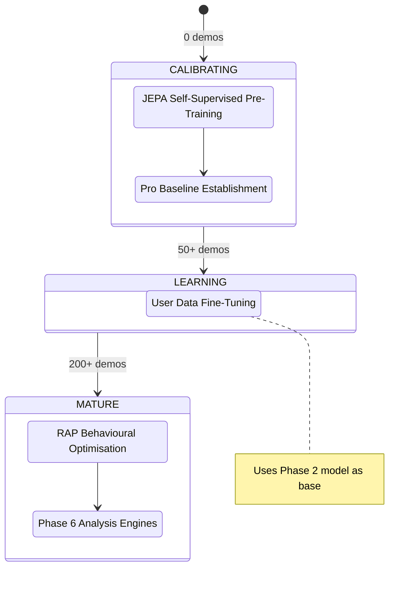

# Macena CS2 Analyzer — AI Pipeline Biopsy

> **Document classification:** Internal Technical Reference
> **Scope:** Complete dissection of every AI component, model architecture, training regime, knowledge system, and data pathway in the project.
> **Last verified:** 2026-02-14 (full codebase audit, enhanced with source-verified corrections)
> **Word count target:** ≥ 5 000 words

---

## Table of Contents

1. [Executive Summary](#1-executive-summary)
2. [System Architecture Overview](#2-system-architecture-overview)
3. [Subsystem 1 — Neural Network Core (`backend/nn/`)](#3-subsystem-1--neural-network-core)
4. [Subsystem 2 — RAP Coach Model (`backend/nn/rap_coach/`)](#4-subsystem-2--rap-coach-model)
5. [Subsystem 3 — Coaching Services (`backend/services/`)](#5-subsystem-3--coaching-services)
6. [Subsystem 4 — Knowledge & Retrieval (`backend/knowledge/`)](#6-subsystem-4--knowledge--retrieval)
7. [Subsystem 5 — Analysis Engines (`backend/analysis/`)](#7-subsystem-5--analysis-engines)
8. [Subsystem 6 — Processing & Feature Engineering (`backend/processing/`)](#8-subsystem-6--processing--feature-engineering)
9. [Database Schema & Data Lifecycle](#9-database-schema--data-lifecycle)
10. [Training Regime & Maturity Gating](#10-training-regime--maturity-gating)
11. [Loss Functions Catalogue](#11-loss-functions-catalogue)
12. [Open Issues & Recommendations](#12-open-issues--recommendations)

---

## 1. Executive Summary

The Macena CS2 Analyzer is a **hybrid AI coaching system** for Counter-Strike 2 (CS2). It combines deep learning models (JEPA, LSTM+MoE, a 6-layer RAP architecture), Retrieval-Augmented Generation (RAG), the COPER experience bank, game-theoretic search, and Bayesian belief modelling into a unified pipeline that:

1. **Ingests** professional and user demo files, extracting tick-level state and match-level statistics.
2. **Trains** multiple neural network models through a phased maturity-gated schedule (3-tier: CALIBRATING → LEARNING → MATURE).
3. **Infers** coaching advice by fusing ML predictions with semantically-retrieved tactical knowledge via a 4-tier fallback chain (COPER → Hybrid → RAG → Basic).
4. **Explains** its reasoning via causal attribution, template-based narratives, pro-player comparisons, and optional LLM polishing (Ollama).

The system contains **≈ 10 000+ lines of Python** across 45+ AI-critical source files, spanning six logical subsystems documented below.

> **Kid-Friendly Analogy:** Imagine you have a super-smart robot sports coach that watches your soccer games on video. First, it **watches** hundreds of professional games and your games, taking notes on every single move (that's the "ingesting" part). Then, it **studies** those notes and learns what great players do differently from beginners — like a student going through school grades (CALIBRATING is kindergarten, LEARNING is middle school, MATURE is graduation). When it's time to give you advice, it doesn't just guess — it checks its **notebook of tips**, its **memory of past coaching sessions**, and what the **pros would do** in your exact situation, picking whichever source it trusts the most. Finally, it **explains** why it's telling you to do something — not just "do this," but "do this *because* you keep getting caught in the open here." It's like having a coach who watched every pro game ever played, remembers every practice session you've had, and can explain exactly why you should change your strategy.

```
┌─────────────────────────────────────────────────────────────┐
│                  THE 4-STEP COACHING LOOP                   │
│                                                             │
│   ┌──────────┐    ┌──────────┐    ┌──────────┐    ┌──────┐ │
│   │ 1. WATCH │───>│ 2. LEARN │───>│ 3. THINK │───>│4.TALK│ │
│   │ (Ingest) │    │ (Train)  │    │ (Infer)  │    │(Tell)│ │
│   └──────────┘    └──────────┘    └──────────┘    └──────┘ │
│       │                │                │             │     │
│   Reads demo      Builds brain     Combines ML    Explains │
│   files frame     through 3        with knowledge  with    │
│   by frame        maturity         retrieval for   causal  │
│                   stages           best advice     reasons │
│                                                             │
│   ┌─────────────────────────────────────────────────────┐   │
│   │  45+ source files  ·  10,000+ lines  ·  6 subsystems│   │
│   └─────────────────────────────────────────────────────┘   │
└─────────────────────────────────────────────────────────────┘
```

---

## 2. System Architecture Overview

The system is divided into **6 major subsystems** that work together like departments in a company. Each subsystem has a specific job, and data flows between them in a well-defined pipeline.

> **Kid-Friendly Analogy:** Think of the whole system like a **big factory with 6 departments**. The first department (Ingestion) is the **mailroom** — it receives raw game recordings and sorts them. The second department (Processing) is the **workshop** — it takes those recordings apart and measures everything inside. The third department (Training) is the **school** — it teaches the AI brain by showing it thousands of examples. The fourth department (Knowledge) is the **library** — it stores tips, past advice, and expert knowledge so the coach can look things up. The fifth department (Inference) is the **brain** — it combines what the AI learned with what the library knows to create advice. The sixth department (Analysis) is the **detective squad** — it runs special investigations like "is this player tilted?" or "was that a good position?" All six departments work together so the coach can give smart, personalized advice.

```
┌──────────────────────────────────────────────────────────────────┐
│                    THE 6 DEPARTMENTS (SUBSYSTEMS)                │
│                                                                  │
│  ┌───────────┐  ┌───────────┐  ┌───────────┐                    │
│  │ INGESTION │─>│PROCESSING │─>│ TRAINING  │                    │
│  │ (Mailroom)│  │ (Workshop)│  │ (School)  │                    │
│  └───────────┘  └───────────┘  └─────┬─────┘                    │
│                                      │                           │
│  ┌───────────┐  ┌───────────┐  ┌─────▼─────┐                    │
│  │ ANALYSIS  │─>│ KNOWLEDGE │─>│ INFERENCE │──> Coaching Advice  │
│  │(Detective)│  │ (Library) │  │  (Brain)  │                    │
│  └───────────┘  └───────────┘  └───────────┘                    │
└──────────────────────────────────────────────────────────────────┘
```

### Full System Diagram



> **Kid-Friendly Analogy:** This big diagram is like a **treasure map** showing how information travels through the system. The journey starts at the top left with raw game recordings (`.dem` files, HLTV data, CSV files) — think of them as **raw ingredients** arriving at a kitchen. Those ingredients go through the Processing section where they're **chopped, measured, and prepped** (features extracted, vectors created). Then they reach the Training section where three different "chefs" (JEPA, AdvancedCoachNN, and RAP) each learn their own cooking style. The Knowledge section is like the **recipe book shelf** — it holds tips (RAG), past cooking successes (COPER), and ingredient relationships (Knowledge Graph). The Inference section is where the **head chef** combines everything — trained skills, recipe books, and pro chef techniques — to create the final dish: coaching advice. The Analysis section is like having **food critics** who evaluate specific qualities: "Is this too spicy?" (momentum), "Is it creative?" (deception index), "Did they forget an ingredient?" (blind spots). Everything flows downward and rightward until it reaches the Kivy GUI — the **plate** where the user sees the final result.

### Data Flow Summary



> **Kid-Friendly Analogy:** This diagram shows the **two parallel assembly lines** inside the Processing department. Imagine a game recording (`.dem` file) as a **long movie**. The **top assembly line** watches the movie and writes down summary statistics — like a report card for each match (kills, deaths, damage, etc.). Those report cards get normalized (put on the same scale, like converting all temperatures to Celsius), split into study groups (70% for learning, 15% for quizzes, 15% for final exams), and used to train the basic coaching model. The **bottom assembly line** is more detailed — it goes through the movie **frame by frame** (every "tick" of the game clock), measuring 19 things about each player at each moment (position, health, what they see, etc.) and creating 64x64 pixel "snapshots" of the map. Both the numbers and the pictures feed into the RAP Coach's State Reconstructor, which combines them into a complete picture of "what was happening at this exact moment" — and that's what the advanced RAP Coach model learns from.

```
THE TWO DATA PIPELINES — A SIMPLE VIEW

  ┌──────────┐
  │ .dem file│
  └────┬─────┘
       │
       ├──────── PIPELINE A: "The Report Card Path" ──────────────┐
       │                                                           │
       │  Per-Round Stats ──> Normalize ──> Split 70/15/15        │
       │  (kills, deaths,     (same scale)  (learn/quiz/exam)     │
       │   damage, rating)                         │               │
       │                                    Train Basic Model      │
       │                                    (Model Weights .pt)    │
       │                                                           │
       ├──────── PIPELINE B: "The Frame-by-Frame Path" ──────────┐
       │                                                           │
       │  Every Tick ──> 19-dim Vector ──> State Reconstructor    │
       │  (128 per sec)   (numbers)    ┐       │                   │
       │                               │  ┌────▼─────┐            │
       │  Every Tick ──> 64x64 Images ─┘  │ RAP Coach│            │
       │  (map snapshots)                  │ Training │            │
       │                                   └──────────┘            │
       └───────────────────────────────────────────────────────────┘
```

---

## 3. Subsystem 1 — Neural Network Core

**Directory:** `backend/nn/`
**Key files:** `model.py`, `jepa_model.py`, `jepa_train.py`, `jepa_trainer.py`, `coach_manager.py`, `training_orchestrator.py`, `config.py`, `factory.py`, `persistence.py`

This subsystem contains all the neural network models — the "brains" of the coaching system. It includes three distinct model architectures, a training manager, and utilities for model creation and persistence.

> **Kid-Friendly Analogy:** This is the **brain department** of the factory. It contains three different types of brains (AdvancedCoachNN, JEPA, and RAP Coach), each built differently and good at different things — like having a math brain, a language brain, and a creative brain all working together. The Training Manager is like the **principal of the school** — it decides which brain gets to study what and when, and it keeps track of everyone's grades.

```
┌──────────────────────────────────────────────────────────┐
│                NEURAL NETWORK CORE (backend/nn/)         │
│                                                          │
│  ┌─────────────┐  ┌─────────────┐  ┌─────────────┐      │
│  │AdvancedCoach│  │   JEPA      │  │  RAP Coach  │      │
│  │  NN (LSTM   │  │ (Self-      │  │ (6-Layer    │      │
│  │  + MoE)     │  │  Supervised)│  │  Deep Arch) │      │
│  └──────┬──────┘  └──────┬──────┘  └──────┬──────┘      │
│         │                │                │              │
│         └────────────────┼────────────────┘              │
│                          ▼                               │
│              ┌───────────────────┐                       │
│              │  Coach Manager    │                       │
│              │  (Orchestration)  │                       │
│              └─────────┬─────────┘                       │
│                        ▼                                 │
│              ┌───────────────────┐                       │
│              │  Model Factory +  │                       │
│              │  Persistence      │                       │
│              └───────────────────┘                       │
└──────────────────────────────────────────────────────────┘
```

### 3.1 AdvancedCoachNN (LSTM + Mixture of Experts)

Defined in `model.py`, this is the supervised coaching backbone.

| Component | Detail |
|---|---|
| **Input dimension** | 19 features (`METADATA_DIM` from vectorizer.py) |
| **Config** | `CoachNNConfig` dataclass: `input_dim=19`, `output_dim=19` (default), `hidden_dim=128`, `num_experts=3`, `num_lstm_layers=2`, `dropout=0.2`, `use_layer_norm=True` |
| **Hidden layers** | 2-layer LSTM (128 hidden, `batch_first=True`, dropout=0.2) with `LayerNorm` post-LSTM |
| **Expert head** | 3 parallel linear experts (configurable), softmax-gated by a learned gate network |
| **Output** | Weighted sum of expert outputs → coaching score vector. Default output_dim = METADATA_DIM (19) in `CoachNNConfig`; overridden to OUTPUT_DIM (4) when instantiated via `ModelFactory` |
| **Role bias** | Optional `role_id` parameter: `gate_weights = (gate_weights + role_bias) / 2.0` — biases expert selection toward role-specific knowledge |
| **Input validation** | `_validate_input_dim()` auto-reshapes 1D → `unsqueeze(0).unsqueeze(0)` and 2D → `unsqueeze(0)` for robustness |
| **Auxiliary** | `CoachGAN` for synthetic data augmentation (Generator + Discriminator MLP) |

> **Kid-Friendly Analogy:** This model is like a **panel of 3 judges** at a talent show. First, the LSTM reads the player's game data like reading a story — it understands what happened step by step, remembering important moments (that's what LSTMs are good at — memory). After reading the whole story, it summarizes everything into a single "opinion" (128 numbers). Then, three different expert judges each look at that opinion and give their own score. But not all judges are equally good at every type of performance — a dance expert is better at judging dance, a singing expert at singing. So a **gate network** (like a moderator) decides how much to trust each judge: "For this player, Judge 1 is 60% relevant, Judge 2 is 30%, Judge 3 is 10%." The final score is a weighted blend of all three judges' opinions.

Each expert module in AdvancedCoachNN: `Linear(128→128) → LayerNorm(128) → ReLU → Linear(128→output_dim)`.

> **Implementation note:** JEPA's `_create_expert()` omits LayerNorm — just `Linear → ReLU → Linear`. This is a deliberate design choice: JEPA experts operate on already-normalized latent embeddings, while AdvancedCoachNN experts process raw LSTM outputs that benefit from per-expert normalization.

**Forward pass (pseudo):**

```
h, _ = LSTM(x)                         # x: [batch, seq_len, 19]
h = LayerNorm(h[:, -1, :])             # take last timestep → [batch, 128]
gate_weights = softmax(W_gate · h)     # [batch, 3]
expert_outputs = [E_i(h) for i in 1..3]
output = tanh(Σ gate_weights_i × expert_outputs_i)
```

> **Kid-Friendly Analogy:** Here's the step-by-step recipe: (1) The LSTM reads the player's 19 measurements across multiple time steps, like reading pages of a diary. (2) It picks the last page's summary — the most recent understanding. (3) A "moderator" looks at that summary and decides how much to trust each of the 3 experts (these trust-weights always add up to 100%). (4) Each expert gives their own coaching scores. (5) The final answer is the experts' scores mixed together according to how much the moderator trusts each one, squeezed into a range of -1 to +1 by the tanh function (like grading on a curve).

```
┌───────────────────────────────────────────────────────┐
│          AdvancedCoachNN — Forward Pass                │
│                                                       │
│  19 features ──> [LSTM Layer 1] ──> [LSTM Layer 2]    │
│  per timestep         ↓                   ↓           │
│                  remembers...        summarizes...     │
│                                          ↓            │
│                                   128-dim summary     │
│                                    ┌─────┼─────┐     │
│                                    ▼     ▼     ▼     │
│                               Expert1 Expert2 Expert3 │
│                                 ↓       ↓       ↓    │
│                              score1  score2  score3   │
│                                 ↓       ↓       ↓    │
│                Gate:  ──────> [60%]   [30%]   [10%]   │
│                                 ↓       ↓       ↓    │
│                            ┌────┴───────┴───────┘    │
│                            ▼                          │
│                     Weighted Sum → tanh               │
│                            ↓                          │
│                    4-dim Coaching Score                │
│                  (values between -1 and +1)           │
└───────────────────────────────────────────────────────┘
```

### 3.2 JEPA Coaching Model (Joint-Embedding Predictive Architecture)

Defined in `jepa_model.py`. A **self-supervised pre-training** model inspired by Yann LeCun's I-JEPA, adapted for sequential CS2 data.

> **Kid-Friendly Analogy:** JEPA is the coach's **"learn by watching" phase** — like how you can learn a lot about basketball just by watching NBA games, even before anyone teaches you the rules. Instead of needing someone to label every play as "good" or "bad" (supervised learning), JEPA teaches itself by playing a guessing game: "I saw what happened in the first half of this round... can I predict what happens next?" If it guesses well, it's building a good understanding of CS2 patterns. If it guesses badly, it adjusts. This is called **self-supervised learning** — the model creates its own "homework" from the data itself.

```mermaid
graph LR
    subgraph "Self-Supervised Phase"
        X1["Context Window<br/>(ticks 0..T)"] -->|Online Encoder| Z_C["Z_context"]
        X2["Target Window<br/>(ticks T+1..2T)"] -->|Target Encoder<br/>(EMA)| Z_T["Z_target"]
        Z_C -->|Predictor MLP| Z_P["Z_predicted"]
        Z_P -.->|InfoNCE Loss| Z_T
    end

    subgraph "Fine-Tuning Phase"
        Z_C2["Z_context"] --> CH["Coaching Head<br/>(LSTM → MoE)"]
        CH --> Y["Coaching Score"]
    end
```

> **Kid-Friendly Analogy for the diagram:** The self-supervised phase works like this: imagine watching a movie and pressing pause halfway through a scene. The **Online Encoder** watches the first half and creates a summary ("here's what I understand so far"). The **Target Encoder** (a slightly older copy of the same brain, updated slowly) watches the second half and creates its own summary. Then a **Predictor** tries to guess the second half's summary using only the first half's summary. The **InfoNCE Loss** is like a teacher checking: "Did your prediction match what actually happened? And is it different enough from random guesses?" In the Fine-Tuning phase, once the model has gotten good at predicting, we attach a **Coaching Head** on top — now the understanding it built from watching can be used to give actual coaching scores.

**Architecture details:**

| Module | Parameters |
|---|---|
| **Online Encoder** | Linear(input_dim, 512) → LayerNorm → GELU → Dropout(0.1) → Linear(512, latent_dim=256) → LayerNorm |
| **Target Encoder** | Structurally identical; updated via Exponential Moving Average (τ = 0.996) |
| **Predictor** | Linear(256, 512) → LayerNorm → GELU → Dropout(0.1) → Linear(512, 256) |
| **Coaching Head** | LSTM(256, hidden_dim, 2 layers, dropout=0.2) → 3 MoE experts → gated output |

> **Kid-Friendly Analogy:** The **Online Encoder** is like a student — it transforms raw game data into a 256-number "essence" (a compact summary). The **Target Encoder** is like the student's older sibling who updates slowly (EMA means "move toward my younger sibling's knowledge, but only a tiny bit each day" — 99.6% stays the same, only 0.4% updates). This slow-moving target prevents the system from collapsing into a trivial solution (like always predicting "everything is the same"). The **Predictor** is a bridge that tries to translate "what I saw" into "what I think will happen." The **Coaching Head** is the final attachment that converts understanding into actual advice — like going from "I understand basketball" to "you should pass more."

```
JEPA TWO-PHASE LEARNING — SIMPLIFIED

Phase 1: Self-Supervised ("Learn by watching")
┌─────────────────────────────────────────────────┐
│  First half of round    Second half of round    │
│  ┌────────────┐         ┌────────────┐          │
│  │ ticks 0..T │         │ ticks T+1… │          │
│  └─────┬──────┘         └─────┬──────┘          │
│        ▼                      ▼                 │
│  Online Encoder          Target Encoder         │
│  (student)               (older sibling, slow)  │
│        ▼                      ▼                 │
│    Z_context              Z_target              │
│        ▼                      │                 │
│    Predictor ─── "Do these ───┘                 │
│        ▼          match?"                       │
│    Z_predicted ──── InfoNCE Loss                │
│                  (grade the prediction)          │
└─────────────────────────────────────────────────┘

Phase 2: Fine-Tuning ("Now give advice")
┌─────────────────────────────────────────────────┐
│  Z_context ──> Coaching Head (LSTM + MoE)       │
│                     ▼                           │
│              Coaching Score                      │
│     (the understanding is now useful!)           │
└─────────────────────────────────────────────────┘
```

**Pre-training procedure** (`jepa_trainer.py`):
1. Loads sequences of `PlayerTickState` from pro demo SQLite files.
2. Splits each sequence into context and target windows.
3. Encodes context through the online encoder + predictor, encodes target through the target (EMA) encoder.
4. Minimises **InfoNCE contrastive loss** using in-batch negatives with cosine similarity and temperature τ=0.07.
5. After each batch, performs EMA update: `θ_target ← τ·θ_target + (1−τ)·θ_online`.
6. **Drift monitoring**: Tracks DriftReport objects; triggers automatic retraining if drift > 2.5σ.

> **Kid-Friendly Analogy:** The training recipe goes like this: (1) Load recordings of pro players, frame by frame. (2) For each recording, split it into "what happened first" and "what happened next." (3) Two encoders look at each half independently. (4) The system checks: "Did my prediction of 'what happened next' land close to the actual answer, and far from random wrong answers?" — this is InfoNCE, like a multiple-choice test where the model must pick the right answer out of many wrong ones. (5) The older sibling encoder slowly absorbs the younger sibling's knowledge (only 0.4% per step). (6) If the data starts looking very different from what the model trained on (drift > 2.5 standard deviations), it raises a red flag: "The game meta changed — time to retrain!"

**Selective Decoding** (`forward_selective`): Skips the full forward pass if the cosine distance between the current and previous embedding is below a threshold (`skip_threshold=0.05`). Uses `1.0 - F.cosine_similarity()` as the distance metric, and when skipping returns the cached previous output. This enables efficient real-time inference with dynamic frame skipping — during static game moments (players holding angles), most frames are skipped entirely.

> **Kid-Friendly Analogy:** Selective Decoding is like a security camera with **motion detection**. Instead of recording 24/7 (processing every single frame), it only activates when something actually changes. If two consecutive frames are nearly identical (distance < 0.05 — basically "nothing happened"), the model skips the computation entirely. This saves a huge amount of processing power during slow moments (like when players are holding angles and waiting) while still catching every important action.

### 3.3 CoachTrainingManager (Orchestration)

Defined in `coach_manager.py` (663 lines). This is the **brain of the training pipeline**, governing a strict **3-tier maturity-gated training cycle** across 4 phases:

> **Kid-Friendly Analogy:** The CoachTrainingManager is like the **school principal** who decides what grade each student is in and what subjects they're allowed to take. A brand new student (CALIBRATING) can only take introductory classes. A student who has passed enough classes (LEARNING) can take advanced courses. And a graduating senior (MATURE) gets access to everything. The principal also enforces a rule: "You can't start any classes until you've attended at least 10 orientation sessions." This prevents the system from trying to teach when it has almost no data to learn from.

```mermaid
graph TD
    START["New Data Arrives"] --> CHECK{"Maturity<br/>Tier?"}
    CHECK -->|"0-49 demos"| CAL["CALIBRATING<br/>50% confidence"]
    CHECK -->|"50-199 demos"| LEARN["LEARNING<br/>80% confidence"]
    CHECK -->|"200+ demos"| MAT["MATURE<br/>100% confidence"]

    CAL --> P1["Phase 1: JEPA Self-Supervised<br/>(InfoNCE on pro demos)"]
    P1 --> P2["Phase 2: Pro Baseline<br/>(Supervised on HLTV data)"]
    P2 --> P3["Phase 3: User Fine-Tuning<br/>(Personalised coaching)"]
    P3 --> P4["Phase 4: RAP Behavioural<br/>Optimisation"]

    style P1 fill:#4a9eff,color:#fff
    style P2 fill:#228be6,color:#fff
    style P3 fill:#15aabf,color:#fff
    style P4 fill:#ff6b6b,color:#fff
```



> **Kid-Friendly Analogy for the diagram:** Think of the 4 phases as **school years**: Phase 1 (JEPA) is like **watching game film** — the student watches hundreds of pro matches and learns patterns without anyone grading them. Phase 2 (Pro Baseline) is like **studying from a textbook** — now a teacher says "this is what good play looks like" and the student studies to match it. Phase 3 (User Fine-Tuning) is like **private tutoring** — the system adapts specifically to THIS player's style and weaknesses. Phase 4 (RAP) is like **advanced strategy class** — the full 6-layer RAP Coach kicks in with game theory, positioning, and causal reasoning. You can't take Phase 4 until you've completed Phases 1–3, just like you can't take calculus before algebra.

**Maturity tiers & confidence multipliers:**

| Tier | Demo Count | Confidence Multiplier | Features Unlocked |
|---|---|---|---|
| CALIBRATING | 0–49 | 0.50 | Basic heuristics, JEPA pre-training |
| LEARNING | 50–199 | 0.80 | Pro baseline comparison, user fine-tuning |
| MATURE | 200+ | 1.00 | Full RAP Coach, game theory, all analysis |

> **Kid-Friendly Analogy:** The confidence multiplier is like a **trust score**. When the coach is new (CALIBRATING), it only trusts its own advice 50% — it knows it might be wrong, so it's cautious. After studying 50+ demos (LEARNING), it trusts itself 80%. After 200+ demos (MATURE), it's fully confident — 100%. This is like a weather forecaster: a rookie forecaster might say "I'm 50% sure it'll rain," but an experienced one with decades of data says "I'm 100% confident." The coach never pretends to know more than it actually does.

```
THE MATURITY LADDER

  ┌─────────────────────────────────────────────┐
  │  MATURE (200+ demos)    ████████████ 100%   │  Full access: RAP Coach,
  │                                             │  game theory, all analysis
  ├─────────────────────────────────────────────┤
  │  LEARNING (50-199)      ████████░░░░  80%   │  Pro baseline, user
  │                                             │  fine-tuning enabled
  ├─────────────────────────────────────────────┤
  │  CALIBRATING (0-49)     █████░░░░░░░  50%   │  Basic heuristics and
  │                                             │  JEPA pre-training only
  ├─────────────────────────────────────────────┤
  │  NOT STARTED (< 10)     ░░░░░░░░░░░░   0%   │  Training blocked!
  │                         "Need 10 demos"     │  (10/10 Rule)
  └─────────────────────────────────────────────┘
```

**Prerequisites (10/10 Rule):** Requires ≥10 professional demos OR (≥10 user demos + connected Steam/FACEIT account) before any training begins.

The manager uses a strict **19-feature training contract** (matching `METADATA_DIM`).

> **Known issue:** `coach_manager.py` defines `TRAINING_FEATURES` with stale names for indices 16–18: `"map_ctx_1"`, `"map_ctx_2"`, `"map_ctx_3"`. The canonical names from `vectorizer.py` are `"kast_estimate"`, `"map_id"`, `"round_phase"`. The assertion `len(TRAINING_FEATURES) == METADATA_DIM` passes (count matches), but the names are cosmetically stale. The feature VALUES are populated correctly — only the label strings in coach_manager.py are outdated.

```
health, armor, has_helmet, has_defuser, equipment_value,
is_crouching, is_scoped, is_blinded,
enemies_visible,
pos_x, pos_y, pos_z,
view_yaw_sin, view_yaw_cos, view_pitch,
z_penalty, kast_estimate, map_id, round_phase
```

> **Kid-Friendly Analogy:** These 19 features are like a **checklist of 19 questions** the coach asks about a player at every single moment in a game: "How healthy are you? Do you have armor? A helmet? A defuse kit? How expensive is your gear? Are you crouching? Using a scope? Are you blinded? How many enemies can you see? Where are you standing (x, y, z coordinates)? Which way are you looking (broken into sin/cos to avoid angle weirdness)? Are you on the wrong floor of a multi-level map? How well have you been performing (KAST)? Which map is this? Is it a pistol round, eco, force, or full buy?" Every model in the system speaks this exact same "19-question language" — this is the training contract. If any part of the system used different questions, the answers wouldn't match, and everything would break.

**Target indices:** `[0, 8, 9, 10]` = `[health, enemies_visible, pos_x, pos_y]` — the model predicts improvement deltas for these 4 metrics.

> **Kid-Friendly Analogy:** Out of the 19 measurements, the model focuses on predicting improvements for just 4: **health** (are you taking less damage?), **enemies visible** (are you spotting more enemies?), **position X** (are you standing in a better horizontal spot?), and **position Y** (better vertical spot?). These 4 were chosen because they capture the most important coaching feedback: "Stay alive longer, spot enemies sooner, and stand in better positions." It's like a basketball coach who tracks hundreds of stats but focuses feedback on: shooting accuracy, turnovers, rebounds, and assists — the 4 things that matter most for improvement.

### 3.4 TrainingOrchestrator

Defined in `training_orchestrator.py`. Unified epoch loop, validation, early stopping, and checkpointing for both JEPA and RAP model types.

| Parameter | Default | Purpose |
|---|---|---|
| `model_type` | "jepa" | Routes to JEPA or RAP trainer |
| `max_epochs` | 100 | Training ceiling |
| `patience` | 10 | Early stopping patience |
| `batch_size` | 32 | Samples per batch |

> **Kid-Friendly Analogy:** The TrainingOrchestrator is like a **gym trainer with a stopwatch**. It runs the training loop: "Do one full pass through all the data (epoch), check your quiz scores (validation), and if you haven't improved in 10 tries (patience), stop — you're done, no point in overtraining." It also saves the model's best version to disk (checkpointing), like saving your game progress. If the model type is "jepa," it uses the JEPA trainer; if "rap," it uses the RAP trainer — same gym, different exercise routines.

```
TRAINING ORCHESTRATOR — THE TRAINING LOOP

  ┌─────────────────────────────────────────┐
  │  Start Training                         │
  │       ▼                                 │
  │  ┌─── Epoch 1 ──────────────────┐       │
  │  │  Train on all batches (32)   │       │
  │  │  Check validation loss       │       │
  │  │  Save if best so far         │       │
  │  └──────────────────────────────┘       │
  │       ▼                                 │
  │  ┌─── Epoch 2...100 ───────────┐       │
  │  │  Same as above               │       │
  │  │  BUT: if no improvement      │       │
  │  │  for 10 epochs → STOP EARLY  │       │
  │  └──────────────────────────────┘       │
  │       ▼                                 │
  │  Load best saved model → Done!          │
  └─────────────────────────────────────────┘
```

### 3.5 ModelFactory & Persistence

**ModelFactory** (`factory.py`) provides unified model instantiation:

| Type Constant | Model Class | Checkpoint Name | Factory Defaults |
|---|---|---|---|
| `TYPE_LEGACY` ("default") | `TeacherRefinementNN` | `"latest"` | `input_dim=19`, `output_dim=4`, `hidden_dim=64` |
| `TYPE_JEPA` ("jepa") | `JEPACoachingModel` | `"jepa_stage1"` | `input_dim=19`, `output_dim=4` |
| `TYPE_RAP` ("rap") | `RAPCoachModel` | `"rap_coach"` | `metadata_dim=19`, `output_dim=10` |

> **Note:** The factory's `hidden_dim=64` for legacy models differs from `CoachNNConfig`'s default of `hidden_dim=128`. The factory overrides the config default when instantiating models via `get_model()`.

> **Kid-Friendly Analogy:** The ModelFactory is like a **toy factory** that can build three different types of robots. You tell it "I want a JEPA robot" and it knows exactly which parts to use and how to assemble it. Each robot has a name tag (checkpoint name) so you can find it later on the shelf. Instead of remembering how each robot is built, you just tell the factory "build me a jepa" and it handles everything.

**Persistence** (`persistence.py`): Save/load with `weights_only=True` (security), graceful fallback chain (user-specific → global → skip), size mismatch handling.

> **Kid-Friendly Analogy:** Persistence is like **saving your video game progress**. After training, the model's "brain state" (all its learned weights) is saved to a `.pt` file. When you restart the app, it loads the saved brain instead of starting from scratch. The `weights_only=True` flag is a security measure — like only loading save files you created yourself, not random ones from the internet that might contain viruses. The fallback chain means: "First, try loading YOUR personal saved brain. If that doesn't exist, try the default one. If that doesn't exist either, just start fresh." And if the brain shape changed (like adding new features), it handles the mismatch gracefully instead of crashing.

```
MODEL FACTORY — CHOOSE YOUR BRAIN

  ┌──────────────────────────────────────────────┐
  │  ModelFactory.create("jepa")                 │
  │       │                                      │
  │       ├── "default" ──> TeacherRefinementNN   │
  │       │                 saved as: latest      │
  │       │                                      │
  │       ├── "jepa" ────> JEPACoachingModel     │
  │       │                 saved as: jepa_stage1 │
  │       │                                      │
  │       └── "rap" ─────> RAPCoachModel         │
  │                         saved as: rap_coach   │
  └──────────────────────────────────────────────┘

  PERSISTENCE — SAVE & LOAD CHAIN

  Try loading:
    1st: User-specific checkpoint ──> Found? Use it!
    2nd: Global checkpoint ──────────> Found? Use it!
    3rd: Skip (start fresh) ─────────> Train from scratch
```

### 3.6 Configuration (`config.py`)

```python
INPUT_DIM = METADATA_DIM = 19    # Feature vector dimension
OUTPUT_DIM = 4                    # Default (overridden per model)
BATCH_SIZE = 32
LEARNING_RATE = 0.001
EPOCHS = 50
```

> **Kid-Friendly Analogy:** This is the **settings page** for the AI brain. Just like a video game has settings for volume, brightness, and difficulty, the neural network has settings for how many features it reads (19), how many scores it outputs (4), how many examples it studies at once (32 — the batch size), how fast it learns (0.001 — the learning rate, like the speed dial on a treadmill), and how many times it reviews all the data (50 epochs). These settings are carefully chosen: too fast a learning rate and the model "overshoots" and never settles; too slow and it takes forever.

**Device management:** `get_device()` returns CUDA if available, fallback to CPU. Intensity-based batch sizing: High=128, Med=32, Low=8.

> **Kid-Friendly Analogy:** The device manager checks: "Do I have a turbo engine (GPU/CUDA) available, or do I need to use the regular engine (CPU)?" A GPU can process data 10–100x faster than a CPU for neural network math. If you have a gaming graphics card (like a GTX 1650), the system uses it. If not, it falls back to the CPU — slower but still works. The batch sizing adjusts too: with a turbo engine, you can handle 128 examples at once; with the regular engine, only 8 at a time — like a delivery truck versus a bicycle for carrying packages.

---

## 4. Subsystem 2 — RAP Coach Model

**Directory:** `backend/nn/rap_coach/`
**Files:** `model.py`, `perception.py`, `memory.py`, `strategy.py`, `pedagogy.py`, `communication.py`, `skill_model.py`, `trainer.py`, `chronovisor_scanner.py`

The RAP (Reasoning, Adaptation, Pedagogy) Coach is a **deep architecture with 5 neural layers + 1 external communication layer** purpose-built for CS2 coaching under partial observability (POMDP conditions). The `RAPCoachModel` class contains Perception, Memory, Strategy, Pedagogy (including CausalAttributor), and a Position Head — all learnable. The Communication layer (`communication.py`) operates externally as a post-processing template selector.

> **Kid-Friendly Analogy:** The RAP Coach is the **most advanced brain** in the system — think of it as a 6-story building where each floor has a special job. Floor 1 (Perception) is the **eyes** — it looks at pictures of the map, the player's view, and movement patterns. Floor 2 (Memory) is the **hippocampus** — it remembers what happened earlier in the round and connects it to similar past rounds. Floor 3 (Strategy) is the **decision room** — it decides what advice to give. Floor 4 (Pedagogy) is the **teacher's office** — it figures out WHY something went wrong. Floor 5 (Positioning) is the **GPS** — it calculates where the player should have been standing. Floor 6 (Communication) is the **spokesperson** — it translates everything into plain English advice. The "POMDP" part means the coach has to work with **incomplete information** — it can't see the whole map, just like a player can't. It's like coaching a football team from the stands when half the field is covered in fog.

```
THE 6 LAYERS OF THE RAP COACH — SIMPLIFIED

  ┌─────────────────────────────────────────────────┐
  │  Layer 6: COMMUNICATION  (The Spokesperson)     │
  │  "Translates strategy into human language"       │
  ├─────────────────────────────────────────────────┤
  │  Layer 5: POSITIONING    (The GPS)               │
  │  "Where should you have been standing?"          │
  ├─────────────────────────────────────────────────┤
  │  Layer 4: PEDAGOGY       (The Teacher)           │
  │  "WHY did that go wrong? 5 possible reasons"     │
  ├─────────────────────────────────────────────────┤
  │  Layer 3: STRATEGY       (The Decision Room)     │
  │  "What should you do? Push/Hold/Rotate/Utility?" │
  ├─────────────────────────────────────────────────┤
  │  Layer 2: MEMORY         (The Hippocampus)       │
  │  "I remember this situation... similar to..."    │
  ├─────────────────────────────────────────────────┤
  │  Layer 1: PERCEPTION     (The Eyes)              │
  │  "I see the map, the view, and movement"         │
  └─────────────────────────────────────────────────┘
       ▲ Data flows UPWARD through all 6 layers
```



### 4.1 Perception Layer (`perception.py`)

A **three-stream convolutional** front-end that processes visual inputs:

| Input | Shape | Backbone | Output Dim |
|---|---|---|---|
| **View tensor** | `3×64×64` | ResNet ventral stream: [3,4,6,3] blocks, 3→64 channels | **64-dim** |
| **Map tensor** | `3×64×64` | ResNet dorsal stream: [2,2] blocks, 3→32 channels | **32-dim** |
| **Motion tensor** | `3×64×64` | Conv(3→16→32) + MaxPool + AdaptiveAvgPool | **32-dim** |

The three feature vectors are concatenated into a single **128-dimensional perception embedding** (64 + 32 + 32).

> **Kid-Friendly Analogy:** The Perception Layer is like the coach's **three different pairs of glasses**. The first pair (View tensor / Ventral stream) shows **what the player sees** — their first-person perspective, processed through a deep 15-block ResNet that extracts 64 important features from the image. The second pair (Map tensor / Dorsal stream) shows the **overhead radar/minimap** — where everyone is standing — processed through a simpler 4-block network into 32 features. The third pair (Motion tensor) shows **who is moving and how fast** — like motion blur in a photo — processed into another 32 features. Then all three views are **glued together** into one 128-number summary: "Here's everything I can see right now." This is inspired by how the human brain processes vision — the ventral stream recognizes "what" things are, while the dorsal stream tracks "where" things are.

```
PERCEPTION LAYER — THREE VISUAL STREAMS

  ┌──────────────┐  ┌──────────────┐  ┌──────────────┐
  │  VIEW TENSOR │  │  MAP TENSOR  │  │MOTION TENSOR │
  │  (What you   │  │  (Where is   │  │  (Who is     │
  │   see — FPS) │  │   everyone?) │  │   moving?)   │
  │  3×64×64 px  │  │  3×64×64 px  │  │  3×64×64 px  │
  └──────┬───────┘  └──────┬───────┘  └──────┬───────┘
         │                 │                 │
    ResNet Deep       ResNet Light      Conv Stack
   (15 blocks)        (4 blocks)       (3 layers)
         │                 │                 │
      64-dim           32-dim            32-dim
         │                 │                 │
         └────────┬────────┴────────┬────────┘
                  ▼                 │
           128-dim Perception Embedding
           "Everything I can see right now"
```

ResNet blocks use **identity shortcuts** with learnable downsample (Conv1×1 + BatchNorm) when stride ≠ 1 or channel count changes. **44 Conv layers** across all three streams:

| Stream | Block Config | Blocks | Conv/Block | Shortcut Convs | Total |
|--------|-------------|--------|-----------|----------------|-------|
| **View (Ventral)** | `[3,4,6,3]` → 1 + 15 = 16 blocks | 16 | 2 | 1 (first block) | **33** |
| **Map (Dorsal)** | `[2,2]` → 1 + 3 = 4 blocks | 4 | 2 | 1 (first block) | **9** |
| **Motion** | Conv stack (2 layers) | — | — | — | **2** |
| **Total** | | | | | **44** |

> **How `_make_resnet_stack` works:** Creates 1 initial block with `stride=2` (for spatial downsampling), then `sum(num_blocks) - 1` additional blocks with `stride=1`. Each `ResNetBlock` has 2 Conv2d layers (3×3 kernel). The first block also gets a shortcut Conv1×1 because input channels (3) differ from output channels (64 or 32).

> **Kid-Friendly Analogy:** Identity shortcuts are like **elevators in a building** — they let information skip floors and go directly from early layers to later layers. Without them, the information would have to climb 70 flights of stairs (70 convolutional layers), and by the time it reaches the top, the original signal would be so faded that the network couldn't learn. The shortcuts ensure that even in a very deep network, gradients (the learning signals) can flow back efficiently. This is the same trick that made modern deep learning possible — invented by Kaiming He in 2015.

### 4.2 Memory Layer (`memory.py`) — LTC + Hopfield

This layer tackles the fundamental challenge that CS2 is a **Partially Observable Markov Decision Process** (POMDP).

> **Kid-Friendly Analogy:** POMDP is a fancy way of saying **"you can't see everything."** In CS2, you don't know where all enemies are — you only see what's in front of you. This is like playing chess with a blanket over half the board. The Memory Layer's job is to **remember and guess** — it keeps track of what happened earlier in the round and uses that memory to fill in the blanks about what it can't see. It has two special tools for this: an LTC network (short-term memory that adapts to game speed) and a Hopfield network (long-term pattern matching that says "this situation reminds me of something I've seen before").

**Liquid Time-Constant (LTC) Network with AutoNCP Wiring:**
- Input: 147-dim (128 perception + 19 metadata)
- NCP units: 288 (hidden_dim 256 + 32 inter-neurons)
- Output: 256-dim hidden state
- Uses the `ncps` library with sparse, brain-like connectivity patterns
- Adapts temporal resolution to game pace (slow setups vs. rapid firefights)

> **Kid-Friendly Analogy:** The LTC Network is like a **living, breathing brain** — unlike regular neural networks that process time in fixed steps (like a clock ticking every second), the LTC adapts its speed to what's happening. During a slow setup (players walking quietly), it processes in slow-motion. During a fast firefight, it speeds up — like how your heart beats faster when you're excited. The "AutoNCP Wiring" means the connections between neurons are sparse and structured like a real brain — not everything connects to everything else. This is more efficient and more biologically realistic.

**Hopfield Associative Memory:**
- Input/Output: 256-dim
- Heads: 4
- Uses `hflayers.Hopfield` as **content-addressable memory** for prototype round retrieval

> **Kid-Friendly Analogy:** The Hopfield Memory is like a **photo album of famous plays**. During training, it stores "prototype rounds" — classic patterns like "a perfect B-site retake on Inferno" or "a failed rush through smoke on Dust2." When a new game moment arrives, the Hopfield network asks: "Does this remind me of any photo in my album?" If it finds a match, it retrieves the associated memory — like a police detective flipping through mugshots and saying "I've seen this face before!" It has 4 "heads" (attention heads) so it can search for 4 different types of patterns simultaneously.

```
MEMORY LAYER — TWO MEMORY SYSTEMS WORKING TOGETHER

  Input: 147-dim (128 vision + 19 metadata)
         │
    ┌────▼─────────────────────┐
    │  LTC Network (288 units) │  ← "Short-term memory"
    │  Adapts to game pace     │     Slow setup → slow processing
    │  Brain-like sparse wiring│     Fast firefight → fast processing
    └────────────┬─────────────┘
                 │ 256-dim
    ┌────────────▼─────────────┐
    │  Hopfield Memory (4 heads)│  ← "Long-term pattern matching"
    │  "Have I seen this before?│     Searches photo album of
    │   Yes! It's like round X" │     prototype rounds
    └────────────┬─────────────┘
                 │ 256-dim
         ┌───────┴───────┐
         │  ADD (Residual)│  ← LTC + Hopfield combined
         └───────┬───────┘
                 │ 256-dim
    ┌────────────▼─────────────┐
    │  Belief Head             │  ← "What do I believe is
    │  256 → 256 → SiLU → 64  │     happening right now?"
    └────────────┬─────────────┘
                 │ 64-dim belief vector
                 ▼
      "The coach's tactical intuition"
```

**Residual Combination:** `combined_state = ltc_out + hopfield_out`

> **Kid-Friendly Analogy:** The residual combination is like **asking two advisors and adding their opinions together**. The LTC says "based on what just happened, I think X." The Hopfield says "based on my memory of similar situations, I think Y." Instead of picking one, the system adds both opinions together — this way, both recent events AND historical patterns contribute to the final understanding.

**Belief Head:** `Linear(256→256) → SiLU → Linear(256→64)` — produces a 64-dim belief vector encoding the coach's latent tactical understanding.

**Forward pass:**
```python
ltc_out, hidden = self.ltc(x, hidden)          # x: [B, seq, 147] → [B, seq, 256]
mem_out = self.hopfield(ltc_out)                # [B, seq, 256]
combined_state = ltc_out + mem_out              # Residual
belief = self.belief_head(combined_state)       # [B, seq, 64]
return combined_state, belief, hidden
```

### 4.3 Strategy Layer (`strategy.py`) — Superposition + MoE

Implements **SuperpositionLayer** combined with context-gated Mixture of Experts:

> **Kid-Friendly Analogy:** The Strategy Layer is like a **war room with 4 specialist generals**, each expert in a different type of situation. One general is great at aggressive pushes, another at defensive holds, another at utility plays, and another at rotations. A "gatekeeper" (the softmax gate) listens to the current situation and decides how much to trust each general: "We're on an eco round on Dust2? General 2 (defensive specialist) gets 60% of the say, General 4 (utility) gets 30%, and the others share the rest." The **Superposition Layer** is the secret sauce — it lets each general adjust their thinking based on the current game context (map, economy, side) using a smart gating mechanism.

**SuperpositionLayers** (`layers/superposition.py`): Context-dependent gating where `output = F.linear(x, weight, bias) * sigmoid(context_gate(context))`. A sigmoid gate vector conditioned on **18-dim** context (not the full 19-dim METADATA_DIM — the strategy layer receives a context vector with one dimension dropped) selectively masks expert outputs. L1 sparsity loss (`context_gate_l1_weight = 1e-4`) encourages interpretable, sparse gating. Observable: gate statistics (mean, std, sparsity, active_ratio) can be traced.

> **Design note:** `RAPStrategy.__init__` uses `context_dim=18` by default, not `METADATA_DIM=19`. This means the strategy layer operates on a slightly reduced context vector. The gate network is `Linear(hidden_dim=256, num_experts=4) → Softmax(dim=-1)`.

> **Kid-Friendly Analogy:** The Superposition Layer is like a **dimmer switch for each neuron**. Instead of every neuron always being fully on, a context-dependent gate (controlled by the 19 metadata features) can dim or brighten each one. If the context says "this is an eco round," certain neurons get dimmed (they're not relevant for eco rounds) while others get brightened. The L1 sparsity loss is like telling the system: "Try to use as few neurons as possible — the simpler your explanation, the better." This makes the model more interpretable — you can actually see which gates activate for which situations.

```
STRATEGY LAYER — 4 EXPERTS + CONTEXT GATING

  256-dim hidden state
         │
    ┌────▼───────────────────────────────────────┐
    │          4 EXPERT MODULES                   │
    │                                             │
    │  ┌─────────┐ ┌─────────┐ ┌────────┐ ┌────┐ │
    │  │Expert 1 │ │Expert 2 │ │Expert 3│ │Ex 4│ │
    │  │SuperPos │ │SuperPos │ │SuperPos│ │ SP │ │
    │  │→ReLU    │ │→ReLU    │ │→ReLU   │ │→Re │ │
    │  │→Linear  │ │→Linear  │ │→Linear │ │→Li │ │
    │  └────┬────┘ └────┬────┘ └───┬────┘ └──┬─┘ │
    │       │           │          │          │    │
    │  Each expert's output is modulated by   │    │
    │  context gates (18-dim context)          │    │
    ├─────────────────────────────────────────────┤
    │  GATE:  [0.35]    [0.40]    [0.15]   [0.10] │
    │  (softmax — always sums to 1.0)              │
    ├─────────────────────────────────────────────┤
    │  Weighted sum → 10-dim advice probabilities  │
    └─────────────────────────────────────────────┘
```

**4 Expert Modules:** Each expert is a `ModuleDict`: `SuperpositionLayer(256→128, context_dim=18) → ReLU → Linear(128→10)`.

**Gate Network:** `Linear(256→4) → Softmax`.

**Output:** 10-dimensional advice probability distribution and the 4-dim gate weight vector.

### 4.4 Pedagogy Layer (`pedagogy.py`) — Value + Attribution

Two sub-modules:

1. **Value Critic:** `Linear(256→64) → ReLU → Linear(64→1)`. Estimates V(s) for temporal-difference learning. **Skill Adapter:** `Linear(10 skill_buckets → 256)` allows skill-conditioned value estimates.

> **Kid-Friendly Analogy:** The Value Critic is like a **sports commentator** who, at any moment during a game, can say "Right now, this team has a 72% advantage." It estimates V(s) — the "value" of the current game state. The **Skill Adapter** adjusts this estimate based on the player's skill level: a beginner in the same position as a pro faces very different odds, so the value prediction should reflect that.

2. **CausalAttributor:** Produces a 5-dimensional attribution vector mapping to coaching concepts:

   | Index | Concept | Mechanical Signal |
   |---|---|---|
   | 0 | **Positioning** | norm(position_delta) |
   | 1 | **Crosshair Placement** | norm(view_delta) |
   | 2 | **Aggression** | 0.5 × position_delta |
   | 3 | **Utility** | sigmoid(hidden.mean()) — dynamic signal |
   | 4 | **Rotation** | 0.8 × position_delta |

   Fusion: `attribution = context_weights × mechanical_errors` where context_weights come from `Linear(256→32) → ReLU → Linear(32→5) → Sigmoid`.

> **Kid-Friendly Analogy:** The CausalAttributor is the coach's way of answering **"WHY did that go wrong?"** Instead of just saying "you died," it breaks down the blame into 5 categories — like a school report card with 5 subjects. "You died because: 45% bad positioning, 30% poor utility usage, 15% wrong crosshair placement, 5% too aggressive, 5% bad rotation." It does this by combining two signals: (1) what the neural network's hidden state thinks is important (context_weights — the brain's intuition), and (2) measurable mechanical errors (how far from the optimal position, how wrong the view angle was). Multiplying them together gives a blame-assignment that's both data-driven and intuition-guided.

```
CAUSAL ATTRIBUTION — THE "WHY" ENGINE

  Neural hidden state ──> Context Weights (learned intuition)
                          [0.45, 0.10, 0.05, 0.30, 0.10]
                                    ×
  Mechanical errors   ──> Error Signals (measurable facts)
                          [distance from optimal pos,
                           view angle error,
                           aggression level,
                           utility usage signal,
                           rotation distance]
                                    =
  Attribution vector:     [Position: 45%, Crosshair: 10%,
                           Aggression: 5%, Utility: 30%,
                           Rotation: 10%]

  → "You died mainly because of BAD POSITIONING and
     POOR UTILITY USAGE"
```

### 4.5 Skill Latent Model (`skill_model.py`)

Decomposes raw statistics into 5 skill axes using statistical normalisation against pro baselines:

| Skill Axis | Input Statistics | Normalisation |
|---|---|---|
| **Mechanics** | accuracy, avg_hs | Z-score (μ=pro_mean, σ=pro_std) |
| **Positioning** | rating_survival, rating_kast | Z-score |
| **Utility** | utility_blind_time, utility_enemies_blinded | Z-score |
| **Timing** | opening_duel_win_pct, positional_aggression_score | Z-score |
| **Decision** | clutch_win_pct, rating_impact | Z-score |

> **Kid-Friendly Analogy:** The Skill Model creates a **5-subject report card** for every player. Each subject (Mechanics, Positioning, Utility, Timing, Decision) is graded by comparing the player to professionals. The Z-score is like asking: "How far above or below the class average is this student?" A Z-score of 0 means "exactly average among pros." A Z-score of -2 means "way below average — needs serious work." A Z-score of +1 means "above average — doing well." The system then converts Z-scores to percentiles (what percentage of pros you're better than) and maps that to a curriculum level 1–10 — like school grades. A level 1 student gets beginner-friendly coaching; a level 10 student gets advanced tactical analysis.

```
SKILL MODEL — YOUR 5-AXIS REPORT CARD

  Player Stats         Pro Baseline        Z-Score      Percentile   Level
  ─────────────        ────────────        ───────      ──────────   ─────
  accuracy: 0.18   vs  pro_mean: 0.22  →  z = -0.80  →   21%    →  Lv 3
  avg_hs: 0.45     vs  pro_mean: 0.52  →  z = -0.70  →   24%    →  Lv 3
                                                    ┌──── avg ────┐
  Mechanics axis: ──────────────────────────────────│   22.5%     │→ Lv 3
                                                    └─────────────┘

  ┌────────────┬──────────┬──────────┬─────────┬──────────┐
  │ MECHANICS  │POSITIONING│ UTILITY  │ TIMING  │ DECISION │
  │   Lv 3     │   Lv 5    │  Lv 7   │  Lv 4   │  Lv 6    │
  │   ██░░░    │  ████░    │ ██████░ │ ███░░   │ █████░   │
  └────────────┴──────────┴──────────┴─────────┴──────────┘
         ↓ Encoded as one-hot tensor [0,0,1,0,0,0,0,0,0,0]
         ↓ Fed to Pedagogy Layer's Skill Adapter
```

Z-scores are converted to percentiles via the **logistic approximation** `1/(1+exp(-1.702z))` (fast CDF approximation), then the mean percentile maps to a **curriculum level** (1–10) via `int(avg_skill * 9) + 1`, clamped to [1, 10]. The level is encoded as a one-hot tensor (10-dim) via `SkillLatentModel.get_skill_tensor()` for the pedagogy layer's skill adapter.

### 4.6 RAP Trainer (`trainer.py`)

Orchestrates the training loop with a **composite loss function**:

```
L_total = L_strategy + 0.5 × L_value + L_sparsity + L_position
```

> **Kid-Friendly Analogy:** The total loss is like a **report card with 4 grades**, each measuring a different aspect of the model's performance. The model tries to make ALL four grades as low as possible (in machine learning, lower loss = better performance). The weights (1.0, 0.5, 1e-4, 1.0) are like how much each subject matters — Strategy and Position are full-credit subjects, Value is half-credit, and Sparsity is extra credit. The model can't just ace one subject and fail the others — it has to balance all four.

| Loss Term | Formula | Weight | Purpose |
|---|---|---|---|
| `L_strategy` | `MSELoss(advice_probs, target_strat)` | 1.0 | Correct tactical recommendation |
| `L_value` | `MSELoss(V(s), true_advantage)` | 0.5 | Accurate advantage estimation |
| `L_sparsity` | `model.compute_sparsity_loss()` — L1 on gate weights | 1e-4 | Expert specialisation |
| `L_position` | `MSE(pred_xy, true_xy) + 2.0 × MSE(pred_z, true_z)` | 1.0 | Optimal positioning, **strict Z-axis penalty** |

> **Design note:** The 2× Z-axis multiplier exists because vertical positioning errors (e.g., wrong level on Nuke/Vertigo) are tactically catastrophic — they represent wrong-floor errors that no horizontal correction can fix.

> **Kid-Friendly Analogy:** The Z-axis penalty is like a **fire alarm for wrong-floor mistakes**. In CS2 maps like Nuke (which has two floors) or Vertigo (a skyscraper), telling a player to go to the wrong floor is a disaster — it's like telling someone to go to the kitchen when you meant the attic. Being slightly off on horizontal position (X/Y) is like being a few steps left or right — not great, but fixable. Being on the wrong floor (Z) is like being in a completely different room. That's why vertical errors are punished 2× harder during training: the model quickly learns "NEVER suggest the wrong floor."

```
RAP TRAINING — THE 4-PART GRADE

  ┌──────────────────────────────────────────────────────┐
  │  L_total = L_strategy + 0.5×L_value + L_sparsity    │
  │            + L_position                               │
  │                                                       │
  │  ┌──────────┐  ┌──────────┐  ┌──────────┐  ┌───────┐│
  │  │ Strategy │  │  Value   │  │ Sparsity │  │Positn ││
  │  │ Weight:1 │  │Weight:0.5│  │Wt: 0.0001│  │Wt: 1  ││
  │  │          │  │          │  │          │  │       ││
  │  │"Did you  │  │"Did you  │  │"Did you  │  │"Did   ││
  │  │ give the │  │ estimate │  │ use few  │  │ you   ││
  │  │ right    │  │advantage │  │ experts? │  │ find  ││
  │  │ advice?" │  │ right?"  │  │(simpler= │  │ the   ││
  │  │          │  │          │  │ better)" │  │ right ││
  │  │          │  │          │  │          │  │ spot?"││
  │  │          │  │          │  │          │  │       ││
  │  │          │  │          │  │          │  │XY + 2Z││
  │  └──────────┘  └──────────┘  └──────────┘  └───────┘│
  │                                                       │
  │  Goal: minimize ALL four → better coaching!           │
  └──────────────────────────────────────────────────────┘
```

**Output per training step:** `{loss, sparsity_ratio, loss_pos, z_error}`.

### 4.7 RAPCoachModel Forward Pass Summary

```python
def forward(view_frame, map_frame, motion_diff, metadata, skill_vec=None):
    z_spatial = self.perception(view_frame, map_frame, motion_diff)   # [B, 128]
    z_spatial_seq = z_spatial.unsqueeze(1).repeat(1, seq_len, 1)
    lstm_in = cat([z_spatial_seq, metadata], dim=2)                   # [B, seq, 147]
    hidden_seq, belief, _ = self.memory(lstm_in)                      # [B, seq, 256], [B, seq, 64]
    last_hidden = hidden_seq[:, -1, :]
    prediction, gate_weights = self.strategy(last_hidden, context)    # [B, 10], [B, 4]
    value_v = self.pedagogy(last_hidden, skill_vec)                   # [B, 1]
    optimal_pos = self.position_head(last_hidden)                     # [B, 3]
    attribution = self.attributor.diagnose(last_hidden, optimal_pos)  # [B, 5]
    return {
        "advice_probs": prediction,     # [B, 10]
        "belief_state": belief,         # [B, seq, 64]
        "value_estimate": value_v,      # [B, 1]
        "gate_weights": gate_weights,   # [B, 4]
        "optimal_pos": optimal_pos,     # [B, 3]
        "attribution": attribution      # [B, 5]
    }
```

> **Kid-Friendly Analogy:** This is the **complete recipe** for how the RAP Coach thinks, step by step: (1) **Eyes** — the Perception layer looks at the view, map, and motion images and creates a 128-number summary of what it sees. (2) That visual summary gets combined with 19 metadata numbers (health, position, etc.) to form a 147-number description. (3) **Memory** — the LTC + Hopfield memory processes the description across time, producing a 256-number hidden state and a 64-number belief vector ("what I think is happening"). (4) **Strategy** — 4 experts look at the hidden state and produce 10 advice probabilities ("40% chance you should push, 30% hold, etc."). (5) **Teacher** — the pedagogy layer estimates "how good is this situation?" (value). (6) **GPS** — the position head predicts where you should move (3D coordinates). (7) **Blame** — the attributor figures out why things went wrong (5 categories). All 6 outputs are returned together as a dictionary — the complete coaching analysis for one game moment.

```
RAP COACH FORWARD PASS — THE COMPLETE THINKING PROCESS

  INPUTS                                 OUTPUTS
  ──────                                 ───────
  View image ─┐                          advice_probs [10]
  Map image  ─┼─> Perception ─┐            "what to do"
  Motion img ─┘    (eyes)     │
                   128-dim    │          belief_state [64]
                      +       │            "what I think"
  Metadata ──────── 19-dim    │
                      =       │          value_estimate [1]
                   147-dim    │            "how good is this?"
                      │       │
                      ▼       │          gate_weights [4]
                   Memory     │            "which expert spoke?"
                   (brain)    │
                   256-dim    │          optimal_pos [3]
                      │       │            "where to stand"
            ┌─────────┼────────┼──┐
            ▼         ▼        ▼  ▼      attribution [5]
         Strategy  Pedagogy  Pos  Attr     "why it matters"
```

### 4.8 ChronovisorScanner (`chronovisor_scanner.py`)

A **signal-processing module** that identifies critical moments in matches by analysing temporal advantage deltas:

> **Kid-Friendly Analogy:** The Chronovisor is like a **highlight reel detector** — it watches an entire match and automatically finds the most exciting or important moments. It works by tracking the team's advantage over time (like a stock price graph) and looking for sudden spikes or crashes. A sudden spike upward means "something great just happened" (a clutch play, a perfect execute). A sudden crash means "something went terribly wrong" (a failed push, getting caught off-guard). Instead of watching the whole 45-minute match, the player can jump directly to these 5-10 critical moments.

1. Uses the trained RAP model to predict V(s) for each tick window.
2. Computes deltas using a **64-tick lag**: `deltas = values[LAG:] - values[:-LAG]`.
3. Detects **spikes** where `|delta| > 0.15` (15% advantage change threshold).
4. Searches for peak within a **192-tick window**, tracking sign consistency.
5. **Non-maximum suppression** prevents duplicate detections.
6. Classifies each spike as **"play"** (positive gradient, advantage gained) or **"mistake"** (negative, advantage lost).
7. Returns `CriticalMoment` dataclass instances with `(match_id, start_tick, peak_tick, end_tick, severity [0-1], type, description)`.

> **Kid-Friendly Analogy:** Here's the step-by-step: (1) The RAP model watches every moment and assigns an "advantage score" (like a heartbeat monitor). (2) It compares each moment to what happened 64 ticks ago (about half a second) — "did things get better or worse?" (3) If the change exceeds 15%, that's a significant event — like a heart rate spike. (4) It zooms into a 192-tick window around the spike to find the exact peak moment. (5) It filters out duplicate detections — if two spikes are too close together, it keeps only the bigger one. (6) It labels each spike: "play" (you did something great) or "mistake" (you made an error). (7) It packages everything into a neat report card for each critical moment, with severity scores from 0 (minor) to 1 (game-changing).

```
CHRONOVISOR — FINDING CRITICAL MOMENTS

  Advantage over time (V(s)):
  1.0 │
      │         ╱╲                    ← PLAY! (advantage spike)
  0.7 │        ╱  ╲     ╱╲
      │       ╱    ╲   ╱  ╲
  0.5 │──────╱──────╲─╱────╲──────── threshold (0.15 change)
      │               ╱      ╲
  0.3 │                       ╲
      │                        ╲╱   ← MISTAKE! (advantage crash)
  0.0 │
      └──────────────────────────── time (ticks)
            ▲           ▲       ▲
            │           │       │
        Critical    Critical  Critical
        Moment 1   Moment 2  Moment 3
        (play)     (play)    (mistake)
```

### 4.9 GhostEngine (`inference/ghost_engine.py`)

Real-time inference for the "Ghost" — optimal player position overlay.

**Pipeline:** tick_data → FeatureExtractor.extract() → TensorFactory (view/map/motion) → RAPCoachModel → optimal_pos delta → scale by 500.0 → `(ghost_x, ghost_y)` world coordinates.

> **Kid-Friendly Analogy:** The Ghost Engine is like a **"better you" hologram** on the screen. At every moment during playback, it asks the RAP Coach: "Given this exact situation, where SHOULD the player be standing?" The answer comes back as a small position delta (like "5 pixels to the right and 3 pixels up"), which gets scaled to real map coordinates. The result is a transparent "ghost" player rendered on the tactical map — showing the optimal position. It's like having a chess engine that shows "the best move" as a transparent piece floating on the board. If the ghost is far from where you actually stood, you know you were in a bad position. If it's close, you positioned well.

```
GHOST ENGINE — "WHERE SHOULD YOU HAVE BEEN?"

  Current tick data
       │
       ▼
  FeatureExtractor.extract() → 19-dim vector
       │
       ▼
  TensorFactory → view/map/motion images (64×64)
       │
       ▼
  RAPCoachModel.forward()
       │
       ▼
  optimal_pos delta (dx, dy, dz) — small numbers
       │
       × 500.0 (scale to world coordinates)
       │
       ▼
  (ghost_x, ghost_y) — where you SHOULD be
       │
       ▼
  Rendered as transparent player on tactical map
  "The ghost shows the optimal position"
```

**Graceful fallback:** Returns `(0.0, 0.0)` on any exception. Uses random weights if checkpoint missing.

> **Kid-Friendly Analogy:** The fallback is like a GPS that says "I don't know where you should go" instead of crashing your car into a wall. If anything goes wrong — the model isn't loaded, the data is corrupted, or CUDA runs out of memory — the Ghost Engine quietly returns (0,0) instead of crashing the application. If no trained model exists yet, it uses random weights (essentially guessing), which produces meaningless ghost positions — but at least it doesn't crash. This "never crash, always degrade gracefully" philosophy runs through the entire system.

---

## 5. Subsystem 3 — Coaching Services

**Directory:** `backend/services/`
**Files:** `coaching_service.py`, `ollama_writer.py`, `analysis_orchestrator.py`

This subsystem is the **decision-making center** — it takes everything the neural networks and knowledge systems have produced and synthesizes it into actual coaching advice for the player.

> **Kid-Friendly Analogy:** If the Neural Network Core (Section 3) is the brain and the RAP Coach (Section 4) is the specialist doctor, then the Coaching Services subsystem is the **receptionist and front desk** of the hospital. It takes the doctor's findings, the nurse's notes, and the lab results, and turns them into a clear report for the patient. It also has a backup plan for every scenario: if the specialist is unavailable, it sends you to a general practitioner; if the general practitioner is out, it gives you a pamphlet; and if all else fails, it at least tells you your basic vital signs. The patient (player) ALWAYS leaves with something useful — never empty-handed.

### 5.1 CoachingService (`coaching_service.py`)

The **central synthesis engine** implementing a **4-tier coaching fallback chain** with graceful degradation:



> **Kid-Friendly Analogy for the sequence diagram:** Follow the arrows from top to bottom — this is the coach's "thought process" in order: (1) Match data comes in. (2) The coach first asks the Experience Bank: "Have we seen this situation before? What worked?" (3) If the answer sounds too robotic, it optionally sends it to Ollama (a local AI writer) to make it sound more natural. (4) If the Experience Bank didn't have enough data, it falls back to Hybrid mode (ML predictions + RAG knowledge combined). (5) If ML models aren't available either, it falls back to just RAG (looking up relevant tips). (6) If even RAG fails, it uses simple stat templates ("Your K/D is 0.8, below average"). (7) Meanwhile, in the background, 6 analysis engines run special investigations. (8) Everything gets saved to the database for future reference.

**4-Tier Fallback Chain:**

| Tier | Method | Confidence | When Used |
|---|---|---|---|
| 1. **COPER** | `_generate_coper_insights()` | Highest | Default — experience-based synthesis |
| 2. **Hybrid** | `_generate_hybrid_insights()` | High | If COPER has insufficient experiences |
| 3. **RAG Basic** | `_enhance_with_rag()` | Medium | If ML models unavailable |
| 4. **Template** | Basic stat template | Low | Last resort — always returns *something* |

> **Kid-Friendly Analogy:** The 4-tier fallback is like **ordering food at a restaurant**. Tier 1 (COPER) is the chef's special — the best, most personalized dish, made from experience. Tier 2 (Hybrid) is the regular menu — still great food, just not as customized. Tier 3 (RAG Basic) is the kids' menu — simpler, but still nutritious. Tier 4 (Template) is bread and water — basic, but you will never leave hungry. The key guarantee is: **the player always gets coaching advice**, no matter what. The system never says "sorry, I have nothing for you."

```
THE 4-TIER FALLBACK CHAIN — NEVER EMPTY-HANDED

  ┌─── Try Tier 1: COPER ──────────────┐
  │  "I've seen this exact situation    │  ← Best quality
  │   before and here's what worked"    │     Highest confidence
  └────────────┬───────────────────────┘
               │ If not enough experiences...
  ┌────────────▼───────────────────────┐
  │  Try Tier 2: Hybrid ML + RAG       │  ← Great quality
  │  "ML says X, and the knowledge     │     High confidence
  │   base adds context Y"             │
  └────────────┬───────────────────────┘
               │ If ML models unavailable...
  ┌────────────▼───────────────────────┐
  │  Try Tier 3: RAG Basic             │  ← Good quality
  │  "The knowledge base says..."      │     Medium confidence
  └────────────┬───────────────────────┘
               │ If RAG also unavailable...
  ┌────────────▼───────────────────────┐
  │  Tier 4: Template                  │  ← Basic quality
  │  "Your K/D is 0.8, which is below  │     Low confidence
  │   the pro average of 1.2"          │     BUT always works!
  └────────────────────────────────────┘
```

**Key design:** Never returns zero insights. Phase 6 analysis is non-blocking (wrapped in try-catch, logged non-fatally).

**Round phase inference** (`_infer_round_phase`): Equipment value → round phase classification:
| Equipment Value | Round Phase |
|----------------|-------------|
| < $1,500 | `pistol` |
| $1,500 – $2,999 | `eco` |
| $3,000 – $3,999 | `force` |
| ≥ $4,000 | `full_buy` |

**Health range classification** (`_health_to_range`): Used for COPER context hashing — `"full"` (≥80), `"damaged"` (40–79), `"critical"` (<40).

### 5.2 OllamaCoachWriter (`ollama_writer.py`)

Transforms structured coaching insights into natural language via local LLM (Ollama).

- **Singleton** via `get_ollama_writer()` factory
- **Feature-flagged:** `USE_OLLAMA_COACHING` setting (default: False)
- **Graceful degradation:** Returns original text if Ollama unavailable
- **System prompt:** CS2 coaching expert tone, <100 words, actionable, encouraging

> **Kid-Friendly Analogy:** The OllamaCoachWriter is like a **translator** who takes dry statistics and turns them into motivating advice. Without it, the coach might say: "avg_hs deviation: -0.07, z_score: -1.4, category: mechanics." With it, the coach says: "Your headshot percentage is slightly below the pro average. Try focusing on crosshair placement — keep it at head level around corners." It runs a local AI model (Ollama) on your computer — no internet needed, no data sent to the cloud. If Ollama isn't installed, the system simply uses the original text — no crash, no error, just slightly less polished wording.

### 5.3 AnalysisOrchestrator (`analysis_orchestrator.py`)

Synthesizes Phase 6 advanced analysis from 6 engines:

**Input:** Match tick data, events, player stats
**Output:** `MatchAnalysis` with per-round `RoundAnalysis` objects containing:
- `momentum_score` (tilt/hot streak)
- `deception_score` (tactical sophistication)
- `utility_entropy` (effectiveness measurement)
- `blind_spots` (strategic gaps)
- `strategy_rec` (game tree recommendation)

> **Kid-Friendly Analogy:** The AnalysisOrchestrator is like a **team of 6 specialist detectives** who each investigate a different aspect of your gameplay. Detective Momentum checks if you're on a hot streak or tilting. Detective Deception checks if you're predictable or tricky. Detective Entropy checks if your utility (grenades) is effective. Detective Blind Spots checks if you keep making the same mistake. Detective Strategy checks if you're making the right decisions. Detective Death Probability checks how risky your positions are. They all work in the background (non-blocking), so even if one detective fails, the others still report their findings.

```
ANALYSIS ORCHESTRATOR — 6 SPECIALIST DETECTIVES

  Match Data
      │
      ├──> Momentum Tracker ────────> "Are you tilted or hot?"
      ├──> Deception Analyzer ──────> "Are you predictable?"
      ├──> Entropy Analyzer ────────> "Are your grenades effective?"
      ├──> Game Tree Search ────────> "Should you push or hold?"
      ├──> Blind Spot Detector ─────> "Keep making the same mistake?"
      └──> Death Probability ───────> "How risky is your position?"
                │
                ▼
          MatchAnalysis
          (per-round scores for all 6 dimensions)
```

---

## 6. Subsystem 4 — Knowledge & Retrieval

**Directory:** `backend/knowledge/`
**Files:** `rag_knowledge.py`, `experience_bank.py`

This subsystem is the coach's **library and diary** — it stores tactical knowledge (like a textbook) and past coaching experiences (like a journal of what worked and what didn't).

> **Kid-Friendly Analogy:** Imagine you have two ways to study for a test. The first is a **textbook** (RAG Knowledge Base) — it has all the CS2 tips organized by topic: "aim," "positioning," "utility," etc. You can search it by asking questions in plain English, and it finds the most relevant pages. The second is your **personal diary** (Experience Bank) — it records every coaching session you've had, what advice was given, and whether you actually improved afterward. Over time, the diary gets smarter: advice that worked gets highlighted, and advice that didn't gets faded out. Together, the textbook and the diary give the coach both **general knowledge** and **personal experience** to draw from.

### 6.1 RAG Knowledge Base (`rag_knowledge.py`)

Implements a **Retrieval-Augmented Generation** pipeline using dense vector similarity search:

| Component | Detail |
|---|---|
| **Embedding model** | `sentence-transformers/all-MiniLM-L6-v2` (384-dim vectors) |
| **Fallback** | Hash-based embeddings if Sentence-BERT unavailable |
| **Storage** | SQLite `TacticalKnowledge` table (embedding stored as JSON-encoded float array) |
| **Retrieval** | Cosine similarity via `scipy.spatial.distance.cosine` |
| **Top-k** | Configurable, default k=5 |
| **Versioning** | `CURRENT_VERSION = "v2"`; stale embeddings re-computed on version bump |
| **Categories** | 11: aim, positioning, utility, movement, economy, strategy, crosshair_placement, communication, mental, game_sense, trading |

> **Kid-Friendly Analogy:** RAG works like a **smart search engine for the coach's brain**. When the coach needs advice about positioning on Dust2 as a CT AWPer, it doesn't search by keywords like Google. Instead, it converts the question into a 384-number "meaning vector" and finds stored tips whose meaning vectors point in the same direction (cosine similarity). It's like if every book in a library had a GPS coordinate representing its topic, and instead of searching by title, you gave your GPS coordinates and found the 5 closest books. The 1.2× relevance multiplier is like saying "books from the same shelf (same map/side/round type) get bonus points." The deduplication filter (0.85 threshold) prevents returning 5 copies of essentially the same tip.

```
RAG KNOWLEDGE BASE — HOW SEARCH WORKS

  Player situation: "Positioning on Dust2 as CT AWPer, eco round"
         │
         ▼
  Embed query with Sentence-BERT → [0.12, -0.34, 0.56, ...]  (384 numbers)
         │
         ▼
  Compare to ALL stored knowledge embeddings:
  ┌──────────────────────────────────────────────────────┐
  │  Tip #1: "AWP positioning on Dust2 long"  sim: 0.91 │ ← Top match!
  │  Tip #2: "CT economy management"          sim: 0.72 │
  │  Tip #3: "AWP angles on Mirage"           sim: 0.85 │ ← Good match
  │  Tip #4: "Dust2 AWP mid peek timing"      sim: 0.89 │ ← Great!
  │  Tip #5: "Crosshair placement basics"     sim: 0.45 │ ← Too different
  │  ...                                                 │
  └──────────────────────────────────────────────────────┘
         │
         ▼ Apply context boost (×1.2 for matching map/side)
         ▼ Remove duplicates (>0.85 similar to each other)
         ▼
  Return Top-5 most relevant tips with similarity scores
```

**Query construction:** Dynamic natural-language queries from player statistics, map, side, role. Context-matching items get a 1.2× relevance multiplier. Deduplication filters items with >0.85 similarity to already-selected results.

### 6.2 Experience Bank (`experience_bank.py`) — COPER Framework

Implements the **Contextual Observation–Prediction–Experience–Retrieval (COPER)** framework:

> **Kid-Friendly Analogy:** COPER is the coach's **personal diary with superpowers**. Every time the coach gives advice during a match, it writes a diary entry: "On Dust2, T-side eco round, the player was at B tunnels with 60HP and a Deagle. I told them to hold the angle. They survived and got 2 kills. This advice WORKED!" Later, when a similar situation comes up, the coach flips through its diary and finds that entry. But it's even smarter than that — it also checks what pro players did in similar situations, looks for patterns ("This player keeps struggling in eco rounds on T-side"), and adjusts confidence based on how recently the advice was validated.



**Dual retrieval strategy:**
1. **User experiences:** Past situations from the user's own play history.
2. **Pro experiences:** How professionals handled analogous situations.
3. **Pattern analysis:** Identifies recurring weaknesses, improvement trends, context correlations.

> **Kid-Friendly Analogy:** The dual retrieval is like studying for an exam using **both your own past tests AND the answers from the class genius**. Your own past tests show what you personally struggle with. The class genius's answers show the ideal approach. Pattern analysis is like your teacher looking at all your tests and saying: "I notice you always lose points on the same type of question — let's focus on that."

**Feedback loop (EMA-based):**
- Each experience tracks `outcome_validated`, `effectiveness_score`, `times_advice_given`, `times_advice_followed`
- Follow-up matches update effectiveness: `new_score = 0.7 × old_score + 0.3 × outcome_value`
- Stale experiences (>90 days without validation): confidence decays by 10%
- Usage tracking increments `usage_count` on each retrieval

> **Kid-Friendly Analogy:** The feedback loop is how the coach **learns from its own advice**. After giving advice, it checks: "Did the player actually do what I suggested? Did their performance improve?" The EMA formula (0.7 old + 0.3 new) means the coach trusts its long-term track record more than any single result — like how a restaurant's rating is based on hundreds of reviews, not just the last one. If advice hasn't been validated in 90 days, it loses 10% confidence — like a weather forecast that gets less reliable the further into the future it goes. This creates a self-improving system: good advice gets more confident over time, bad advice gets gradually phased out.

```
COPER FEEDBACK LOOP — THE COACH LEARNS FROM ITS OWN ADVICE

  Match N:
    Coach gives advice ──> "Hold this angle with AWP"
    Store experience with ID #42
         │
  Match N+1:
    Player encounters similar situation
    Did they follow the advice? ──> Yes!
    What was the outcome? ──────> Survived + 2 kills
         │
         ▼
    Update experience #42:
      effectiveness = 0.7 × old_score + 0.3 × new_value
      confidence += 0.05 (advice worked!)
      times_advice_given += 1
      times_advice_followed += 1
         │
  After 90 days with no validation:
    confidence *= 0.9 (decay — "I'm less sure now")
```

**Experience extraction from demos:** Groups events by tick, identifies player kills/deaths, builds context from tick snapshot, infers action (scoped_hold, crouch_peek, pushed, held_angle), determines outcome.

### 6.3 Knowledge Graph

A lightweight **entity-relation graph** stored in SQLite (`kg_entities`, `kg_relations` tables). Supports 1-hop `query_subgraph(entity_name)` for multi-hop reasoning to supplement semantic similarity.

> **Kid-Friendly Analogy:** The Knowledge Graph is like a **web of connected facts**. Instead of storing tips as isolated paragraphs, it connects concepts: "Smoke → blocks → vision," "AWP → requires → long angles," "Dust2 B site → connects to → tunnels." When the coach searches for "AWP positioning," the Knowledge Graph can follow the connections: "AWP needs long angles → Dust2 has long angles at A long and mid → those positions connect to the A site." This "follow the connections" ability (called multi-hop reasoning) helps the coach make logical inferences that pure text search might miss.

```
KNOWLEDGE GRAPH — CONNECTED FACTS

  ┌────────┐     requires     ┌────────────┐
  │  AWP   │────────────────>│ Long Angles │
  └────────┘                  └──────┬─────┘
       │                             │
   effective_on                 found_at
       │                             │
       ▼                             ▼
  ┌─────────┐                ┌──────────────┐
  │ Dust2   │                │ A Long, Mid  │
  │ Inferno │                │ Connector    │
  └─────────┘                └──────────────┘

  Query: "AWP positioning" → follows connections →
  → "AWP requires long angles found at A Long, Mid"
```

---

## 7. Subsystem 5 — Analysis Engines

**Directory:** `backend/analysis/`
**10 files, ~2,100 lines of production code**

This subsystem contains **8 specialized analysis engines** — each one designed to investigate a different dimension of gameplay. They run as Phase 6 analysis, providing deep insights beyond what the neural networks alone can offer.

> **Kid-Friendly Analogy:** Think of these 8 analysis engines as a **team of 8 different sports scientists**, each with their own specialty. One scientist studies your shooting mechanics, another your decision-making under pressure, another your ability to be unpredictable, and so on. Each scientist produces their own mini-report card, and together they paint a complete picture of your strengths and weaknesses. No single scientist sees everything, but together they cover all the important aspects of competitive CS2 play.

```
THE 8 ANALYSIS ENGINES — YOUR SPECIALIST TEAM

  ┌────────────────────────────────────────────────────────┐
  │  1. Role Classifier      "What position do you play?"  │
  │  2. Win Probability      "What are the odds right now?" │
  │  3. Game Tree            "What's the best move?"        │
  │  4. Bayesian Death       "How likely are you to die?"   │
  │  5. Deception Index      "How unpredictable are you?"   │
  │  6. Momentum Tracker     "Are you hot or tilted?"       │
  │  7. Entropy Analyzer     "Are your grenades effective?" │
  │  8. Blind Spot Detector  "What mistake do you repeat?"  │
  └────────────────────────────────────────────────────────┘
```

### 7.1 Role Classifier (`role_classifier.py`, ~400 lines)

Assigns one of 6 roles using **learned statistical thresholds**:

| Role | Primary Signal | Secondary Signal |
|---|---|---|
| **AWPer** | AWP kill ratio vs threshold | — |
| **Entry Fragger** | Entry rate + first-death bonus (0.3×) | — |
| **Support** | Assist rate + utility damage bonus (max 0.3×) | — |
| **IGL** | Survival rate + KD balance bonus | — |
| **Lurker** | Solo kill ratio vs threshold | — |
| **Flex** | Fallback when confidence is low | — |

> **Kid-Friendly Analogy:** The Role Classifier is like a **talent scout** who watches your play style and figures out what position you naturally fit into. If you get a lot of AWP kills, you're probably an AWPer. If you're always the first to die (but also get opening kills), you're probably an Entry Fragger. If you throw lots of flashes and help your teammates, you're Support. If nobody is sure what you do best, you're classified as Flex — a generalist. The thresholds aren't hardcoded; they're learned from real pro player data (what percentage of kills does a real AWPer get with the AWP?).

**Cold-start guard:** `RoleThresholdStore` requires ≥10 samples and ≥3 valid thresholds to exit cold start. Returns `(FLEX, 0.0)` if in cold start. Thresholds are **persisted to database** via `persist_to_db()` and `load_from_db()` — fully implemented, not stubs.

> **Kid-Friendly Analogy:** The cold-start guard is like a **new teacher who says "I don't know my students well enough yet."** Until the system has seen at least 10 pro players and learned at least 3 valid role thresholds, it refuses to classify anyone — instead returning "Flex" with 0% confidence. This prevents the embarrassing mistake of calling someone an AWPer when the system has only seen 2 examples of what an AWPer looks like.

**Team balance audit** (`audit_team_balance()`): Detects multiple AWPers (HIGH), missing Entry (HIGH), missing Support (MEDIUM), no diversity (CRITICAL), multiple Lurkers (MEDIUM).

### 7.2 Win Probability Predictor (`win_probability.py`, ~250 lines)

12-feature neural network estimating P(round_win | game_state):

> **Kid-Friendly Analogy:** The Win Probability Predictor is like a **live scoreboard in a basketball game** that shows "Home team has a 72% chance of winning." It looks at 12 things about the current moment — how much money each team has, how many players are alive, whether the bomb is planted, how much time is left — and predicts the odds. It uses a small neural network (much smaller than the RAP Coach) because it needs to be fast — updating every few seconds during live analysis.

**Architecture:** `Linear(12, 64) → ReLU → Dropout → Linear(64, 32) → ReLU → Linear(32, 1) → Sigmoid`.

**12 Features:**

| # | Feature | Normalisation |
|---|---|---|
| 1 | team_economy | /16000 |
| 2 | enemy_economy | /16000 |
| 3 | economy differential | (team−enemy)/16000 |
| 4 | alive_players | /5 |
| 5 | enemy_alive | /5 |
| 6 | player count differential | (alive−enemy)/5 |
| 7 | utility_remaining | /10 |
| 8 | map_control_pct | [0, 1] |
| 9 | time_remaining | /115 |
| 10 | bomb_planted | binary |
| 11 | is_ct | binary |
| 12 | equipment value ratio | min(team/enemy, 2)/2 |

**Heuristic overrides:** 3+ advantage → floor at 85%, 3+ disadvantage → cap at 15%, 0 alive → 0%, bomb planted adjustments (T: ×1.2, CT: ×0.85), economy ±$8000 bounds.

> **Kid-Friendly Analogy:** The heuristic overrides are **common-sense safety rails**. Even if the neural network glitches and predicts a 50% win chance when your entire team is dead, the safety rail says "No — 0 players alive = 0% chance. Period." Similarly, if you have 3 more players alive than the enemy, the safety rail says "You're at LEAST 85% likely to win, no matter what the neural network thinks." These rules encode the most basic game knowledge that should never be violated, acting as a sanity check on the AI's predictions.

### 7.3 Expectiminimax Game Tree (`game_tree.py`, ~445 lines)

Implements **expectiminimax search** with adaptive opponent modelling:

> **Kid-Friendly Analogy:** The Game Tree is like a **chess engine for CS2**. It asks: "If I push, what might the enemy do? And if they do that, what's my best response?" It builds a tree of possibilities 3 levels deep — your move, the enemy's likely response, and your counter-response. Unlike regular chess, CS2 has randomness (you might miss a shot, the enemy might rotate), so it uses "expectiminimax" — which means it accounts for probabilities at each step. The result is a ranking of "Push is best, Hold is second, Rotate is third, Utility is fourth" with a confidence score for each option.

- **Actions:** push, hold, rotate, use_utility
- **Opponent Model:** Economy-aware priors (eco/force/full_buy), side adjustments, advantage adjustments, time pressure
- **Depth:** 3 levels (max → chance → min)
- **Node budget:** 1000 (prevents explosion)
- **Leaf evaluation:** `WinProbabilityPredictor` (lazy-loaded)
- **Opponent learning:** Incremental EMA update (α capped at 0.5)

```
GAME TREE — LOOKING 3 MOVES AHEAD

  Level 1 (YOU):  What should I do?
       ┌──────────┬──────────┬──────────┐
       ▼          ▼          ▼          ▼
     PUSH       HOLD     ROTATE    UTILITY
       │          │          │          │
  Level 2 (CHANCE): What might the enemy do?
       │    ┌─────┴─────┐
       │    ▼           ▼
       │  PUSH(30%)  HOLD(70%)      ← probabilities
       │    │           │
  Level 3 (ENEMY MIN): Their best response
       │    │    ┌──────┴──────┐
       │    │    ▼             ▼
       │    │  UTILITY      ROTATE
       │    │    │             │
       ▼    ▼    ▼             ▼
  Win Prob: 0.72  0.45  0.68   0.31

  Result: PUSH (0.72) is the best action!
```

### 7.4 Bayesian Death Estimator (`belief_model.py`, ~150 lines)

Models P(death | belief, HP, armor, weapon_class):

> **Kid-Friendly Analogy:** The Death Estimator is like a **danger meter** that answers: "Given where you are, how healthy you are, what weapon the enemy has, and what we think they're doing — how likely are you to die in the next few seconds?" It uses Bayesian statistics, which is a fancy way of saying "start with a guess, then update it with evidence." The initial guess is based on HP: if you have full health, there's about a 35% chance of dying; if you're low HP, it jumps to 80%. Then it adjusts based on what it knows: "But the enemy has an AWP (×1.4 more dangerous), and the threat is recent (no decay)." This gives a final probability that the coach uses to decide whether to recommend aggressive or defensive play.

- **Prior:** HP-bracket death rates (full ≥80: 0.35, damaged 40-79: 0.55, critical <40: 0.80)
- **Likelihood factors:** Threat level (with exponential decay exp(−0.1 × age)), armor reduction (0.75×), weapon multipliers (AWP: 1.4×, Rifle: 1.0×, SMG: 0.75×, Pistol: 0.6×, Knife: 0.3×)
- **Posterior:** Logistic combination in log-odds space
- **Calibration:** `calibrate(historical_rounds)` learns empirical priors (≥10 samples per bracket)

```
BAYESIAN DEATH ESTIMATOR — HOW DANGEROUS IS THIS?

  Start: Prior based on HP
  ┌──────────────┬────────────┐
  │ HP ≥ 80      │ P(die)=35% │  "Healthy — moderate risk"
  │ HP 40-79     │ P(die)=55% │  "Damaged — higher risk"
  │ HP < 40      │ P(die)=80% │  "Critical — very high risk"
  └──────────────┴────────────┘
         │
         ▼ Apply evidence:
  ┌──────────────────────────────────┐
  │ × Threat level (fades with time) │
  │ × Armor reduction (÷0.75)       │
  │ × Weapon: AWP=×1.4, Rifle=×1.0  │
  │           SMG=×0.75, Pistol=×0.6 │
  └──────────────────────────────────┘
         │
         ▼
  Final P(death) = updated Bayesian posterior
  Example: HP=60, AWP threat, no armor → 77% death risk
```

### 7.5 Deception Index (`deception_index.py`, ~220 lines)

Quantifies tactical deception via three sub-metrics:

> **Kid-Friendly Analogy:** The Deception Index measures how **tricky and unpredictable** a player is. In CS2, being predictable is dangerous — if the enemy knows you always peek the same angle, they'll pre-aim it. The Deception Index is like a **poker face score**: high score means you're hard to read (good), low score means you're transparent (bad). It measures three things: (1) Do you throw fake flashes to bait reactions? (2) Do you fake site takes by suddenly changing direction? (3) Do you mix up walking and running to confuse enemies about your position?

| Sub-metric | Weight | Detection Method |
|---|---|---|
| **Fake Flash Rate** | 0.25 | Flashes that don't blind enemies — `bait_rate = 1 - effective/total` |
| **Rotation Feint Rate** | 0.40 | Direction changes >108° detected via angular velocity sampling (20 position intervals) |
| **Sound Deception Score** | 0.35 | Inverse of crouch ratio — `1.0 - crouch_ratio × 2.0` |

Composite: `DI = 0.25·fake_flash + 0.40·rotation_feint + 0.35·sound_deception`, clamped to [0, 1].

```
DECEPTION INDEX — YOUR POKER FACE SCORE

  ┌──────────────────────────────────────────────────┐
  │                                                  │
  │  Fake Flashes (25%):    ████░░░░░░  0.40         │
  │  "Do you throw bait     ← higher = more          │
  │   flashes?"              deceptive                │
  │                                                  │
  │  Rotation Feints (40%): ██████░░░░  0.60         │
  │  "Do you fake site      ← direction changes      │
  │   takes?"                >108° detected           │
  │                                                  │
  │  Sound Deception (35%): ████████░░  0.75         │
  │  "Do you mix walking    ← low crouch ratio        │
  │   and running?"          = more deceptive         │
  │                                                  │
  │  ─────────────────────────────────────────       │
  │  Composite DI: 0.25×0.40 + 0.40×0.60            │
  │              + 0.35×0.75 = 0.60                  │
  │                                                  │
  │  Verdict: "Moderately unpredictable — good!"     │
  └──────────────────────────────────────────────────┘
```

### 7.6 Momentum Tracker (`momentum.py`, ~160 lines)

Models psychological momentum as time-decaying performance multiplier:

> **Kid-Friendly Analogy:** The Momentum Tracker is like a **mood ring for your gameplay**. When you win several rounds in a row, you're "hot" — you're playing with confidence, taking smarter risks, and your momentum multiplier goes above 1.2. When you lose several in a row, you might be "tilted" — frustrated, making mistakes, and your multiplier drops below 0.85. The tracker accounts for the fact that momentum fades over time (winning 3 rounds ago matters less than winning the last round), and it resets at halftime (when you switch sides). It's like tracking a basketball team's "run" — a 10-0 scoring run creates momentum that affects performance.

- **Win streak:** `multiplier = 1.0 + 0.05 × streak_length × decay`
- **Loss streak:** `multiplier = 1.0 − 0.04 × streak_length × decay`
- **Decay:** `exp(−0.15 × gap_rounds)`
- **Bounds:** [0.7, 1.4]
- **Tilt detection:** multiplier < 0.85
- **Hot detection:** multiplier > 1.2
- **Half-switch resets:** Rounds 13 (MR12) and 16 (MR13)

```
MOMENTUM TRACKER — YOUR GAMEPLAY MOOD RING

  1.4  ┌──────── HOT ZONE ────────────────────
       │  ▲ Win streaks push you up here
  1.2  │  │ ──────────────────────────────── Hot threshold
       │  │     ╱╲   ╱╲
  1.0  │──┼────╱──╲─╱──╲──────── Neutral
       │  │  ╱      ╲
  0.85 │  │ ──────────╲──────────────── Tilt threshold
       │  │            ╲
  0.7  │  │             ╲──── TILT ZONE
       └──┴──────────────────────────────────
       R1   R5    R10   R13   R16    R24
                        ↑      ↑
                    Half-switch resets!
```

### 7.7 Entropy Analyzer (`entropy_analysis.py`, ~145 lines)

Measures utility effectiveness via **Shannon entropy reduction** of enemy positions:

> **Kid-Friendly Analogy:** Entropy is a measure of **uncertainty** — the higher the entropy, the more uncertain you are about where enemies might be. The Entropy Analyzer asks: "Before you threw that smoke, enemies could be in 100 possible positions (high entropy). After the smoke, they could only be in 30 positions (lower entropy). Your smoke reduced uncertainty by 70%, which means it was an effective smoke!" It's like playing hide-and-seek: if you're searching a whole house, there are many hiding spots (high entropy). If you close off the kitchen and bathroom, there are fewer spots (lower entropy). A good grenade reduces the number of places you need to worry about.

- Discretises positions into 32×32 grid
- Computes `H = −Σ p(cell) × log₂(p(cell))`
- Utility impact = `H_pre − H_post` (positive = information gained)
- Max entropy reductions: Smoke 2.5 bits, Molotov 2.0, Flash 1.8, HE 1.5

```
ENTROPY — MEASURING UNCERTAINTY REDUCTION

  Before Smoke:                    After Smoke:
  ┌────────────────────────┐      ┌────────────────────────┐
  │ ? ? ? ? ? ? ? ? ? ? ? ?│      │ ? ? ?  ░░░░  ? ? ? ? ?│
  │ ? ? ? ? ? ? ? ? ? ? ? ?│      │ ? ? ?  ░░░░  ? ? ? ? ?│
  │ ? ? ? ? ? ? ? ? ? ? ? ?│      │ ? ? ?  ░░░░  ? ? ? ? ?│
  │ ? ? ? ? ? ? ? ? ? ? ? ?│      │ ? ? ?  SMOKE ? ? ? ? ?│
  │ ? ? ? ? ? ? ? ? ? ? ? ?│      │ ? ? ?  ░░░░  ? ? ? ? ?│
  └────────────────────────┘      └────────────────────────┘
  H_pre = 8.5 bits (very uncertain)   H_post = 6.0 bits

  Utility impact = 8.5 - 6.0 = 2.5 bits reduced!
  Max possible for smoke = 2.5 → 100% effective!
```

### 7.8 Blind Spot Detector (`blind_spots.py`, ~210 lines)

Identifies recurring suboptimal decisions vs game tree recommendations:

> **Kid-Friendly Analogy:** The Blind Spot Detector is like a **driving instructor** who notices you always forget to check your mirrors before changing lanes. It compares what you actually did in each round against what the Game Tree said was the optimal action. If you keep pushing when you should hold, or keep holding when you should rotate, it flags that as a "blind spot" — a recurring mistake you might not even be aware of. The more often a mistake happens AND the bigger its impact, the higher its priority. Then it generates a specific training plan: "You tend to push in post-plant situations when holding is better. Practice passive post-plant positioning."

- Compares actual player actions against `ExpectiminimaxSearch` optimal actions
- Classifies situations (post-plant, clutch, eco, late round, numbers advantage)
- Priority = `frequency × impact_rating`
- Generates natural-language training plans for top blind spots

```
BLIND SPOT DETECTOR — FINDING YOUR RECURRING MISTAKES

  Your actions vs Optimal actions:
  ┌────────────────────────────────────────────────┐
  │ Round 3:  You PUSHED    │  Optimal: HOLD      │ ← Mismatch!
  │ Round 7:  You HELD      │  Optimal: HOLD      │ ← Match ✓
  │ Round 11: You PUSHED    │  Optimal: HOLD      │ ← Mismatch!
  │ Round 15: You PUSHED    │  Optimal: ROTATE    │ ← Mismatch!
  │ Round 19: You HELD      │  Optimal: UTILITY   │ ← Mismatch!
  │ Round 22: You PUSHED    │  Optimal: HOLD      │ ← Mismatch!
  └────────────────────────────────────────────────┘

  Pattern detected: "Push instead of Hold"
  Frequency: 3/6 situations = 50%
  Impact: High (lost round advantage each time)
  Priority: 0.50 × 0.80 = 0.40

  Training plan: "Practice passive post-plant positioning.
  You tend to push when the game tree recommends holding."
```

### 7.9 Utility & Economy Analyzer (`utility_economy.py`, ~370 lines)

**UtilityAnalyzer:** Per-type effectiveness scoring against pro baselines (Molotov: 35 dmg/throw, Flash: 1.2 enemies/flash, etc.)

**EconomyOptimizer:** Buy recommendations based on economy thresholds ($5000 full-buy, $2000 force, <$2000 eco), round context, score differential, and loss bonus.

> **Kid-Friendly Analogy:** The **Utility Analyzer** is like a **grenade report card** — it checks if your molotovs are doing as much damage as a pro's (35 damage per throw is the benchmark), if your flashbangs are blinding enough enemies (pros average 1.2 enemies per flash), and so on. The **Economy Optimizer** is like a **financial advisor for CS2** — it tells you when to spend big (full-buy: $5000+), when to save (eco: under $2000), and when to take a calculated risk (force-buy: $2000-$5000). It also considers the bigger picture: "The score is 12-10 and you're losing — maybe a force-buy is worth the risk."

```
ECONOMY OPTIMIZER — YOUR CS2 FINANCIAL ADVISOR

  $0 ─────── $2000 ─────── $5000 ─────── $16000
  │           │              │               │
  │   ECO     │  FORCE-BUY   │   FULL-BUY    │
  │  "Save    │  "Calculated │  "Buy          │
  │   money"  │   risk"      │   everything"  │
  │           │              │               │
  │  Pistol   │  SMG/Shotgun │  Rifle+Armor  │
  │  only     │  +Armor maybe│  +Utility     │
```

---

## 8. Subsystem 6 — Processing & Feature Engineering

**Directory:** `backend/processing/`

This subsystem handles all the **data preparation** — transforming raw game recordings into the precise numerical formats that the neural networks need for training and inference.

> **Kid-Friendly Analogy:** This is the **kitchen prep station** of the factory. Before the chefs (neural networks) can cook, the ingredients (raw game data) need to be washed, peeled, chopped, and measured. The Feature Extractor is the head prep cook who ensures everything is cut to exactly the same size every time. The Tensor Factory creates picture-perfect "food photos" of the game state. The Data Pipeline is the dishwasher-and-organizer who cleans bad data and sorts everything into training/testing piles. Without this prep station, the chefs would receive raw, inconsistent ingredients and produce terrible food.

### 8.1 Unified Feature Extractor (`vectorizer.py`)

The **single source of truth** for tick-level feature vectors. Both training (`RAPStateReconstructor`) and inference (`GhostEngine`) MUST use this class.

> **Kid-Friendly Analogy:** The Feature Extractor is the **universal translator** of the system. It takes messy, complex game state data (a player's position in 3D space, health, weapons, what they see, etc.) and translates it into exactly 19 clean numbers, each scaled to fit between -1 and 1 (or 0 and 1). Think of it like converting every measurement in a recipe to the same unit: instead of mixing cups, tablespoons, grams, and liters, everything gets converted to milliliters. This way, every part of the system speaks the same "19-number language." If training uses one translator and inference uses a different one, the results would be garbage — so there's only ONE translator, shared everywhere.

**19-dimensional feature vector contract:**

| Index | Feature | Normalisation | Range |
|---|---|---|---|
| 0 | `health` | `/100` | [0, 1] |
| 1 | `armor` | `/100` | [0, 1] |
| 2 | `has_helmet` | binary | {0, 1} |
| 3 | `has_defuser` | binary | {0, 1} |
| 4 | `equipment_value` | `/10000` | [0, 1] |
| 5 | `is_crouching` | binary | {0, 1} |
| 6 | `is_scoped` | binary | {0, 1} |
| 7 | `is_blinded` | binary | {0, 1} |
| 8 | `enemies_visible` | `/5` (clamped) | [0, 1] |
| 9 | `pos_x` | `/4096` | [−1, 1] |
| 10 | `pos_y` | `/4096` | [−1, 1] |
| 11 | `pos_z` | `/1024` | [−1, 1] |
| 12 | `view_yaw_sin` | `sin(yaw_rad)` | [−1, 1] |
| 13 | `view_yaw_cos` | `cos(yaw_rad)` | [−1, 1] |
| 14 | `view_pitch` | `/90` | [−1, 1] |
| 15 | `z_penalty` | `compute_z_penalty()` | [0, 1] |
| 16 | `kast_estimate` | KAST from stats or 0.70 default | [0, 1] |
| 17 | `map_id` | Hash-based deterministic encoding | [0, 1] |
| 18 | `round_phase` | 0=pistol, 0.33=eco, 0.66=force, 1=full | [0, 1] |

**Design decisions:**
- **Cyclic yaw encoding** (sin/cos at indices 12-13) eliminates ±180° discontinuity
- **Z-penalty** (index 15) quantifies wrong-level risk for multi-level maps
- **KAST estimation fallback chain:** explicit value → calculate from stats → default 0.70
- **Map identity encoding:** deterministic hash enables map-specific learning
- **HeuristicConfig** (`base_features.py`) allows all normalisation bounds to be overridden via JSON

> **Kid-Friendly Analogy for design decisions:** The **cyclic yaw encoding** (sin/cos) solves a sneaky problem: if you encode the direction a player is looking as a single angle, then looking left (-179°) and looking right (+179°) seem very far apart to the math, even though they're almost the same direction. By using sin and cos, the math correctly understands they're neighbors — like wrapping a ruler into a circle so 0° and 360° touch. The **Z-penalty** is a "wrong floor alarm" — on multi-level maps like Nuke, being on the wrong floor is a disaster, so the model explicitly tracks this risk. The **map identity encoding** lets the model learn that strategies on Dust2 are different from Inferno, without needing a separate model for each map.

### 8.2 HLTV 2.0 Rating (`rating.py`)

The **unified rating module** preventing Inference-Training Skew:

```
R = (R_kill + R_survival + R_kast + R_impact + R_damage) / 5

where:
  R_kill     = KPR / 0.679
  R_survival = (1 − DPR) / 0.317
  R_kast     = KAST / 0.70
  R_impact   = (2.13·KPR + 0.42·ADR/100) / 1.0
  R_damage   = ADR / 73.3
```

> **Kid-Friendly Analogy:** The HLTV 2.0 Rating is like a **GPA (Grade Point Average)** for CS2 players. Instead of averaging grades across Math, English, Science, History, and Art, it averages five CS2 "subjects": Kill Rate, Survival Rate, KAST (how often you contributed), Impact (how impactful your kills were), and Damage (how much total damage you dealt). Each subject is normalized by the pro average (like grading on a curve): if pros average 0.679 kills per round, then getting 0.679 KPR gives you a "B" (1.0). Getting more gives you an "A+" and getting less gives you a "C." The fact that both training and inference use this exact same formula prevents "Inference-Training Skew" — like making sure the same grading rubric is used for both practice tests and the final exam.

Used by: demo_parser.py (parsing), base_features.py (aggregation), coaching_service.py (insights).

### 8.3 Tensor Factory (`tensor_factory.py`)

Converts raw tick data into 64×64 image tensors for the RAP Perception layer:

| Tensor | Channels | Content |
|---|---|---|
| **Map** | 3 (R/G/B) | R: player position, G: teammates (α-blended), B: enemies (α-blended) |
| **View** | 3 | Same layout but masked by FOV cone (90° default) via trigonometric masking |
| **Motion** | 2 or 3 | Velocity/acceleration heatmaps (Gaussian-blurred 2D drops) |

> **Kid-Friendly Analogy:** The Tensor Factory creates **tiny 64x64 pixel paintings** of the game situation for the RAP Coach's eyes to look at. The **Map tensor** is like a bird's-eye-view painting: the player is a red dot, teammates are green dots, enemies are blue dots. The **View tensor** is the same painting but with everything outside the player's 90° field of vision erased — it's like wearing blinders, so the model only sees what the player could actually see. The **Motion tensor** is like a long-exposure photograph: fast-moving players leave bright streaks, stationary players are invisible. Together, these three "paintings" give the RAP Coach a complete visual understanding of each moment.

### 8.4 Heatmap Engine (`heatmap_engine.py`)

High-performance Gaussian occupancy maps for tactical visualization:
- Thread-safe data generation (`generate_heatmap_data()`)
- Main-thread-only texture creation (OpenGL)
- Differential heatmaps with hotspot detection for positional coaching

> **Kid-Friendly Analogy:** The Heatmap Engine creates **heat maps** — like the weather maps you see on TV, but for player positions. Areas where the player stands often glow red-hot, and areas they never visit are cold blue. The "differential" heatmap shows the difference between YOUR positions and PRO positions — if a spot glows red, you stand there too much compared to pros; if it glows blue, you never go there but pros do. This visual immediately shows "you spend too much time in A long and not enough time rotating mid."

### 8.5 Data Pipeline (`data_pipeline.py`)

`ProDataPipeline` handles ML-ready data preparation:
1. **Fetch** all `PlayerMatchStats` from database
2. **Clean** outliers (`avg_adr < 400`, `avg_kills < 3.0`)
3. **Scale** via `StandardScaler`
4. **Split** temporally (70/15/15) with chronological ordering per group (pro/user)
5. **Persist** `dataset_split` column in-place

> **Kid-Friendly Analogy:** The Data Pipeline is like a **school admissions office** that prepares student files for classes. First, it **pulls all files** from the database. Then it **removes cheaters** — anyone with impossibly high stats (400+ ADR means they probably used hacks or the data is corrupted). Next, it **standardizes grades** so everything is on the same scale. Then it **sorts students chronologically** and assigns 70% to the "learning class" (training), 15% to the "quiz class" (validation), and 15% to the "final exam class" (testing). The temporal split is crucial — it means the model never sees "future" data during training, preventing time-travel cheating.

### 8.6 Validation (`validation/`)

- **drift.py:** Data distribution drift detection with DriftReport objects
- **schema.py:** Schema validation for DB records
- **sanity.py / dem_validator.py:** Demo file and data sanity checks

> **Kid-Friendly Analogy:** The Validation subsystem is the **quality control inspector** at the factory. Drift detection checks: "Does the data we're getting today look similar to what we trained on, or has the game changed?" (like checking if a cookie recipe still tastes the same as last month's batch). Schema validation checks: "Does each database record have all the required fields in the right format?" (like making sure every form is filled out completely). Sanity checks verify that demo files are real, complete, and not corrupted (like shaking a box to make sure it's not empty before shipping it).

---

## 9. Database Schema & Data Lifecycle

The project uses **SQLModel** (Pydantic + SQLAlchemy) with SQLite (WAL mode). 20+ tables:

> **Kid-Friendly Analogy:** The database is the system's **filing cabinet** — every piece of information has a specific drawer and folder. SQLite in WAL mode means multiple programs can read the cabinet simultaneously without blocking each other (like a library where many people can read different books at the same time). SQLModel combines Pydantic (for data validation — "make sure the age field is actually a number") with SQLAlchemy (for database operations — "save this to the right table"). The 20+ tables are organized like a school's records office: student profiles, test scores, class notes, teacher evaluations, and library books.



> **Kid-Friendly Analogy for the ER diagram:** Each box represents a **type of record** in the database. `PlayerMatchStats` is like a **report card** for each player in each match (how many kills, deaths, their rating, etc.). `PlayerTickState` is like a **frame-by-frame diary** — 128 entries per second recording exactly where the player was, how healthy, what direction they were looking. `CoachingExperience` is the coach's **diary** — every coaching moment, whether the advice worked, and how effective it was. `CoachingInsight` is the **actual advice** delivered to the player. `TacticalKnowledge` is the **textbook** — tips and strategies the coach can look up. `RoleThresholdRecord` is the **grading rubric** — the learned thresholds for classifying player roles. The lines between tables show relationships: every match record links to a player profile, and coaching experiences link to specific matches.

**Data lifecycle:**

| Phase | Tables Written | Volume |
|---|---|---|
| Demo ingestion | `PlayerMatchStats`, `PlayerTickState`, `MatchMetadata` | ~100K ticks/match |
| HLTV crawling | `ProPlayer`, `ProTeam`, `ProPlayerStatCard` | ~500 players |
| CSV import | External tables via `csv_migrator.py` | ~10K rows |
| Feature engineering | `PlayerMatchStats.dataset_split` updated | In-place |
| RAG population | `TacticalKnowledge` | ~200 articles |
| Experience extraction | `CoachingExperience` | ~1K per match |
| Coaching output | `CoachingInsight` | ~5-20 per match |
| Role threshold learning | `RoleThresholdRecord` | 9 thresholds |
| System telemetry | `CoachState`, `ServiceNotification`, `IngestionTask` | Continuous |
| Backup | Automated via `BackupManager` (7 daily + 4 weekly rotation) | Full DB copy |

> **Kid-Friendly Analogy:** The data lifecycle shows **how information flows through the system over time**, like tracking a package from factory to delivery. First, game recordings arrive (100,000 data points per match!). Then pro player stats get scraped from HLTV (like downloading a sports almanac). External CSVs are imported (like getting historical records). The AI processes everything, generates coaching advice, learns role thresholds, and continuously logs system health. Backups happen automatically — 7 daily copies and 4 weekly copies, like saving your homework to both your computer and a USB drive, just in case.

```
DATA LIFECYCLE — FROM RAW RECORDING TO COACHING ADVICE

  ┌─────────┐     ┌──────────┐     ┌──────────┐     ┌──────────┐
  │ Demo    │────>│ Features │────>│ Training │────>│ Coaching │
  │ Ingest  │     │ Extracted│     │ Complete │     │ Delivered│
  │ 100K    │     │ 19-dim   │     │ Weights  │     │ 5-20     │
  │ ticks   │     │ vectors  │     │ saved    │     │ insights │
  └─────────┘     └──────────┘     └──────────┘     └──────────┘
       │                                                  │
       └── Backup: 7 daily + 4 weekly ───────────────────┘
```

---

## 10. Training Regime & Maturity Gating

> **Kid-Friendly Analogy:** The training regime is the **complete school curriculum** — from kindergarten to graduation. A student (the AI model) starts with zero knowledge and gradually learns through 4 phases, unlocking more advanced classes as they prove themselves. The maturity gates are like **grade requirements** — you can't take AP Physics (RAP Optimization) until you've passed Basic Math (JEPA Pre-Training), Algebra (Pro Baseline), and Pre-Calculus (User Fine-Tuning). Each gate checks: "Have you studied enough demos to be ready for the next level?"



**Per-phase data requirements:**

| Phase | Minimum Data | Training Type | Primary Loss |
|---|---|---|---|
| 1. JEPA Pre-Train | 10 pro demos | Self-supervised (InfoNCE) | Contrastive with in-batch negatives |
| 2. Pro Baseline | 50 pro matches | Supervised | MSE(pred, pro_stats) |
| 3. User Fine-Tune | 50 user matches | Supervised (transfer) | MSE(pred, user_stats) |
| 4. RAP Optimisation | 200 total matches | Multi-task | Strategy + Value + Sparsity + Position |

> **Kid-Friendly Analogy:** Phase 1 is like **watching cooking shows** — the model learns patterns just by observing (self-supervised, no labels needed). Phase 2 is like **cooking school with a textbook** — "this is how a pro makes pasta" (supervised with pro data). Phase 3 is like **cooking for your specific family** — "your family prefers spicy food, so let's adapt the recipe" (fine-tuning on user data). Phase 4 is **master chef training** — learning to balance flavor, presentation, timing, and nutrition simultaneously (multi-task: strategy + value + sparsity + position). You need at least 10 cooking shows to start, 50 recipes to learn, and 200 total dishes made before you graduate.

```
TRAINING PHASES — THE COMPLETE CURRICULUM

  Phase 1: WATCH & LEARN (10+ pro demos)
  ┌────────────────────────────────────────┐
  │ Self-supervised: "Predict what happens │
  │ next" — no labels needed              │
  │ Loss: InfoNCE contrastive             │
  └──────────────────┬───────────────────┘
                     ▼
  Phase 2: STUDY THE TEXTBOOK (50+ pro matches)
  ┌────────────────────────────────────────┐
  │ Supervised: "Match the pro standard"   │
  │ Loss: MSE(pred, pro_stats)            │
  └──────────────────┬───────────────────┘
                     ▼
  Phase 3: PERSONALIZE (50+ user matches)
  ┌────────────────────────────────────────┐
  │ Transfer learning: "Adapt to THIS user"│
  │ Loss: MSE(pred, user_stats)           │
  └──────────────────┬───────────────────┘
                     ▼
  Phase 4: MASTER CLASS (200+ total matches)
  ┌────────────────────────────────────────┐
  │ Multi-task: Strategy + Value           │
  │ + Sparsity + Position (with Z-penalty) │
  │ Full RAP Coach activated!              │
  └────────────────────────────────────────┘
```

**Retraining trigger:** Teacher daemon monitors pro demo count growth; triggers retraining when `count ≥ last_count × 1.10`.

> **Kid-Friendly Analogy:** The retraining trigger is like a **school that updates its curriculum when enough new textbooks arrive**. The Teacher daemon (a background process) constantly watches: "How many pro demos do we have now?" When the count grows by 10% or more since the last training, it says: "We have enough new material — time to retrain the model so it stays current with the evolving professional meta."

---

## 11. Loss Functions Catalogue

> **Kid-Friendly Analogy:** Loss functions are the **test scores** that the AI tries to minimize. Each model has its own type of test. A lower score means better performance — the opposite of school grades! Think of each loss function as a specific question on the test: "How close was your prediction to the right answer?" (MSE), "Did you pick the right answer from multiple choices?" (InfoNCE/BCE), "Did you use too many resources?" (Sparsity). The table below is like the **complete exam schedule** — every test, for every model, with the exact grading formula.

| Model | Loss Name | Formula | Purpose |
|---|---|---|---|
| **JEPA** | InfoNCE Contrastive | `−log(exp(sim(pred, target)/τ) / Σ exp(sim(pred, neg_i)/τ))`, τ=0.07, `F.normalize` before cosine similarity | Align context predictions with target embeddings |
| **JEPA** | Fine-tune | `MSE(coaching_head(Z_ctx), y_true)` | Supervised coaching score |
| **AdvancedCoachNN** | Supervised | `MSELoss(MoE_output, y_true)` | Match-level coaching |
| **RAP** | Strategy | `MSELoss(advice_probs, target_strat)` | Correct tactical recommendation |
| **RAP** | Value | `0.5 × MSE(V(s), true_advantage)` | Accurate advantage estimation |
| **RAP** | Sparsity | `L1(gate_weights)` | Expert specialisation |
| **RAP** | Position | `MSE(xy) + 2× MSE(z)` | Optimal positioning with Z-axis penalty |
| **CoachGAN** | Generator | `BCELoss(D(G(z)), ones)` | Fool discriminator |
| **CoachGAN** | Discriminator | `BCELoss(D(real), ones) + BCELoss(D(fake), zeros)` | Distinguish real/fake |
| **WinProb** | Prediction | `BCEWithLogitsLoss(pred, outcome)` | Round outcome prediction |

> **Kid-Friendly Analogy for key loss functions:** **InfoNCE** is like a multiple-choice test: "Here are 32 possible answers — which one is correct?" The model gets a higher score for picking the right one AND being confident about it. **MSE** (Mean Squared Error) is like measuring how far your dart landed from the bullseye — closer = lower loss. **BCE** (Binary Cross-Entropy) is like a true/false quiz — "Did your team win? Yes or no?" The **Sparsity loss** is like a teacher saying "Use fewer words in your essay" — it encourages the model to activate fewer experts, making it more efficient and interpretable. The **Position loss with 2× Z-penalty** is like saying "missing left or right is bad, but falling off a cliff (wrong floor) is twice as bad."

---

## 12. Open Issues & Recommendations

### 12.1 Identified Gaps

> **Kid-Friendly Analogy:** Even the best systems have room for improvement. This table is like a **bug tracker** — a list of known issues, how serious they are, and whether they've been fixed yet. The strikethrough items are like **homework that's already been turned in** — resolved! The open items are like **homework still on the to-do list**.

| ID | Severity | Component | Description | Status |
|---|---|---|---|---|
| G-01 | ~~Medium~~ | `jepa_trainer.py` | ~~Contrastive loss uses simple MSE without InfoNCE~~ | **RESOLVED** — InfoNCE with in-batch negatives and temperature τ=0.07 is implemented |
| G-02 | **Low** | `rap_coach/model.py` | Some forward-pass inputs use placeholder tensors during early development | Open |
| G-03 | ~~Medium~~ | `vectorizer.py` | ~~Indices 16-18 permanently zero~~ | **RESOLVED** — Now populated: kast_estimate, map_id, round_phase |
| G-04 | **Low** | `chronovisor_scanner.py` | Fails gracefully when no RAP model loaded but produces empty results — UI should indicate this | Open |
| G-05 | **Medium** | `experience_bank.py` | Semantic search loads all embeddings into memory for linear scan. For >100K experiences, ANN index (FAISS/Annoy) would scale better | Open |
| G-06 | **Low** | `game_tree.py` | Opponent action probabilities have learned profiles (EMA-based) but initial priors are static | Open |
| G-07 | ~~Medium~~ | `data_pipeline.py` | ~~StandardScaler fit on all data before splitting~~ | **Mitigated** — temporal splitting prevents chronological leakage; fit-on-train is still recommended |
| G-08 | **Low** | `entropy_analysis.py` | Fixed 32×32 grid may miss clustered positions; KDE would be smoother | Open |
| G-09 | **Low** | `belief_model.py` | Threat decay (exp(−0.1×age)) is heuristic, not empirically validated | Open |
| G-10 | **Medium** | `coach_manager.py` | `TRAINING_FEATURES` indices 16–18 use stale names (`map_ctx_1,2,3`) vs vectorizer canonical names (`kast_estimate, map_id, round_phase`). Feature values correct; label strings outdated. | Open |
| G-11 | **Low** | `rap_coach/strategy.py` | `RAPStrategy` uses `context_dim=18` by default while `METADATA_DIM=19`. The strategy layer receives a reduced context vector — intentional or oversight is unclear. | Open |

### 12.2 Architectural Strengths

> **Kid-Friendly Analogy:** These are the system's **superpowers** — the design decisions that make it robust, smart, and reliable. Think of them like safety features in a car: seatbelts, airbags, ABS brakes, blind-spot monitoring. Each one prevents a specific type of failure.

1. **Unified 19-dim feature contract** — `METADATA_DIM = 19` enforces training/inference parity system-wide.
2. **3-tier maturity gating** — Prevents premature model deployment with insufficient data.
3. **4-tier coaching fallback** — COPER → Hybrid → RAG → Basic ensures insights always delivered.
4. **Multi-model diversity** — JEPA (self-supervised), LSTM+MoE (supervised), RAP (multi-task) each contribute complementary inductive biases.
5. **Temporal splitting** — Prevents data leakage by ensuring chronological ordering.
6. **COPER feedback loop** — EMA-based effectiveness tracking with stale experience decay.
7. **Phase 6 analysis suite** — 8 analysis engines (role, win prob, game tree, belief, deception, momentum, entropy, blind spots).
8. **Threshold persistence** — Role thresholds survive restarts via `RoleThresholdRecord` DB table.
9. **Configurable heuristics** — `HeuristicConfig` externalises normalisation bounds to JSON.
10. **LLM polishing** — Optional Ollama integration for natural-language coaching narratives.

```
ARCHITECTURAL STRENGTHS — THE 10 PILLARS

  ┌──────────────────────────────────────────────────────────┐
  │  1. Unified 19-dim contract    "Everyone speaks same"    │
  │  2. 3-tier maturity gates      "No premature deployment" │
  │  3. 4-tier coaching fallback   "Never empty-handed"      │
  │  4. Multi-model diversity      "3 brains > 1 brain"      │
  │  5. Temporal splitting         "No time-travel cheating"  │
  │  6. COPER feedback loop        "Learn from own advice"    │
  │  7. Phase 6 analysis (8 eng.)  "8 specialist detectives" │
  │  8. Threshold persistence      "Survives restarts"       │
  │  9. Configurable heuristics    "Override via JSON"        │
  │  10. LLM polishing (Ollama)   "Advice sounds natural"    │
  └──────────────────────────────────────────────────────────┘
```

---

> **End of AI Pipeline Biopsy Document**
> Total AI-critical source files analysed: **45+**
> Total lines of AI code audited: **≈ 10 000+**
> Subsystems covered: **6** (NN Core, RAP Coach, Coaching Services, Knowledge, Analysis, Processing)
> Models documented: **5** (AdvancedCoachNN/TeacherRefinementNN, JEPA, RAPCoachModel, CoachGAN, WinProbabilityNN)
> Analysis engines documented: **8** (Role, WinProb, GameTree, Belief, Deception, Momentum, Entropy, BlindSpots)
> Database tables documented: **20+**
> Discrepancies corrected: **11** (D-02, D-06, D-07, D-08, D-11, D-12, D-15, D-16, D-37, G-10, G-11)
