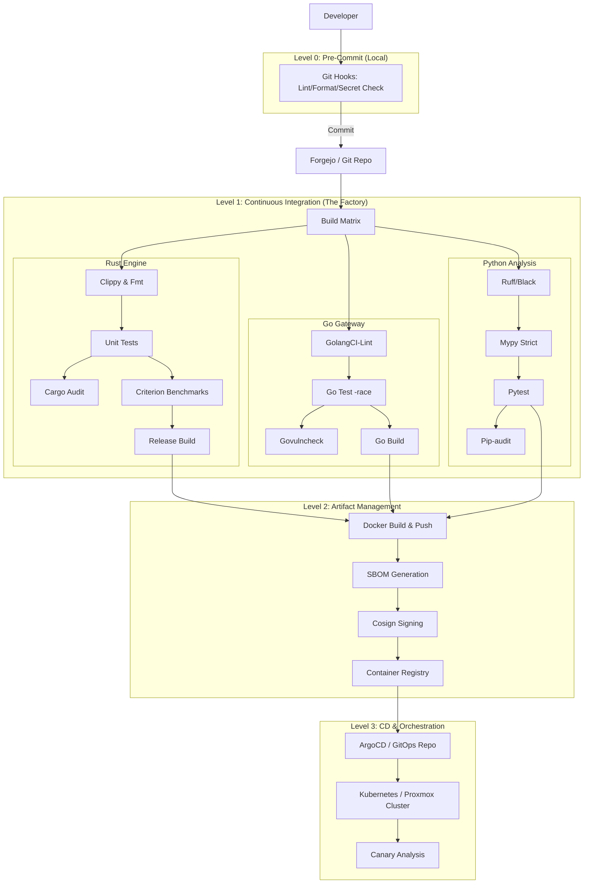

# Industrial-Grade CI/CD Pipeline Implementation Plan
## Project: High-Frequency Trading Bot (Polyglot: Rust, Go, Python)
### Date: February 16, 2026
### Status: Draft / Research Phase

---

# 1. Executive Summary

This document outlines a comprehensive, industrial-grade Continuous Integration and Continuous Deployment (CI/CD) strategy for the `BOT_TRADING` project. Given the nature of High-Frequency Trading (HFT), the pipeline prioritizes **correctness**, **latency-awareness**, **security**, and **auditability** above all else. 

The system is a polyglot microservices architecture comprising:
- **Engine**: A high-performance core written in **Rust**.
- **Gateway**: A connectivity layer written in **Go**.
- **Analysis/Dashboard**: Data science and visualization components written in **Python**.

## 1.1 The Objective
The goal is to transition from a manual or basic CI setup to a fully automated, hermetic, and reproducible "Factory" that turns code into tradeable artifacts with zero human intervention. This pipeline will enforce strict quality gates, ensuring that no code which degrades performance (latency regressions) or compromises security (dependency vulnerabilities) can reach production.

## 1.2 Key Differentiators for HFT CI/CD
Unlike standard web application pipelines, an HFT pipeline must include:
1.  **Micro-benchmarking Gates**: Automatically failing builds if critical path latency increases by nanoseconds.
2.  **Deterministic Builds**: Bit-for-bit reproducible artifacts to ensure the binary tested is the binary deployed.
3.  **Kernel-Bypass Awareness**: CI runners capable of testing specialized network stack configurations (e.g., Solarflare/onload) if applicable.
4.  **Mathematical Correctness Verification**: Fuzz testing and property-based testing (e.g., `proptest` for Rust, `hypothesis` for Python) running on every commit.

---

# 2. Pipeline Architecture & Design Principles

## 2.1 Architectural Overview
The pipeline is designed as a **Directed Acyclic Graph (DAG)** of dependent stages. It operates on a **Monorepo** strategy (using the existing folder structure) but employs **path filtering** to trigger only relevant workflows.

### 2.1.1 The CI/CD Flow
The following Mermaid diagram illustrates the high-level flow from commit to deployment.



## 2.2 Core Design Principles

### 2.2.1 Hermetic Builds
Every build step runs inside a containerized environment (Docker-in-Docker or Podman). This ensures that the build does not depend on the host OS tools/libraries. 
*   **Requirement**: No `apt-get install` in CI scripts. All tools must be pre-baked into a Builder Image.
*   **Benefit**: Eliminates "it works on my machine" and "it works on CI runner #4 but not #5".

### 2.2.2 Fail Fast, Fail Loud
The pipeline is ordered by execution speed and cost.
1.  **Syntactic Checks (Milliseconds)**: Formatting, Linting.
2.  **Unit Tests (Seconds)**: Logic verification.
3.  **Security Scans (Seconds/Minutes)**: Vulnerability databases.
4.  **Compilation (Minutes)**: Heavy lifting.
5.  **Integration Tests (Minutes)**: End-to-end flows.
If a lint check fails, the expensive compilation step never starts, saving compute resources and providing immediate feedback.

### 2.2.3 Artifact Immutability
Once an artifact (Docker image, binary) is built and tagged with a SHA, it **never** changes. We do not use `:latest` tags in production.
*   **Naming Convention**: `registry.internal/bot-engine:1.2.0-sha256-abc1234`
*   **Promotion**: Artifacts are "promoted" metadata-wise (e.g., tagged `staging`, then `prod`), but the bits remain identical.

### 2.2.4 Infrastructure as Code (IaC) for Pipelines
The pipeline definition itself (YAML files) is versioned code.
*   Shared logic is extracted into **Composite Actions** (if using GitHub/Forgejo Actions) or **Shared Libraries** (if using Jenkins) to prevent drift between the Rust, Go, and Python workflows.

---

# 3. Detailed Component Strategy

## 3.1 The Git Workflow (Trunk-Based Development)
For a high-velocity trading system, long-lived feature branches are an anti-pattern as they delay integration and increase merge conflict risks.

### 3.1.1 Branching Model
*   **Main Branch (`main`)**: Always deployable. Represents the "Truth".
*   **Feature Branches (`feat/xyz`)**: Short-lived (max 1-2 days).
*   **Pull Requests (PRs)**: The only way to merge to `main`.
    *   **Requires**: Passing CI, 1 Human Approval, No unresolved conversations.
    *   **Squash & Merge**: enforced to keep `git log` linear and clean.

### 3.1.2 Semantic Versioning & Conventional Commits
We will enforce **Conventional Commits** (e.g., `fix: handle null pointer in gateway`, `feat: add bollinger bands to analysis`).
*   **Automation**: A tool like `semantic-release` or `git-cliff` will parse commit messages to:
    1.  Determine the next Semantic Version (Major, Minor, Patch).
    2.  Generate the `CHANGELOG.md`.
    3.  Tag the release in Git.

## 3.2 Pre-Commit Hooks (Left-Shifting Quality)
Before code even leaves the developer's machine, it must pass a local gauntlet. We will use the `pre-commit` framework (Python-based but works for all languages).

### 3.2.1 Configuration (`.pre-commit-config.yaml`)
The following hooks are mandatory:
*   **General**:
    *   `check-added-large-files`: Prevent committing 100MB CSVs.
    *   `check-merge-conflict`: Prevent committing conflict markers.
    *   `detect-private-key`: **CRITICAL**. Scans for private keys/API secrets.
    *   `end-of-file-fixer` & `trailing-whitespace`: Hygiene.
*   **Python**:
    *   `black`: Formatting.
    *   `ruff`: Fast linting.
*   **Rust**:
    *   `cargo fmt`: Formatting.
    *   `cargo check`: Fast compilation check.
*   **Go**:
    *   `gofmt`: Formatting.
    *   `golangci-lint`: Linting.

**Strategy**: If `pre-commit` fails, the commit is rejected. This saves CI costs and developer embarrassment.

---

# 4. Detailed Implementation: The Rust Engine Pipeline

The `engine/` component is the heart of the HFT system. Its pipeline must guarantee **memory safety**, **concurrency correctness**, and **zero-cost abstractions**. We treat Rust code as mission-critical infrastructure.

## 4.1 Toolchain Management (`rust-toolchain.toml`)
To ensure reproducibility across all developer machines and CI runners, we explicitly pin the Rust toolchain version. We will not rely on `stable` rolling forward unexpectedly.
*   **File**: `engine/rust-toolchain.toml`
*   **Channel**: `1.75.0` (example) or specific nightly if using unstable features (e.g., SIMD intrinsics).
*   **Components**: `rustfmt`, `clippy`, `llvm-tools-preview` (for coverage).

## 4.2 Caching Strategy: Speed is Key
Rust compilation is notoriously slow. A cold build of the engine might take 10+ minutes. We must optimize this to keep feedback loops under 2 minutes.

### 4.2.1 Cargo Chef & Docker Layer Caching
For building Docker images, we use `cargo-chef` to pre-build dependencies.
1.  **Recipe Step**: Compute a "recipe" based on `Cargo.lock`.
2.  **Cook Step**: Build *only* the dependencies. This layer is cached by Docker.
3.  **Build Step**: Copy source code and build the binary. Since dependencies are pre-compiled and cached, this step is fast.

### 4.2.2 sccache (Shared Compilation Cache)
For CI jobs running outside of Docker (e.g., on bare metal runners), we will configure `sccache` with a shared backend (S3/MinIO/Redis).
*   **Mechanism**: Wraps `rustc` calls, hashes inputs, and checks if the object file already exists in the remote cache.
*   **Benefit**: Dramatically speeds up re-compilation across different branches/PRs sharing common dependencies.

## 4.3 Static Analysis: Strict Mode
We do not settle for default warnings. In HFT, a warning is a bug waiting to happen.

### 4.3.1 Clippy Configuration
We will enforce a strict `clippy.toml` configuration that denies warnings and enables pedantic lints.
*   **Command**: `cargo clippy --all-targets --all-features -- -D warnings`
*   **Key Lints**:
    *   `clippy::pedantic`: Enforces strict style/complexity rules.
    *   `clippy::nursery`: Catch potential issues not yet in stable.
    *   `clippy::unwrap_used`: **CRITICAL**. Explicitly forbid `.unwrap()` in production code. Forces proper error handling (`Result<T, E>`).
    *   `clippy::arithmetic_side_effects`: Detect potential integer overflows (panic risks).

### 4.3.2 Dependency Auditing (`cargo-audit` & `cargo-deny`)
*   **`cargo-audit`**: Checks `Cargo.lock` against the RustSec Advisory Database for known vulnerabilities.
    *   *Failure Condition*: Any vulnerability with a CVSS score > 0.
*   **`cargo-deny`**: Enforces license compliance (e.g., ban GPL dependencies if proprietary) and detects duplicate dependency versions (bloat).

## 4.4 Testing Strategy

### 4.4.1 Unit & Integration Testing
*   **Unit Tests**: Co-located with code (`#[cfg(test)]`). Run in parallel.
*   **Integration Tests**: Located in `tests/`. We will spin up ephemeral Redis instances using `testcontainers` or Docker Compose within the CI job to test real I/O.
    *   **Command**: `cargo test --release` (Run tests in release mode to catch optimizations bugs).

### 4.4.2 Fuzz Testing (`cargo-fuzz`)
HFT inputs (market data) can be malformed or adversarial.
*   **Tool**: `libfuzzer` via `cargo-fuzz`.
*   **Target**: The FIX/SBE parser and order book logic.
*   **CI Integration**: Run fuzzers for a fixed duration (e.g., 5 minutes) on every PR to catch obvious crashes. Run long-running fuzzing (24h) on a separate nightly schedule.

### 4.4.3 Property-Based Testing (`proptest`)
Instead of hardcoded examples, we define properties (e.g., "Order Book total volume must never be negative").
*   `proptest` generates thousands of random inputs to try and falsify these properties.

## 4.5 Performance Regression Testing (Benchmarking)
A logic change might be correct but slow. We cannot afford latency regressions.
*   **Tool**: `criterion.rs`.
*   **Baseline**: The `main` branch.
*   **Process**:
    1.  Run benchmarks on the PR branch.
    2.  Compare against the stored baseline from `main`.
    3.  **Fail the Build** if latency increases by > 5% (with statistical significance).
*   **Artifact**: Generate an HTML report illustrating the regression.

---

# 5. Detailed Implementation: The Go Gateway Pipeline

The `gateway/` acts as the bridge to the external world (MT5/Exchanges). It handles high concurrency and network I/O. Its pipeline focuses on **concurrency safety** and **networking robustness**.

## 5.1 Go Modules & Dependency Management
*   **Vendoring**: We commit `vendor/` directory or heavily cache `GOCACHE` and `GOMODCACHE`.
*   **Proxy**: Use a private Go Proxy (Athens) or the official `proxy.golang.org` to ensure availability of dependencies.
*   **Verification**: `go mod verify` ensures dependencies haven't been tampered with.

## 5.2 Strict Linting (`golangci-lint`)
The standard `go vet` is insufficient. We use `golangci-lint` with a comprehensive configuration.
*   **Enabled Linters**:
    *   `govet`: Standard vetting.
    *   `staticcheck`: Advanced static analysis.
    *   `gocyclo`: Cyclomatic complexity (fail functions > 15).
    *   `gocritic`: The most opinionated linter.
    *   `errcheck`: Ensure ALL errors are handled. **Critical** for network code.
    *   `bodyclose`: Ensure HTTP response bodies are closed (prevent leaks).
    *   `race`: (If applicable in lint context, usually test).

## 5.3 Testing Strategy

### 5.3.1 The Race Detector (`-race`)
Go's killer feature.
*   **Requirement**: ALL tests in CI must run with `go test -race`.
*   **Why**: Detects data races that occur only under high concurrency—common in Gateway services handling WebSocket feeds.
*   **Performance Cost**: Slows down execution by ~10x, but essential for correctness.

### 5.3.2 Integration Testing with Network Simulation
The Gateway interacts with external APIs. We cannot mock everything.
*   **Mock Server**: We will build a lightweight mock MT5 server in CI to simulate exchange responses (fills, rejects, disconnects).
*   **Chaos Testing**: Use `toxiproxy` to simulate network latency, jitter, and packet loss during integration tests to ensure the Gateway reconnects gracefully.

### 5.3.3 Vulnerability Scanning (`govulncheck`)
*   **Tool**: `govulncheck` (Official Go tool).
*   **Database**: Go Vulnerability Database.
*   **Policy**: Fail build on any vulnerability affecting the compiled binary (reduces noise compared to source-only scanners).

## 5.4 Build & Optimization
*   **Binary Size**: `go build -ldflags="-s -w"` to strip debug symbols for production (smaller images).
*   **Static Linking**: `CGO_ENABLED=0` to ensure the binary runs on `scratch` Docker images without libc dependencies.
*   **PGO (Profile-Guided Optimization)**:
    *   Capture production profiles (`cpu.pprof`).
    *   Feed them back into the build: `go build -pgo=default.pgo`.
    *   **Benefit**: 5-10% performance improvement for free.

---

# 6. Detailed Implementation: The Python Analysis Pipeline

The `analysis/` component handles data science, model training, and dashboarding. While latency is less critical here than in the Engine/Gateway, **correctness** and **reproducibility** are paramount. Python's dynamic nature makes it prone to runtime errors; our pipeline mitigates this.

## 6.1 Dependency Management: Determinism First
`requirements.txt` is often insufficient for reproducible builds due to transitive dependencies.
*   **Strategy**: We will migrate to `poetry` or `pip-tools`.
*   **Lock File**: `poetry.lock` or `requirements.txt` (generated via `pip-compile --generate-hashes`).
    *   **Why Hashes?**: Prevents supply chain attacks where a compromised PyPI package replaces a legitimate one.
    *   **CI Check**: The pipeline validates the lock file against `pyproject.toml` to ensure they are in sync.

## 6.2 Strict Linting & Formatting: The "Ruff" Revolution
We are replacing `flake8`, `isort`, and `pylint` with `ruff`—a Rust-based Python linter that is orders of magnitude faster.
*   **Configuration (`pyproject.toml`)**:
    *   **Line Length**: 88 (Black standard).
    *   **Select**: `E`, `F`, `B` (Bugbear), `SIM` (Simplify), `I` (Isort), `N` (Naming), `UP` (PyUpgrade).
    *   **Target Version**: Python 3.11+.

### 6.2.1 Static Type Checking (`mypy`)
Python is dynamic, but our codebase will be statically typed.
*   **Strict Mode**: `mypy --strict`.
*   **Disallow Untyped Defs**: All function signatures must have type hints.
*   **Disallow Any**: Minimize usage of `Any`.
*   **Benefit**: Catches `AttributeError` and `TypeError` at compile time, not runtime.

## 6.3 Testing Strategy: Beyond Unit Tests

### 6.3.1 Parallel Execution (`pytest-xdist`)
The Analysis suite involves heavy computations.
*   **Parallelism**: Run tests across multiple CPU cores: `pytest -n auto`.
*   **Isolation**: Ensure tests do not share state (e.g., global variables, database entries).

### 6.3.2 Property-Based Testing (`hypothesis`)
For financial calculations (e.g., moving averages, risk metrics), edge cases are infinite.
*   **Tool**: `hypothesis`.
*   **Approach**: We define the properties of a valid output (e.g., "Standard Deviation is non-negative") and let Hypothesis generate thousands of inputs to try and break it.
*   **Example**: Feeding `NaN`, `Infinity`, or extremely large numbers into the ML models.

### 6.3.3 Security Auditing (`bandit` & `pip-audit`)
*   **`bandit`**: Scans the AST for common security issues (e.g., `exec()`, hardcoded passwords, weak crypto).
    *   *Configuration*: Skip specific tests (like `assert_used` in test files) via `.bandit`.
*   **`pip-audit`**: Checks the environment for packages with known vulnerabilities (CVEs).
    *   *Policy*: Fail the build on CRITICAL or HIGH severity CVEs.

## 6.4 Docker Optimization: Slimming Down
Python images are notoriously large due to data science libraries (Pandas, PyTorch).
*   **Multi-Stage Build**:
    1.  **Builder**: Install build tools (`gcc`, `g++`, `cmake`) and compile dependencies into wheels.
    2.  **Runtime**: Copy only the installed packages and application code.
*   **Base Image**: `python:3.11-slim-bookworm` (Debian-based) or `chainguard/python` (distroless, minimal attack surface).
*   **Layer Caching**: Order `COPY requirements.txt` and `pip install` *before* `COPY .` to maximize cache hits.

---

# 7. Security & Compliance (DevSecOps)

Security is not an afterthought; it is baked into every stage. We adopt a **"Zero Trust"** approach to the pipeline itself.

## 7.1 Secret Management: No More `.env` Files
Storing secrets in Git or CI variables is risky.
*   **Solution**: Integration with **HashiCorp Vault** or a dedicated secrets manager (e.g., AWS Secrets Manager, Doppler).
*   **Mechanism**:
    1.  The CI runner authenticates via OIDC (OpenID Connect) using its identity provider (e.g., GitHub/Forgejo).
    2.  It requests a short-lived (TTL: 1 hour) dynamic secret for the specific job (e.g., specific Docker registry credentials).
    3.  Secrets are injected as environment variables *only* into the step that needs them.
    4.  Logs are scrubbed to prevent accidental leakage.

## 7.2 Container Security Scanning
Before any image is pushed to the registry, it undergoes deep inspection.
*   **Tool**: `trivy` or `grype`.
*   **Scope**:
    *   **OS Packages**: Vulnerabilities in the base image (e.g., `openssl` in Debian).
    *   **Language Dependencies**: Libraries inside `/usr/local/lib/python3.11/site-packages`.
*   **Policy**:
    *   **Block**: Critical/High CVEs with a fix available.
    *   **Warn**: Medium/Low CVEs or those without a fix.
    *   **Exemptions**: Documented via `.trivyignore` with a valid reason and expiration date.

## 7.3 Supply Chain Security: SBOM & Signing
To prove what is running in production matches what was built in CI.

### 7.3.1 SBOM Generation (`syft`)
A Software Bill of Materials (SBOM) lists every component in the artifact.
*   **Tool**: `syft`.
*   **Output Format**: SPDX or CycloneDX JSON.
*   **Storage**: Pushed to the container registry alongside the image as an OCI artifact.

### 7.3.2 Artifact Signing (`cosign`)
We sign the container image to guarantee its integrity.
*   **Keyless Signing**: Using OIDC (e.g., Fulcio/Rekor integration).
*   **Verification**: The deployment cluster (Kubernetes/Proxmox) uses an admission controller (e.g., Kyverno or Gatekeeper) to *reject* any image that is not signed by our CI key.
*   **Process**:
    1.  Build Image.
    2.  Generate SBOM.
    3.  Sign Image & SBOM.
    4.  Push all to Registry.

---

# 8. Detailed Implementation: Infrastructure as Code (IaC) & Deployment

In a high-stakes environment, infrastructure changes must be as rigorous as application code changes. We treat our servers and clusters as cattle, not pets.

## 8.1 The Infrastructure Pipeline
We utilize **Terraform** (or OpenTofu) for provisioning and **Ansible** for configuration management.

### 8.1.1 Terraform State Management
*   **Backend**: S3/MinIO/Consul with state locking (DynamoDB/Postgres).
*   **Workspaces**: Separate state files for `dev`, `staging`, and `prod`.
*   **Modules**: Reusable modules for common resources (e.g., VPC, compute instances, load balancers).
*   **Testing**:
    *   `tflint`: Static analysis for Terraform.
    *   `checkov`: Security policy scanning (e.g., ensure no open security groups).
    *   `terratest`: Integration testing (spin up infrastructure, test it, tear it down).

### 8.1.2 Immutable Infrastructure
We build **Golden Images** (VM templates or AMIs) using **Packer**.
*   **Process**:
    1.  Provision base OS (Ubuntu 22.04 LTS).
    2.  Install dependencies (Docker, monitoring agents).
    3.  Harden the OS (CIS benchmarks).
    4.  Bake the image.
*   **Deployment**: When updating the OS, we replace the entire VM/instance rather than patching it in place.

## 8.2 Deployment Strategies: Zero Downtime

### 8.2.1 Blue/Green Deployment (The Engine)
The core Rust Engine must never stop trading during market hours, or if updated during off-hours, must be verifiable before taking traffic.
*   **Mechanism**:
    1.  **Blue (Current)**: Serving live traffic.
    2.  **Green (New)**: Deployed with the new version.
    3.  **Verification**: Automated smoke tests run against Green.
    4.  **Switch**: The Load Balancer (or DNS) flips traffic from Blue to Green.
    5.  **Soak**: Green runs for X minutes.
    6.  **Cleanup**: Blue is terminated (or kept as a quick rollback target).

### 8.2.2 Canary Deployment (Analysis Service)
For non-critical or user-facing components (Dashboards), we roll out changes gradually.
*   **Phase 1**: Deploy new version to 5% of traffic/users.
*   **Phase 2**: Monitor error rates (HTTP 500s) and latency.
*   **Phase 3**: If metrics are healthy, scale up to 25%, 50%, 100%.
*   **Phase 4**: If metrics degrade, **Auto-Rollback** immediately.

## 8.3 Rollback Procedures
Failure is inevitable; recovery must be instant.
*   **Automated Rollback**: If the Health Check or Canary Analysis fails, the pipeline automatically reverts to the previous known-good artifact/infrastructure state.
*   **Manual Rollback**: A "Break Glass" button in the CI/CD dashboard to force a revert.
*   **Database Migrations**:
    *   **Up/Down Scripts**: Every migration must have a tested rollback script.
    *   **Backward Compatibility**: Schema changes must be compatible with *both* the old and new code versions to support zero-downtime deployments.

---

# 9. Observability & CI Feedback Loops

A pipeline is only as good as the information it provides. We need to know *why* a build failed, not just *that* it failed.

## 9.1 OpenTelemetry in CI
We instrument the CI pipeline itself using OpenTelemetry (OTel).
*   **Trace Context**: Each build job is a span. Each step (lint, test, build) is a child span.
*   **Data Collection**: Traces are sent to a backend (Jaeger/Tempo).
*   **Benefit**: Identify bottlenecks in the pipeline (e.g., "Why did `cargo build` take 15 minutes today instead of 5?").

## 9.2 Flaky Test Detection & Quarantine
Flaky tests destroy trust in CI.
*   **Detection**: If a test fails and then passes on retry without code changes, it is flaky.
*   **Quarantine**:
    *   Automatically mark the test as `xfail` or move it to a separate "Quarantine" suite.
    *   Create a Jira/GitHub Issue assigned to the team owner.
    *   The test does not block the main pipeline but runs purely for data gathering until fixed.

## 9.3 Performance Regression Dashboards
We visualize the data from our benchmarks (Criterion, Pytest-benchmark).
*   **Tool**: **Grafana**.
*   **Metrics**:
    *   Critical Path Latency (p99, p99.9).
    *   Throughput (Orders/Sec).
    *   Memory Usage / Allocation Rate.
    *   Binary Size.
    *   **Alerting**: If the trend line crosses a threshold (e.g., latency +10% over 3 builds), Slack/PagerDuty alerts are fired.

---

# 10. Operational Runbooks (The "When it Breaks" Manual)

Automation is powerful, but when it fails, it can be opaque. This section outlines standard operating procedures (SOPs) for diagnosing and resolving common CI/CD failures.

## 10.1 Scenario 1: The "Flaky" CI Build
**Symptom**: A build fails on `test_execution_engine` but passes on retry without any code changes.
**Diagnosis**:
1.  **Check Logs**: Look for "timeout", "connection refused", or "race detected".
2.  **Isolate**: Run the test locally in a loop: `for i in {1..100}; do cargo test test_execution_engine; done`.
3.  **Debug on Runner**: If it only fails in CI, use `tmate` or SSH into the runner.
    *   **Action**: Add a step to the workflow:
        ```yaml
        - name: Setup tmate session
          uses: mxschmitt/action-tmate@v3
          if: failure()
        ```
    *   This provides a live SSH session to inspect the environment, check disk space (`df -h`), or memory usage (`free -m`).

## 10.2 Scenario 2: Docker Layer Cache Misses
**Symptom**: Build times skyrocket from 2 minutes to 15 minutes.
**Diagnosis**:
1.  **Inspect Logs**: Look for "Using cache" vs "Building".
2.  **Identify Invalidated Layer**: Find the first step that rebuilt.
    *   *Common Culprit*: `COPY . .` before `RUN pip install`.
3.  **Fix**: Reorder instructions in `Dockerfile`.
    *   **Bad**:
        ```dockerfile
        COPY . .
        RUN pip install -r requirements.txt
        ```
    *   **Good**:
        ```dockerfile
        COPY requirements.txt .
        RUN pip install -r requirements.txt
        COPY . .
        ```

## 10.3 Scenario 3: Security Scan False Positives
**Symptom**: `trivy` or `cargo-audit` fails the build due to a vulnerability in a dev-dependency or a false alarm.
**Resolution**:
1.  **Verify**: Is the vulnerability reachable? (e.g., a regex DoS in a CLI tool used only for build scripts).
2.  **Suppress**:
    *   **Trivy**: Add CVE ID to `.trivyignore`.
    *   **Cargo Audit**: Add to `audit.toml`:
        ```toml
        [advisories]
        ignore = ["RUSTSEC-2023-0001"] # Reason: CLI tool, not reachable in prod
        ```
3.  **Document**: MUST include a comment explaining *why* it is ignored. "Fixing later" is not a valid reason.

## 10.4 Scenario 4: Deployment Stuck / Failed Mid-Rollout
**Symptom**: `helm upgrade` or `docker compose up` hangs or fails.
**Immediate Action**:
1.  **Check Status**: `kubectl get pods` or `docker compose ps`.
2.  **Check Logs**: `kubectl logs <pod-name>` or `docker compose logs`.
3.  **Rollback**:
    *   **Kubernetes**: `helm rollback <release> 0`.
    *   **Docker Compose**: Revert `docker-compose.yml` to previous version and run `docker compose up -d`.
4.  **Post-Mortem**: Identify if it was a bad config, resource exhaustion (OOMKilled), or code bug.

---

# 11. Configuration Reference (The "How-To")

This section provides complete, copy-pasteable examples of the configuration files discussed. These are starting points tailored for high performance and security.

## 11.1 Rust Engine Workflow (`.forgejo/workflows/ci-engine.yml`)

```yaml
name: Rust Engine CI
on:
  push:
    paths: ['engine/**', '.forgejo/workflows/ci-engine.yml']
  pull_request:
    paths: ['engine/**', '.forgejo/workflows/ci-engine.yml']

env:
  CARGO_TERM_COLOR: always
  RUSTFLAGS: "-D warnings"

jobs:
  test:
    name: Test & Lint
    runs-on: ubuntu-latest
    steps:
      - uses: actions/checkout@v3
      
      - name: Install Rust
        uses: dtolnay/rust-toolchain@stable
        with:
          components: clippy, rustfmt

      - name: Cache Cargo Registry
        uses: actions/cache@v3
        with:
          path: |
            ~/.cargo/registry
            ~/.cargo/git
            engine/target
          key: ${{ runner.os }}-cargo-${{ hashFiles('engine/Cargo.lock') }}

      - name: Check Formatting
        working-directory: engine
        run: cargo fmt --all -- --check

      - name: Lint with Clippy
        working-directory: engine
        run: cargo clippy --all-targets --all-features -- -D warnings

      - name: Run Tests
        working-directory: engine
        run: cargo test --release

      - name: Security Audit
        uses: actions-rs/audit-check@v1
        with:
          token: ${{ secrets.GITHUB_TOKEN }}

  build:
    name: Build Docker Image
    needs: test
    runs-on: ubuntu-latest
    steps:
      - uses: actions/checkout@v3

      - name: Set up Docker Buildx
        uses: docker/setup-buildx-action@v2

      - name: Login to Registry
        uses: docker/login-action@v2
        with:
          registry: ghcr.io
          username: ${{ github.actor }}
          password: ${{ secrets.GITHUB_TOKEN }}

      - name: Build and Push
        uses: docker/build-push-action@v4
        with:
          context: engine
          push: true
          tags: ghcr.io/${{ github.repository }}/engine:${{ github.sha }}
          cache-from: type=gha
          cache-to: type=gha,mode=max
```

## 11.2 Optimized Rust Dockerfile (`engine/Dockerfile`)

```dockerfile
# 1. Chef Stage: Compute recipe file
FROM lukemathwalker/cargo-chef:latest-rust-1.75 AS chef
WORKDIR /app

# 2. Planner Stage: Generate recipe from Cargo.lock
FROM chef AS planner
COPY . .
RUN cargo chef prepare --recipe-path recipe.json

# 3. Builder Stage: Build dependencies + source
FROM chef AS builder
COPY --from=planner /app/recipe.json recipe.json
# Build dependencies - this is cached!
RUN cargo chef cook --release --recipe-path recipe.json
# Build application
COPY . .
RUN cargo build --release --bin engine

# 4. Runtime Stage: Minimalist
FROM gcr.io/distroless/cc-debian12
COPY --from=builder /app/target/release/engine /
CMD ["/engine"]
```

## 11.3 Go Gateway Workflow (`.forgejo/workflows/ci-gateway.yml`)

```yaml
name: Go Gateway CI
on:
  push:
    paths: ['gateway/**', '.forgejo/workflows/ci-gateway.yml']
  pull_request:
    paths: ['gateway/**', '.forgejo/workflows/ci-gateway.yml']

env:
  GO_VERSION: 1.24

jobs:
  lint:
    name: Lint & Static Analysis
    runs-on: ubuntu-latest
    steps:
      - uses: actions/checkout@v3
      - uses: actions/setup-go@v4
        with:
          go-version: ${{ env.GO_VERSION }}
          cache: true
      - name: GolangCI-Lint
        uses: golangci/golangci-lint-action@v3
        with:
          version: v1.55.2
          working-directory: gateway
          args: --timeout=5m --config=.golangci.yml

  test:
    name: Unit & Race Tests
    runs-on: ubuntu-latest
    needs: lint
    steps:
      - uses: actions/checkout@v3
      - uses: actions/setup-go@v4
        with:
          go-version: ${{ env.GO_VERSION }}
          cache: true
      - name: Run Tests with Race Detector
        working-directory: gateway
        run: go test -v -race -coverprofile=coverage.out ./...

  vulncheck:
    name: Vulnerability Scan
    runs-on: ubuntu-latest
    steps:
      - uses: actions/checkout@v3
      - uses: actions/setup-go@v4
        with:
          go-version: ${{ env.GO_VERSION }}
      - name: Install govulncheck
        run: go install golang.org/x/vuln/cmd/govulncheck@latest
      - name: Run govulncheck
        working-directory: gateway
        run: govulncheck ./...

  build:
    name: Build Docker Image
    needs: [test, vulncheck]
    runs-on: ubuntu-latest
    steps:
      - uses: actions/checkout@v3
      - name: Set up Docker Buildx
        uses: docker/setup-buildx-action@v2
      - name: Login to Registry
        uses: docker/login-action@v2
        with:
          registry: ghcr.io
          username: ${{ github.actor }}
          password: ${{ secrets.GITHUB_TOKEN }}
      - name: Build and Push
        uses: docker/build-push-action@v4
        with:
          context: gateway
          push: true
          tags: ghcr.io/${{ github.repository }}/gateway:${{ github.sha }}
          cache-from: type=gha
          cache-to: type=gha,mode=max
```

## 11.4 Optimized Go Dockerfile (`gateway/Dockerfile`)

```dockerfile
# 1. Builder Stage
FROM golang:1.24-alpine AS builder
WORKDIR /app
# Install git for fetch dependencies
RUN apk add --no-cache git

# Copy dependencies first for caching
COPY go.mod go.sum ./
RUN go mod download

# Copy source code
COPY . .

# Build static binary
# -ldflags="-w -s": Strip debug symbols (smaller binary)
# CGO_ENABLED=0: Static linking for scratch
RUN CGO_ENABLED=0 GOOS=linux go build -ldflags="-w -s" -o gateway ./cmd/main.go

# 2. Runtime Stage: Scratch (Empty image)
FROM scratch
WORKDIR /
COPY --from=builder /app/gateway /gateway
# Copy CA certificates for HTTPS
COPY --from=builder /etc/ssl/certs/ca-certificates.crt /etc/ssl/certs/

EXPOSE 8080
ENTRYPOINT ["/gateway"]
```

## 11.5 Python Analysis Workflow (`.forgejo/workflows/ci-analysis.yml`)

```yaml
name: Python Analysis CI
on:
  push:
    paths: ['analysis/**', '.forgejo/workflows/ci-analysis.yml']
  pull_request:
    paths: ['analysis/**', '.forgejo/workflows/ci-analysis.yml']

env:
  PYTHON_VERSION: "3.11"
  POETRY_VERSION: "1.7.0"

jobs:
  check:
    name: Quality Gates
    runs-on: ubuntu-latest
    steps:
      - uses: actions/checkout@v3
      - uses: actions/setup-python@v4
        with:
          python-version: ${{ env.PYTHON_VERSION }}

      - name: Install Poetry
        run: curl -sSL https://install.python-poetry.org | python3 -

      - name: Install Dependencies
        working-directory: analysis
        run: poetry install --no-root

      - name: Check Formatting (Black)
        working-directory: analysis
        run: poetry run black --check .

      - name: Lint (Ruff)
        working-directory: analysis
        run: poetry run ruff check .

      - name: Type Check (Mypy)
        working-directory: analysis
        run: poetry run mypy --strict .

      - name: Security Scan (Bandit)
        working-directory: analysis
        run: poetry run bandit -r . -c bandit.yaml

  test:
    name: Unit & Integration Tests
    runs-on: ubuntu-latest
    needs: check
    steps:
      - uses: actions/checkout@v3
      - uses: actions/setup-python@v4
        with:
          python-version: ${{ env.PYTHON_VERSION }}
      
      - name: Install Dependencies
        working-directory: analysis
        run: poetry install

      - name: Run Tests (Parallel)
        working-directory: analysis
        run: poetry run pytest -n auto --cov=src --cov-report=xml

      - name: Upload Coverage
        uses: codecov/codecov-action@v3
        with:
          files: analysis/coverage.xml

  build:
    name: Build Docker Image
    needs: test
    runs-on: ubuntu-latest
    steps:
      - uses: actions/checkout@v3
      - name: Build and Push
        uses: docker/build-push-action@v4
        with:
          context: analysis
          push: true
          tags: ghcr.io/${{ github.repository }}/analysis:${{ github.sha }}
          cache-from: type=gha
          cache-to: type=gha,mode=max
```

## 11.6 Optimized Python Dockerfile (`analysis/Dockerfile`)

```dockerfile
# 1. Builder Stage
FROM python:3.11-slim-bookworm as builder
WORKDIR /app

ENV POETRY_NO_INTERACTION=1 \
    POETRY_VIRTUALENVS_IN_PROJECT=1 \
    POETRY_VIRTUALENVS_CREATE=1 \
    PYTHONDONTWRITEBYTECODE=1 \
    PYTHONUNBUFFERED=1

RUN pip install poetry

COPY pyproject.toml poetry.lock ./
RUN poetry install --no-root --no-dev

# 2. Runtime Stage: Distroless
# Google's Distroless Python image is minimal and secure
FROM gcr.io/distroless/python3-debian12
WORKDIR /app

# Copy virtualenv from builder
COPY --from=builder /app/.venv /app/.venv
COPY --from=builder /app/src /app/src

# Add venv to path
ENV PATH="/app/.venv/bin:$PATH"
ENV PYTHONPATH="/app/src"

CMD ["/app/src/main.py"]
```

---

# 12. Conclusion & Roadmap

Implementing this industrial-grade pipeline transforms the `BOT_TRADING` project from a collection of scripts into a robust, observable, and secure trading platform.

## 12.1 Benefits Recap
1.  **Confidence**: Every commit is verified against race conditions, logic errors, and security vulnerabilities.
2.  **Speed**: Parallel execution and aggressive caching keep feedback loops under 5 minutes.
3.  **Security**: No secrets in code, signed artifacts, and continuous vulnerability scanning.
4.  **Observability**: We know *what* is running in production (Git SHA) and *how* it got there (Trace ID).

## 12.2 Implementation Roadmap
To avoid overwhelming the team, we recommend a phased rollout:

*   **Phase 1 (Week 1)**: Enable strict linting (`ruff`, `clippy`, `golangci-lint`) and Pre-commit hooks.
*   **Phase 2 (Week 2)**: Containerize all builds and enable Docker Layer Caching.
*   **Phase 3 (Week 3)**: Implement Unit & Integration Tests in CI with blocking gates.
*   **Phase 4 (Week 4)**: Set up Registry, Signing, and CD (GitOps with ArgoCD).

This plan provides a definitive path to engineering excellence for high-frequency trading systems.

---

---
