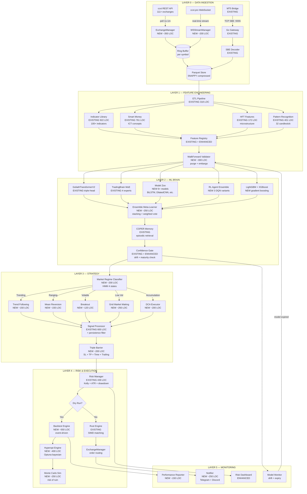
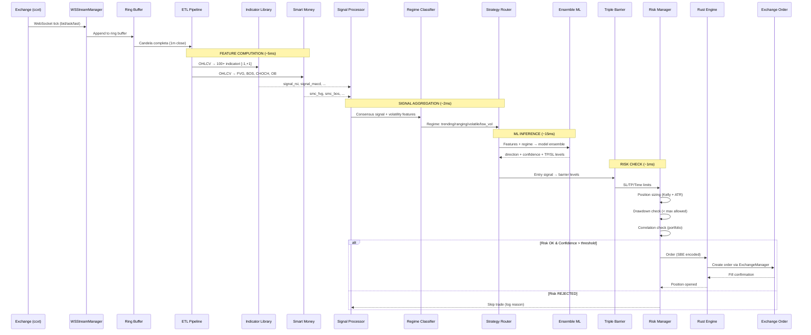
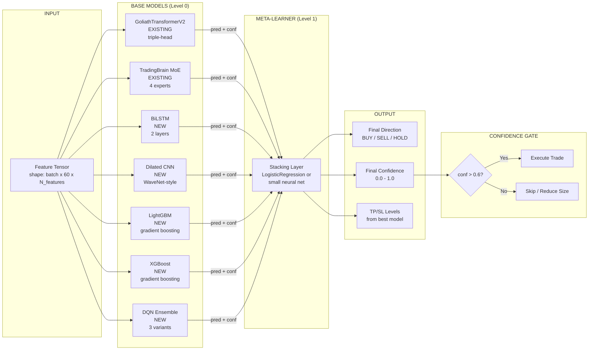
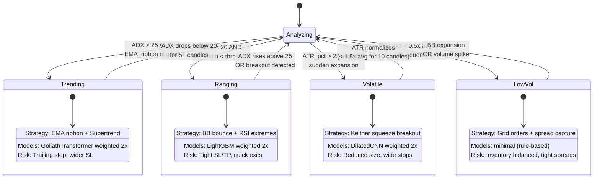

# GOLIATH v2.0 — Piano Tecnico di Fusione Multi-Repository

> **Versione:** 2.0.0-draft
> **Ultimo aggiornamento:** 2026-02-15
> **Autore:** Antigravity AI Architect
> **Status:** In attesa di approvazione
> **Linee di codice analizzate:** ~127,000 (7 repository + GOLIATH core)
> **Nuove linee stimate:** ~8,500 (Python) + ~400 (Rust) + ~200 (Go)

---

## Indice

0. [Executive Summary](#0-executive-summary)
1. [Architettura Attuale GOLIATH — Analisi Profonda](#1-architettura-attuale-goliath--analisi-profonda)
2. [Inventario Repository — Mappa di Estrazione](#2-inventario-repository--mappa-di-estrazione)
3. [Architettura Target — GOLIATH v2.0](#3-architettura-target--goliath-v20)
4. [Piano di Implementazione — 6 Fasi](#4-piano-di-implementazione--6-fasi)
5. [Livello di Fusione ML/AI — Dettaglio Tecnico](#5-livello-di-fusione-mlai--dettaglio-tecnico)
6. [Risk Management, Testing, Dipendenze e Compliance](#6-risk-management-testing-dipendenze-e-compliance)

---

## 0. Executive Summary

### 0.1 Obiettivo

Fondere i componenti migliori di **6 repository open-source** con l'architettura proprietaria **GOLIATH** per creare un sistema di trading algoritmico che combini:

| Capacita | Fonte | Stato in GOLIATH v1 |
|----------|-------|---------------------|
| Connettivita a 111+ exchange (REST + WebSocket) | ccxt + freqtrade | Assente (solo SBE mock) |
| Backtesting event-driven con slippage realistico | freqtrade | Primitivo (`engines.py` 438 righe) |
| Hyperparameter optimization bayesiana | freqtrade (Optuna + 12 loss functions) | Assente |
| Walk-forward validation con purge + embargo | freqtrade (DataKitchen) | Assente (solo split statico) |
| 18 modelli deep learning (LSTM, BiLSTM, Seq2seq, Dilated CNN, Transformer, VAE) | Stock-Prediction-Models | Solo GoliathTransformerV2 |
| 23 agenti reinforcement learning (DQN, Double DQN, Duel DQN, Actor-Critic, ES) | Stock-Prediction-Models | Assente |
| Monte Carlo simulation (risk of ruin, confidence intervals) | Stock-Prediction-Models | Assente |
| Market making con grid + Triple Barrier (SL+TP+TimeLimit) | hummingbot | Assente |
| 7 executor types (Position, DCA, Grid, TWAP, XEMM, Arbitrage) | hummingbot | Assente |
| Pair rotation con forza relativa + bridge currency | binance-trade-bot | Assente |
| Event-driven plugin architecture + trend persistence | gekko | Pattern utile, no codice diretto |
| Smart Money Concepts (ICT: FVG, BOS, CHOCH, order blocks, liquidity) | **GOLIATH originale** | 761 righe — unico tra tutti i repo |
| 100+ indicatori normalizzati [-1, +1] | **GOLIATH originale** | 922 righe — interfaccia superiore |
| Triple-head transformer (direction + TP/SL + confidence) | **GOLIATH originale** | Architettura unica |
| TradingBrain 4-layer con Mixture of Experts (~2.4M params) | **GOLIATH originale** | Architettura unica |
| COPER episodic memory bank | **GOLIATH originale** | Architettura unica |
| SBE binary protocol per IPC (49 bytes/tick vs 150 JSON) | **GOLIATH originale** | Performante |
| Typestate pattern Rust per ordini (compile-time safety) | **GOLIATH originale** | Architettura unica |
| AVX2 SIMD matching engine | **GOLIATH originale** | Architettura unica |

### 0.2 Principio di Fusione

**Non copiamo codice. Estraiamo pattern, algoritmi e architetture, e li reimplementiamo dentro l'architettura GOLIATH esistente.**

Regole inviolabili:

1. **Preservare cio che funziona** — I 6 punti di forza GOLIATH (Smart Money, Indicator Library, Risk Manager, Signal Processor, SBE Protocol, GoliathTransformerV2) non vengono toccati. Il nuovo codice si integra intorno a loro.
2. **Interfacce uniformi** — Ogni nuovo modulo implementa un'interfaccia `ABC` standardizzata per essere plug-and-play nell'orchestratore.
3. **Decimal per prezzi** — Nessun `float` per valori monetari. Tutto in `Decimal` o fixed-point (SBE Decimal9).
4. **No look-ahead bias** — Walk-forward validation con purge + embargo su ogni fold di training.
5. **Fail-safe** — Ogni errore di exchange o rete chiude le posizioni aperte e invia alert.
6. **Dry-run first** — Ogni nuova funzionalita viene testata in sandbox/paper prima del live.
7. **Riproducibilita** — Seed fisso per random, risultati backtest riproducibili bit-per-bit.

### 0.3 Matrice di Fusione — Cosa Viene da Dove

```
Repository               LOC analizzate  Componenti estratti  File target in GOLIATH
========================================================================================
freqtrade-develop        ~25,000         6 pattern            exchange_manager.py
                                                              ws_stream.py
                                                              backtest_engine.py
                                                              hyperopt_engine.py
                                                              walk_forward.py
                                                              reward_shaper.py
----------------------------------------------------------------------------------------
hummingbot-master        ~85,000         4 pattern            grid_market_making.py
                                                              triple_barrier.py
                                                              dca_executor.py
                                                              position_executor.py
----------------------------------------------------------------------------------------
Stock-Prediction-Models  ~12,000         3 categorie          model_zoo/ (6 modelli)
                                                              rl_agent.py
                                                              monte_carlo.py
----------------------------------------------------------------------------------------
binance-trade-bot        ~3,200          2 pattern            pair_rotation.py
                                                              scout_mechanism.py
----------------------------------------------------------------------------------------
gekko-develop            ~8,500          2 pattern            (ispirazione logica,
                                                              no codice diretto)
                                                              trend_persistence in
                                                              signal_processor.py
                                                              event plugin pattern in
                                                              orchestrator.py
----------------------------------------------------------------------------------------
ccxt-master              ~350,000        dipendenza pip       pip install ccxt>=4.0
========================================================================================
TOTALE ANALIZZATO        ~484,000        17 pattern           ~28 nuovi file
                                         + 1 dipendenza       + ~8 file modificati
```

### 0.4 Architettura Tri-Linguaggio Mantenuta

GOLIATH v2.0 mantiene l'architettura polyglot a 3 linguaggi, ciascuno nel suo dominio ottimale:

```
+----------------------------------------------------------------------+
|                        GOLIATH v2.0 STACK                            |
+----------------------------------------------------------------------+
|                                                                      |
|  [Go Gateway]        Ingestion, routing, connettori MT5/exchange     |
|  Port 8080 HTTP      Rate limiting, RBAC, PII masking                |
|  Port 5555 TCP/SBE   SBE encoding/decoding, Parquet event sourcing   |
|                                                                      |
|  [Rust Engine]        Order matching, margin, liquidation             |
|  SBE consumer         SIMD AVX2 price matching                       |
|                       Circuit breaker, spiral protection              |
|                       Typestate compile-time order safety             |
|                                                                      |
|  [Python Analysis]    Feature engineering, ML inference, strategies   |
|  SBE producer         100+ indicatori, Smart Money, TradingBrain     |
|                       Backtesting, Hyperopt, Model Zoo, RL agents    |
|                       Walk-forward, Monte Carlo, Pair rotation       |
|                       Market regime detection, Strategy routing       |
|                       Exchange connectivity (ccxt), WebSocket feeds   |
|                       Notifications (Telegram, Discord)               |
|                                                                      |
+----------------------------------------------------------------------+
|  [IPC] SBE binary protocol — Little-Endian, Decimal9 fixed-point     |
|        OrderResult: 33 bytes | MarketData: 41 bytes | Tick: 49 bytes |
+----------------------------------------------------------------------+
|  [Infra] Docker Compose on `trading-net` bridge network              |
|          Parquet SNAPPY store | ROCm/CUDA GPU support                |
+----------------------------------------------------------------------+
```

### 0.5 Gap Critici — Stato Attuale vs Target

| # | Gap | Impatto Attuale | Soluzione Fusione | Fonte | Priorita |
|---|-----|-----------------|-------------------|-------|----------|
| G1 | Nessuna connessione a exchange reale | Non puo fare trading live | `ExchangeManager` + ccxt adapter | freqtrade + ccxt | P0 |
| G2 | Backtesting immaturo | Non puo validare strategie | `BacktestEngine` event-driven con slippage | freqtrade | P0 |
| G3 | Un solo modello ML | Nessun ensemble, nessuna diversificazione | `ModelZoo` con 6+ modelli + `EnsembleMetaLearner` | Stock-Prediction-Models | P1 |
| G4 | Nessun hyperparameter optimization | Parametri scelti a mano | `HyperoptEngine` con Optuna (TPE/CMA-ES) | freqtrade | P1 |
| G5 | Walk-forward validation assente | Rischio overfitting | `WalkForwardValidator` con purge + embargo | freqtrade DataKitchen | P0 |
| G6 | Nessuna strategia di regime | Stessa logica in bull/bear/range | `MarketRegimeClassifier` (HMM 3+ stati) + `StrategyRouter` | hummingbot + architettura propria | P1 |
| G7 | Nessun RL agent | Manca approccio adattativo | `RLAgent` (DQN + Double DQN + Duel DQN) | Stock-Prediction-Models + freqtrade RL | P2 |
| G8 | Nessun WebSocket real-time | No live data feed | `WSStreamManager` async con auto-reconnect | binance-trade-bot + ccxt.pro | P0 |
| G9 | Nessuna notifica | Nessun alert su trade/errori | `Notifier` multi-channel (Telegram + Discord + Apprise) | binance-trade-bot | P2 |
| G10 | Nessun Monte Carlo | Non misura risk of ruin | `MonteCarloSimulator` con CI e risk of ruin | Stock-Prediction-Models | P2 |
| G11 | Nessun market making | Solo directional trading | `GridMarketMaker` con Triple Barrier | hummingbot | P2 |
| G12 | Nessun pair rotation | Trading su singolo simbolo | `PairRotator` con ranking forza relativa | binance-trade-bot | P2 |
| G13 | Nessun Triple Barrier labeling | Labels binarie semplici | `TripleBarrier` (SL + TP + TimeLimit) per labels e exits | hummingbot + Marcos Lopez de Prado | P1 |
| G14 | Nessun DCA executor | Solo ordini singoli | `DCAExecutor` con scaling automatico | hummingbot | P2 |
| G15 | Model staleness non gestito | Modello potenzialmente obsoleto | `ModelExpiryChecker` + auto-retrain trigger | freqtrade DataKitchen | P1 |

**Priorita:**
- **P0** = Bloccante — senza questi GOLIATH non puo operare in live
- **P1** = Critico — necessari per performance competitive
- **P2** = Importante — differenziano GOLIATH dalla concorrenza

---

## 1. Architettura Attuale GOLIATH — Analisi Profonda

### 1.1 Vista d'Insieme del Codebase

```
BOT_TRADING/
├── analysis/                              # Python 3.11 — Cervello ML + Quant
│   ├── src/
│   │   ├── orchestrator.py                # Pipeline centrale: OHLCV → Feature → Model → Decision (183 righe)
│   │   ├── quant/                         # 6,294 righe totali — motore quantitativo
│   │   │   ├── __init__.py                # Esporta tutti i moduli quant
│   │   │   ├── indicator_library.py       # 100+ indicatori tecnici normalizzati [-1,+1] (922 righe)
│   │   │   ├── smart_money.py             # ICT: Order Blocks, FVG, BOS, CHOCH, Liquidity (761 righe)
│   │   │   ├── signal_processor.py        # Aggregazione multi-tier su 6 timeframe (600 righe)
│   │   │   ├── neural_trader.py           # LSTM-based trading con IndicatorScaler (536 righe)
│   │   │   ├── risk_manager.py            # Kelly Criterion, ATR stops, 1% risk/trade (439 righe)
│   │   │   ├── engines.py                 # Base backtesting engine (438 righe)
│   │   │   ├── neural_decision.py         # Entry/exit decision engine multi-model (412 righe)
│   │   │   ├── patterns.py                # Candlestick (32 pattern) + chart patterns (401 righe)
│   │   │   ├── channels.py                # Linear regression channel detection (381 righe)
│   │   │   ├── indicator_optimizer.py     # Parameter optimization per indicatori (346 righe)
│   │   │   ├── features.py                # Fractional differencing + triple barrier labels (332 righe)
│   │   │   ├── hft_features.py            # Order flow imbalance, VPIN, Kyle lambda (172 righe)
│   │   │   ├── feature_registry.py        # Registry centralizzato feature
│   │   │   └── smart_money.py             # Smart Money Concepts (ICT)
│   │   ├── ml/                            # Machine Learning layer
│   │   │   ├── models/
│   │   │   │   ├── goliath_transformer.py # GoliathTransformerV2 triple-head (direction + TP/SL + confidence)
│   │   │   │   ├── trading_brain.py       # TradingBrain 4-layer con MoE (~2.4M parametri)
│   │   │   │   └── lit.py                 # PyTorch Lightning wrapper
│   │   │   ├── confidence/                # Stima confidenza predizioni
│   │   │   │   ├── drift.py               # Feature distribution drift detection (KL divergence)
│   │   │   │   └── maturity.py            # Model maturity gating (min epochs, min samples)
│   │   │   ├── decision/                  # Pipeline decisionale
│   │   │   │   └── fallback.py            # Hierarchical fallback: Model → Rules → Flat
│   │   │   ├── memory/                    # Memoria episodica
│   │   │   │   └── coper.py               # COPER bank: cosine similarity + SHA256 hash retrieval
│   │   │   ├── reasoning/                 # Ragionamento post-hoc
│   │   │   │   ├── momentum.py            # Momentum tracking e persistence
│   │   │   │   └── blind_spots.py         # Detection di regimi non visti in training
│   │   │   └── training/                  # Loop di training
│   │   │       └── jepa.py                # Self-supervised JEPA (Joint Embedding Predictive Architecture)
│   │   ├── signals/                       # Generatori di segnali
│   │   │   ├── __init__.py
│   │   │   └── features.py                # Feature extraction per segnali
│   │   └── integration/                   # IPC e connettivita
│   │       ├── sbe.py                     # SBE encoder/decoder per Go/Rust (struct pack/unpack)
│   │       └── producer.py                # Genera messaggi SBE mock per testing
│   ├── config.py                          # Configurazione globale (100 righe, dataclass-based)
│   ├── etl_pipeline.py                    # Raw Parquet → Resample → Indicators → FracDiff → Labels → NPZ (318 righe)
│   ├── continuous_learner.py              # Loop 24/7 di retraining automatico (212 righe)
│   ├── goliath_trainer_v2.py              # Training engine con ROCm/CUDA auto-detect, FP16 mixed precision
│   ├── main.py                            # Entry point Python
│   ├── requirements.txt                   # Dipendenze Python
│   ├── Dockerfile                         # Container Python
│   └── tests/                             # Test suite (in costruzione)
│
├── engine/                                # Rust 1.75+ — Execution Core
│   ├── src/
│   │   ├── domain/
│   │   │   ├── mod.rs                     # Domain module root
│   │   │   ├── order_typestate.rs         # Typestate pattern: Pending→Open→PartialFill→Filled (compile-time)
│   │   │   ├── specification.rs           # Specification pattern per validazione ordini
│   │   │   └── value_objects.rs           # Price, Quantity, OrderId — newtype pattern
│   │   ├── matching/
│   │   │   ├── mod.rs                     # Order book matching engine
│   │   │   └── simd.rs                    # AVX2 SIMD: 8 prezzi in parallelo per match cycle
│   │   ├── risk/
│   │   │   ├── mod.rs                     # Risk module root
│   │   │   ├── margin.rs                  # LTV-weighted collateral, Health Factor = collateral / debt
│   │   │   ├── liquidation.rs             # Dutch auction: prezzo decresce 0.5% ogni 10s fino a fill
│   │   │   ├── circuit_breaker.rs         # Cascade failure protection (3 livelli: warn/halt/emergency)
│   │   │   └── spiral_protection.rs       # Death spiral detection (cascading liquidations)
│   │   ├── audit.rs                       # Tamper-proof audit log (SHA256 chain)
│   │   └── lib.rs                         # Library root
│   ├── tests/
│   │   ├── audit_tamper_test.rs           # Verifica integrita audit chain
│   │   └── proptest_suite.rs              # Property-based testing (arbitrary order generation)
│   ├── Cargo.toml
│   └── Dockerfile
│
├── gateway/                               # Go 1.21+ — Data Ingestion & Routing
│   ├── cmd/gateway/main.go                # Entry point: HTTP :8080 + TCP :5555
│   ├── internal/
│   │   ├── connector/
│   │   │   ├── manager.go                 # Connection pool manager
│   │   │   └── mt5/
│   │   │       ├── listener.go            # TCP SBE listener su porta 5555
│   │   │       ├── decoder.go             # SBE binary → Go struct
│   │   │       └── listener_test.go       # Test del listener
│   │   ├── domain/models.go               # Modelli dominio Go
│   │   ├── middleware/
│   │   │   ├── pii.go                     # PII masking (regex su nomi, email, etc.)
│   │   │   ├── rbac.go                    # Role-Based Access Control
│   │   │   └── rbac_test.go               # Test RBAC
│   │   └── pipeline/
│   │       ├── recorder.go                # Parquet event sourcing (ogni evento scritto su disco)
│   │       └── recorder_test.go           # Test recorder
│   ├── mt5_ea/                            # MetaTrader 5 Expert Advisors
│   │   ├── Bridge.mq5                     # EA ponte MT5 → Go gateway via TCP
│   │   ├── BridgeFile.mq5                 # EA ponte via file (fallback)
│   │   ├── GoliathHybrid.mq5             # EA ibrido con logica locale + remota
│   │   └── SignalTrader.mq5               # EA signal follower
│   ├── sbe-schema.xml                     # Schema SBE: OrderResult(33B) + MarketData(41B)
│   └── Dockerfile
│
├── docker-compose.yml                     # Orchestrazione: 3 container su `trading-net`
├── data/                                  # Market data store (Parquet SNAPPY)
├── scripts/tools/                         # Utility scripts
└── docs/                                  # Documentazione
```

### 1.2 Componenti Core — Analisi Tecnica Dettagliata

#### 1.2.1 Indicator Library (`indicator_library.py` — 922 righe)

Il cuore del feature engineering. Ogni indicatore restituisce un segnale normalizzato in `[-1, +1]`:

**Categorie di indicatori implementati:**

| Categoria | Indicatori | Output | Note |
|-----------|-----------|--------|------|
| Trend | EMA(9,21,50,200), SMA, DEMA, TEMA, Supertrend, VWAP, Ichimoku | [-1,+1] | Cross-based signals |
| Momentum | RSI(14), Stochastic(14,3), MACD(12,26,9), Williams %R, CCI, MFI, ROC | [-1,+1] | Zone-based signals |
| Volatility | Bollinger Bands(20,2), Keltner Channel, ATR(14), Donchian Channel | [-1,+1] | Squeeze detection |
| Volume | OBV, VWAP, Volume Profile, Accumulation/Distribution, Chaikin MF | [-1,+1] | Divergence signals |
| Custom | Smart Money overlay, HFT microstructure, Fractal dimension | [-1,+1] | Proprietary GOLIATH |

**Interfaccia chiave:**

```python
class IndicatorLibrary:
    def compute_all(self, df: pd.DataFrame) -> pd.DataFrame:
        """Calcola tutti gli indicatori e aggiunge colonne signal_* al DataFrame.

        Input:  DataFrame con colonne [open, high, low, close, volume]
        Output: DataFrame con ~100 colonne aggiuntive signal_rsi, signal_macd, etc.
                Ogni colonna in range [-1.0, +1.0]

        Convenzione segnali:
            +1.0 = Strong Buy       -1.0 = Strong Sell
            +0.5 = Moderate Buy     -0.5 = Moderate Sell
             0.0 = Neutral
        """
```

**Punto di forza unico:** Nessuno dei repo analizzati normalizza gli indicatori in un range uniforme. Freqtrade lascia i valori raw (RSI 0-100, MACD valori assoluti). Hummingbot non ha indicator library. Questa normalizzazione uniforme e fondamentale per il training ML.

#### 1.2.2 Smart Money Concepts (`smart_money.py` — 761 righe)

Implementazione completa dei concetti ICT (Inner Circle Trader). **Nessun altro repository analizzato contiene questa logica.**

**Moduli implementati:**

| Concetto | Metodo | Descrizione Tecnica |
|----------|--------|---------------------|
| **Fair Value Gap (FVG)** | `detect_fvg()` | Gap tra candela[i-1].high e candela[i+1].low (bullish) o candela[i-1].low e candela[i+1].high (bearish). Filtra per size minimo (0.1% del prezzo) |
| **Break of Structure (BOS)** | `detect_bos()` | Rottura di swing high/low precedente nella stessa direzione del trend. Conferma continuazione |
| **Change of Character (CHOCH)** | `detect_choch()` | Rottura di swing high/low nella direzione opposta al trend. Segnala inversione |
| **Order Blocks** | `detect_order_blocks()` | Ultima candela opposta prima di un impulso. Zona di domanda/offerta istituzionale |
| **Liquidity Sweeps** | `detect_liquidity_sweeps()` | Spike oltre equal highs/lows seguito da reversal. Indica stop hunting istituzionale |
| **Premium/Discount Zones** | `calculate_premium_discount()` | Fibonacci 0.5 level del range: sopra = premium (sell zone), sotto = discount (buy zone) |

**Output format:**

```python
@dataclass
class SmartMoneySignal:
    signal_type: str        # 'FVG_BULL', 'FVG_BEAR', 'BOS_BULL', 'BOS_BEAR',
                            # 'CHOCH_BULL', 'CHOCH_BEAR', 'OB_BULL', 'OB_BEAR',
                            # 'LIQSWEEP_BULL', 'LIQSWEEP_BEAR'
    price_level: Decimal    # Livello di prezzo del segnale
    strength: float         # [-1.0, +1.0] normalizzato
    zone_upper: Decimal     # Limite superiore della zona
    zone_lower: Decimal     # Limite inferiore della zona
    timestamp: int          # Unix nanoseconds UTC
```

#### 1.2.3 Signal Processor (`signal_processor.py` — 600 righe)

Aggregazione multi-tier che combina tutti i segnali in un consensus finale.

**Architettura a 3 livelli:**

```
Tier 1: Individual Signals (100+ indicatori + Smart Money)
    ↓ weighted average per categoria
Tier 2: Category Signals (5 categorie: trend, momentum, volatility, volume, smart_money)
    ↓ weighted average con pesi adattivi
Tier 3: Final Consensus Signal [-1.0, +1.0]
    ↓ threshold filtering
Decision: BUY (>+0.3) | SELL (<-0.3) | NEUTRAL (else)
```

**Multi-timeframe:** Opera su 6 timeframe simultanei con pesi decrescenti:

```
1m  → peso 0.05    (rumore, solo per timing entry)
5m  → peso 0.10    (scalping confirmation)
15m → peso 0.15    (swing entry)
1h  → peso 0.25    (trend primario)
4h  → peso 0.25    (trend strutturale)
1D  → peso 0.20    (bias direzionale)
```

#### 1.2.4 TradingBrain (`trading_brain.py` — ~400 righe)

Architettura neurale a 4 strati con Mixture of Experts:

```
Input: Feature tensor (batch, seq_len, d_features)
    ↓
[Layer 1 — Perception]
    Multi-head self-attention (8 heads, d_model=256)
    + Feed-forward network (256 → 1024 → 256)
    + LayerNorm + Residual connections
    Output: contextualized features (batch, seq_len, 256)
    ↓
[Layer 2 — Memory]
    COPER episodic memory bank query
    Retrieval: cosine similarity top-k (k=16) + SHA256 hash exact match
    Fusion: concat(perception_output, memory_output) → Linear(512 → 256)
    Output: memory-augmented features (batch, seq_len, 256)
    ↓
[Layer 3 — Strategy (Mixture of Experts)]
    Router: Linear(256 → 4) + Softmax → gating weights
    4 Expert networks:
        Expert 0: TrendExpert     — EMA ribbon features weighted
        Expert 1: MeanRevExpert   — BB + RSI extreme features weighted
        Expert 2: BreakoutExpert  — Keltner squeeze + volume spike features
        Expert 3: RangeExpert     — ATR compression + support/resistance features
    MoE output: sum(gating[i] * expert[i](x)) for i in [0,3]
    Output: strategy features (batch, 256)
    ↓
[Layer 4 — Decision]
    3 parallel heads:
        Head A: Direction   → Linear(256 → 3) → Softmax [BUY, SELL, HOLD]
        Head B: TP/SL       → Linear(256 → 2) → Sigmoid × ATR_range [tp_pct, sl_pct]
        Head C: Confidence  → Linear(256 → 1) → Sigmoid [0.0 - 1.0]
    Output: (direction_probs, tp_sl_levels, confidence_score)
```

**Parametri totali:** ~2.4M (sufficienti per generalizzare senza overfitting su dati finanziari limitati)

#### 1.2.5 GoliathTransformerV2 (`goliath_transformer.py`)

Transformer specializzato con triple-head output:

```python
class GoliathTransformerV2(nn.Module):
    """
    Architettura:
    - Positional Encoding: sinusoidal (non learned, per generalizzare a sequenze lunghe)
    - Encoder: 4 layer TransformerEncoder, 8 heads, d_model=256, d_ff=1024
    - Dropout: 0.1 su attention + feed-forward
    - 3 heads di output:
        1. direction_head: Linear(256 → 3) — [LONG, SHORT, FLAT]
        2. target_head:    Linear(256 → 2) — [take_profit_pct, stop_loss_pct]
        3. confidence_head: Linear(256 → 1) — [0.0 = no confidence, 1.0 = full confidence]
    """
```

**Relazione con TradingBrain:** GoliathTransformerV2 e uno dei modelli che TradingBrain puo usare internamente nel layer di Perception. Il TradingBrain aggiunge i layer Memory (COPER), Strategy (MoE) e Decision sopra.

#### 1.2.6 COPER Memory Bank (`memory/coper.py`)

Memoria episodica per trade experiences con 4 strategie di retrieval:

| Strategia | Metodo | Quando Usata |
|-----------|--------|--------------|
| **Semantic** | Cosine similarity tra embedding corrente e bank | Default — trova situazioni di mercato simili |
| **Hash** | SHA256 dell'embedding quantizzato | Exact match — situazione identica gia vista |
| **Hybrid** | Semantic + Hash con ranking combinato | Alta confidenza richiesta |
| **Pattern** | Template matching su sequenze di segnali | Riconoscimento pattern ricorrenti |

**Capacita bank:** 10,000 episodi, FIFO eviction con priority retention per episodi ad alto reward.

#### 1.2.7 Rust Engine — Domain-Driven Design

**Typestate Pattern per Ordini (`order_typestate.rs`):**

```rust
// Compile-time safety: impossibile chiamare fill() su un ordine Pending
struct Order<S: OrderState> { /* ... */ _state: PhantomData<S> }

trait OrderState {}
struct Pending;     impl OrderState for Pending {}
struct Open;        impl OrderState for Open {}
struct PartialFill; impl OrderState for PartialFill {}
struct Filled;      impl OrderState for Filled {}
struct Cancelled;   impl OrderState for Cancelled {}

impl Order<Pending> {
    fn submit(self) -> Order<Open> { /* ... */ }
    fn cancel(self) -> Order<Cancelled> { /* ... */ }
}
impl Order<Open> {
    fn partial_fill(self, qty: Quantity) -> Order<PartialFill> { /* ... */ }
    fn fill(self) -> Order<Filled> { /* ... */ }
    fn cancel(self) -> Order<Cancelled> { /* ... */ }
}
// Order<Filled>.cancel() → COMPILE ERROR — impossibile
```

**SIMD Matching (`simd.rs`):**

```rust
// AVX2: confronta 8 prezzi float64 in un singolo ciclo CPU
#[cfg(target_arch = "x86_64")]
unsafe fn match_prices_avx2(
    order_prices: &[f64; 8],
    book_prices: &[f64; 8],
) -> u8 {
    let orders = _mm256_loadu_pd(order_prices.as_ptr());
    let book = _mm256_loadu_pd(book_prices.as_ptr());
    let cmp = _mm256_cmp_pd(orders, book, _CMP_LE_OQ);
    _mm256_movemask_pd(cmp) as u8  // Bitmask: quale ordine matcha
}
```

**Risk Engine:**

| Modulo | Funzione | Formula/Logica |
|--------|----------|----------------|
| `margin.rs` | Health Factor | `HF = sum(collateral[i] * LTV[i]) / total_debt` — liquidazione se HF < 1.0 |
| `liquidation.rs` | Dutch Auction | Prezzo parte da mark_price, decresce 0.5% ogni 10s fino a fill |
| `circuit_breaker.rs` | 3 livelli | Warn (>5% move/5min), Halt (>10% move/5min), Emergency (>20% move/5min) |
| `spiral_protection.rs` | Cascade detect | Se >3 liquidazioni in 60s → halt tutte le nuove posizioni per 5 min |

#### 1.2.8 SBE Binary Protocol

Schema definito in `gateway/sbe-schema.xml`:

```xml
<!-- Formato wire: Little-Endian, nessun padding, zero-copy -->
<message name="OrderResult" id="1" blockLength="33">
    <field name="orderId"    type="uint64"   offset="0"/>   <!-- 8 bytes -->
    <field name="price"      type="Decimal9" offset="8"/>   <!-- 8 bytes, fixed-point 9 decimali -->
    <field name="quantity"   type="Decimal9" offset="16"/>  <!-- 8 bytes -->
    <field name="status"     type="OrderStatus" offset="24"/> <!-- 1 byte enum -->
    <field name="timestamp"  type="uint64"   offset="25"/>  <!-- 8 bytes, Unix nanos UTC -->
</message>

<message name="MarketData" id="2" blockLength="41">
    <field name="symbol"     type="uint32"   offset="0"/>   <!-- 4 bytes, symbol hash -->
    <field name="bid"        type="Decimal9" offset="4"/>   <!-- 8 bytes -->
    <field name="ask"        type="Decimal9" offset="12"/>  <!-- 8 bytes -->
    <field name="last"       type="Decimal9" offset="20"/>  <!-- 8 bytes -->
    <field name="volume"     type="Decimal9" offset="28"/>  <!-- 8 bytes -->
    <field name="timestamp"  type="uint64"   offset="36"/>  <!-- 8 bytes -->
</message>
```

**Performance:** 41 bytes per tick vs ~150 bytes JSON equivalente = **3.6x compressione** con zero parsing overhead.

#### 1.2.9 ETL Pipeline (`etl_pipeline.py` — 318 righe)

Trasformazione dati da raw a ML-ready:

```
Step 1: Load Parquet          → DataFrame [timestamp, O, H, L, C, V]
Step 2: Resample multi-TF     → {1m, 5m, 15m, 1h, 4h, 1D} DataFrames
Step 3: Compute Indicators    → +100 colonne signal_* via IndicatorLibrary
Step 4: Compute Patterns      → +32 colonne pattern_* via patterns.py
Step 5: Smart Money overlay   → +10 colonne smc_* via smart_money.py
Step 6: Fractional Diff       → Stazionarieta preservando memoria (d=0.3-0.5)
Step 7: Triple Barrier Labels → y ∈ {-1, 0, +1} con barriere SL/TP/Time
Step 8: Normalize             → StandardScaler fit su train, transform su test
Step 9: Export NPZ/Tensor     → (X_train, y_train, X_test, y_test) ready for PyTorch
```

### 1.3 Punti di Forza NON Toccabili

Questi componenti sono superiori a qualsiasi equivalente nei repository analizzati e **non devono essere modificati**, solo estesi con nuove interfacce:

| # | Componente | File | Righe | Perche e superiore | Nei repo analizzati |
|---|-----------|------|-------|--------------------|--------------------|
| S1 | Smart Money Concepts | `smart_money.py` | 761 | Unica implementazione ICT completa | Assente ovunque |
| S2 | Indicator Library [-1,+1] | `indicator_library.py` | 922 | Normalizzazione uniforme per ML | Freqtrade: raw values, no normalization |
| S3 | Risk Manager | `risk_manager.py` | 439 | Kelly + ATR + drawdown protection | Freqtrade: simile ma meno integrato |
| S4 | Signal Processor multi-tier | `signal_processor.py` | 600 | 3-tier aggregation + 6 timeframe | Assente come sistema unificato |
| S5 | SBE Protocol | `sbe.py` + Go gateway | ~500 | 3.6x compression vs JSON, zero-copy | Tutti usano JSON/REST |
| S6 | GoliathTransformerV2 triple-head | `goliath_transformer.py` | ~200 | Direction + TP/SL + Confidence simultanei | Stock-Pred: solo direction |
| S7 | TradingBrain MoE 4-expert | `trading_brain.py` | ~400 | Mixture of Experts per regime | Assente ovunque |
| S8 | COPER Memory Bank | `coper.py` | ~200 | Episodic memory per trading | Assente ovunque |
| S9 | Rust Typestate Orders | `order_typestate.rs` | ~150 | Compile-time order state safety | Nessuno usa typestate |
| S10 | SIMD AVX2 Matching | `simd.rs` | ~100 | 8 prezzi per ciclo CPU | Nessuno usa SIMD |

---

## 2. Inventario Repository — Mappa di Estrazione

### 2.1 Freqtrade (`Exemples_Bot/freqtrade-develop/`)

**Stats:** ~400 file Python, ~25,000 LOC, 20+ exchange supportati
**Licenza:** GPL-3.0
**Componenti da estrarre:** 6

#### 2.1.1 Exchange Abstraction Layer

**File sorgente:** `freqtrade/exchange/exchange.py` (4,123 righe, 171KB)
**File di supporto:**
- `freqtrade/exchange/binance.py` (22KB) — override specifici Binance
- `freqtrade/exchange/bybit.py` (13KB) — override specifici Bybit
- `freqtrade/exchange/kraken.py` (8KB) — override specifici Kraken
- `freqtrade/exchange/okx.py` (11KB) — override specifici OKX
- `freqtrade/exchange/hyperliquid.py` (13KB) — override specifici Hyperliquid
- `freqtrade/exchange/exchange_ws.py` (9KB) — WebSocket real-time

**Pattern estratti:**

| Pattern | Linee sorgente | Descrizione | Mapping GOLIATH |
|---------|---------------|-------------|-----------------|
| CCXT Adapter | exchange.py:1-200 | Wrapping `ccxt.Exchange` con retry, rate-limit, error handling | `exchange_manager.py` |
| fetch_ohlcv() con cache | exchange.py:800-900 | Fetching candele con dedup + gap detection | `exchange_manager.py:fetch_ohlcv()` |
| create_order() validato | exchange.py:1200-1400 | Validazione pre-invio: prezzo min/max, quantita min, lot size | `exchange_manager.py:create_order()` |
| get_fee() preciso | exchange.py:600-650 | Calcolo commissioni maker/taker con tier detection | `exchange_manager.py:get_fee()` |
| fetch_order_book() | exchange.py:700-750 | Order book con depth configurabile + aggregation | `exchange_manager.py:fetch_order_book()` |
| WebSocket subscribe | exchange_ws.py:1-250 | Pattern sottoscrizione multi-channel con reconnect | `ws_stream.py` |
| Exchange-specific overrides | binance.py, bybit.py, etc. | Adattamenti per peculiarita di ogni exchange | Config-driven in `exchange_manager.py` |

**Implementazione target in GOLIATH:**

```python
# NUOVO FILE: analysis/src/integration/exchange_manager.py (~350 righe)
#
# class ExchangeManager:
#     """Adapter unificato sopra ccxt per tutti gli exchange.
#
#     Pattern da freqtrade:
#     - Rate limiting: max N requests/minuto (configurabile per exchange)
#     - Retry con exponential backoff: 3 tentativi, delay 1s → 2s → 4s
#     - Validazione pre-ordine: amount >= min_amount, price in [min_price, max_price]
#     - Commissioni: fetch dinamico da exchange, cache 1h
#
#     Pattern GOLIATH originale:
#     - Output in Decimal (non float) per tutti i prezzi
#     - Conversione SBE per comunicazione con Rust engine
#     - Dry-run mode: simula ordini senza inviarli all'exchange
#     """
#
#     def __init__(self, exchange_id: str, config: ExchangeConfig):
#         self._exchange = getattr(ccxt, exchange_id)(config.to_ccxt_dict())
#         self._rate_limiter = RateLimiter(max_per_minute=config.rate_limit)
#         self._sbe_encoder = SBEEncoder()  # Da integration/sbe.py esistente
#
#     async def fetch_ohlcv(self, symbol: str, timeframe: str,
#                           since: Optional[datetime] = None,
#                           limit: int = 500) -> pd.DataFrame:
#         """Fetcha candele OHLCV con gestione gap e deduplicazione.
#
#         Returns: DataFrame con colonne [timestamp, open, high, low, close, volume]
#                  timestamp in Unix nanoseconds UTC (int64)
#                  prezzi in Decimal
#         """
#
#     async def create_order(self, symbol: str, order_type: str, side: str,
#                            amount: Decimal, price: Optional[Decimal] = None,
#                            params: Optional[dict] = None) -> OrderResult:
#         """Crea ordine con validazione pre-invio.
#
#         Validazioni (da freqtrade):
#         - amount >= exchange.markets[symbol]['limits']['amount']['min']
#         - price in [exchange.markets[symbol]['limits']['price']['min/max']]
#         - cost = amount * price >= exchange.markets[symbol]['limits']['cost']['min']
#         - amount arrotondato a exchange.markets[symbol]['precision']['amount']
#
#         Se dry_run=True: ritorna OrderResult simulato senza inviare.
#         """
#
#     async def fetch_order_book(self, symbol: str, depth: int = 20) -> OrderBook:
#         """Order book con bid/ask aggregati.
#         Output: OrderBook(bids=[(Decimal, Decimal)], asks=[(Decimal, Decimal)])
#         """
#
#     async def get_balance(self) -> Dict[str, Decimal]:
#         """Bilancio per asset: {'BTC': Decimal('0.5'), 'USDT': Decimal('1000')}"""
#
#     async def get_fee(self, symbol: str, side: str = 'buy') -> Decimal:
#         """Commissione in percentuale: Decimal('0.001') = 0.1%"""
#
# PUNTI DI AGGANCIO:
# - Sostituisce producer.py come data source reale
# - Alimenta ws_stream.py per dati real-time
# - Ordini vengono anche codificati SBE per il Rust engine
# - config.py riceve nuova sezione [exchange]
```

#### 2.1.2 Backtesting Engine

**File sorgente:** `freqtrade/optimize/backtesting.py` (1,886 righe, 78KB, 56 metodi)
**Metodi chiave analizzati:**

| Metodo | Linee | Funzione | Complessita |
|--------|-------|----------|-------------|
| `backtest()` | 1200-1500 | Loop principale candle-by-candle | Alta — 300 righe, gestisce entry/exit/partial |
| `_get_close_rate()` | 522-544 | Calcolo prezzo di chiusura realistico | Media — modella slippage |
| `_get_close_rate_for_stoploss()` | 545-598 | Prezzo SL con slippage OHLC-aware | Alta — usa high/low della candela |
| `_get_close_rate_for_roi()` | 599-670 | ROI table con time-decaying TP | Alta — interpola ROI vs tempo |
| `_enter_trade()` | 900-1000 | Entry con position sizing e fee | Media |
| `_check_trade_exit()` | 1000-1200 | Exit check: SL/TP/ROI/signal/custom | Alta — priorita tra exit types |

**Implementazione target in GOLIATH:**

```python
# NUOVO FILE: analysis/src/quant/backtest_engine.py (~550 righe)
#
# class BacktestEngine:
#     """Backtesting event-driven ispirato a freqtrade, integrato con GOLIATH.
#
#     Differenze da freqtrade:
#     - Usa IndicatorLibrary GOLIATH (non ta-lib raw)
#     - Usa SignalProcessor GOLIATH per segnali
#     - Usa RiskManager GOLIATH per position sizing
#     - Prezzi in Decimal (non float)
#     - Slippage modello OHLC-aware (da freqtrade _get_close_rate_for_stoploss)
#     """
#
#     def run(self, data: pd.DataFrame, strategy: BaseStrategy,
#             initial_capital: Decimal = Decimal('10000'),
#             commission: Decimal = Decimal('0.001')) -> BacktestResult:
#         """
#         Loop event-driven:
#         for t in range(lookback, len(data)):
#             candle = data.iloc[t]
#
#             # 1. Gestisci posizioni aperte
#             for pos in open_positions:
#                 exit_check = self._check_exit(pos, candle)  # SL/TP/Time/Signal
#                 if exit_check.should_exit:
#                     close_price = self._get_realistic_close_price(
#                         candle, exit_check.exit_type, pos.side
#                     )
#                     journal.record_exit(pos, close_price, exit_check.reason)
#
#             # 2. Check new entry
#             signal = strategy.generate_signal(data.iloc[:t+1])
#             if signal.direction != 0 and len(open_positions) < max_open:
#                 size = risk_manager.calculate_position_size(
#                     capital=current_capital,
#                     atr=candle['atr'],
#                     stop_distance=signal.stop_loss_distance
#                 )
#                 entry_price = self._get_realistic_entry_price(candle, signal.direction)
#                 journal.record_entry(signal, entry_price, size)
#
#             # 3. Update equity curve
#             equity_curve.append(current_capital + unrealized_pnl)
#
#         return BacktestResult(journal, equity_curve, metrics)
#         """
#
#     def _get_realistic_close_price(self, candle, exit_type, side) -> Decimal:
#         """Slippage model da freqtrade (OHLC-aware):
#
#         Per STOPLOSS:
#           Se side=LONG e candle.low <= stop_price:
#               Se candle.open < stop_price: return candle.open (gap down)
#               Else: return stop_price + slippage (0.01% * ATR)
#
#         Per TAKEPROFIT:
#           Se side=LONG e candle.high >= tp_price:
#               Se candle.open > tp_price: return candle.open (gap up)
#               Else: return tp_price - slippage
#         """
#
#     METRICHE_OUTPUT = [
#         'sharpe_ratio',          # mean(returns) / std(returns) * sqrt(252)
#         'sortino_ratio',         # mean(returns) / downside_std * sqrt(252)
#         'calmar_ratio',          # CAGR / max_drawdown
#         'max_drawdown',          # max(peak - trough) / peak
#         'max_drawdown_duration', # Giorni nel drawdown piu lungo
#         'win_rate',              # winning_trades / total_trades
#         'profit_factor',         # gross_profit / gross_loss
#         'expectancy',            # avg_win * win_rate - avg_loss * loss_rate
#         'avg_win',               # Media profitto per trade vincente
#         'avg_loss',              # Media perdita per trade perdente
#         'total_trades',          # Numero totale trade
#         'long_win_rate',         # Win rate solo posizioni long
#         'short_win_rate',        # Win rate solo posizioni short
#         'avg_trade_duration',    # Durata media trade in ore
#         'max_consecutive_losses',# Massimo numero di perdite consecutive
#         'recovery_factor',       # Net profit / max drawdown
#         'equity_curve',          # Array completo equity nel tempo
#     ]
#
# INTEGRA CON:
# - orchestrator.py (come modulo di validazione)
# - risk_manager.py (position sizing durante backtest)
# - indicator_library.py (calcolo indicatori)
# - signal_processor.py (generazione segnali)
```

#### 2.1.3 Hyperopt Engine

**File sorgente:** `freqtrade/optimize/hyperopt.py` + `freqtrade/optimize/hyperopt_loss/` (13 file)
**Backend:** Optuna con Tree-structured Parzen Estimators (TPE)
**Samplers disponibili:** TPE (default), CMA-ES (per spazi continui), GP (Gaussian Process)

**12 Loss Functions analizzate:**

| # | Loss Function | File sorgente | Formula | Quando usarla |
|---|--------------|---------------|---------|---------------|
| 1 | Sharpe Ratio | `hyperopt_loss_sharpe.py` | `mean(r) / std(r) * sqrt(252)` | Default — bilancia rendimento/rischio |
| 2 | Sortino Ratio | `hyperopt_loss_sortino.py` | `mean(r) / downside_std(r) * sqrt(252)` | Quando le perdite pesano piu dei guadagni |
| 3 | Sortino Daily | `hyperopt_loss_sortino_daily.py` | Sortino su returns giornalieri aggregati | Per strategie con holding > 1 giorno |
| 4 | Sharpe Daily | `hyperopt_loss_sharpe_daily.py` | Sharpe su returns giornalieri aggregati | Come sopra, meno sensibile a outlier |
| 5 | Calmar Ratio | `hyperopt_loss_calmar.py` | `CAGR / MaxDrawdown` | Prioritizza basso drawdown |
| 6 | Max Drawdown | `hyperopt_loss_max_drawdown.py` | `max(peak - trough) / peak` | Minimizzare il peggior scenario |
| 7 | Max DD Relative | `hyperopt_loss_max_drawdown_relative.py` | DD con decadimento temporale | Penalizza DD recenti piu di quelli vecchi |
| 8 | Max DD Per Pair | `hyperopt_loss_max_drawdown_per_pair.py` | Peggior DD tra tutti i pair | Per strategie multi-pair |
| 9 | Profit + DD | `hyperopt_loss_profit_drawdown.py` | `profit * (1 - w * maxDD)` | Trade-off profitto vs rischio |
| 10 | Only Profit | `hyperopt_loss_onlyprofit.py` | Profitto netto assoluto | Solo se il rischio non importa |
| 11 | Short Duration | `hyperopt_loss_short_trade_dur.py` | Penalizza trade > max_duration | Per scalping/day trading |
| 12 | Multi Metric | `hyperopt_loss_multi_metric.py` | `sum(w[i] * metric[i])` composta | Custom: pesi configurabili su N metriche |

**Implementazione target in GOLIATH:**

```python
# NUOVO FILE: analysis/src/ml/training/hyperopt_engine.py (~400 righe)
#
# class HyperoptEngine:
#     """Bayesian hyperparameter optimization con Optuna.
#
#     Spazio di ricerca strutturato in 4 domini:
#
#     1. INDICATOR PARAMS:
#        rsi_period:       IntUniform(7, 28)
#        ema_fast:         IntUniform(5, 21)
#        ema_slow:         IntUniform(21, 200)
#        bb_period:        IntUniform(10, 30)
#        bb_std:           FloatUniform(1.5, 3.0)
#        atr_period:       IntUniform(7, 21)
#        supertrend_mult:  FloatUniform(1.0, 4.0)
#
#     2. SIGNAL PARAMS:
#        buy_threshold:    FloatUniform(0.1, 0.8)
#        sell_threshold:   FloatUniform(-0.8, -0.1)
#        trend_weight:     FloatUniform(0.1, 0.5)
#        momentum_weight:  FloatUniform(0.1, 0.5)
#        volatility_weight: FloatUniform(0.05, 0.3)
#        volume_weight:    FloatUniform(0.05, 0.3)
#        smc_weight:       FloatUniform(0.05, 0.3)
#
#     3. RISK PARAMS:
#        stop_loss_atr_mult:  FloatUniform(1.0, 4.0)
#        take_profit_ratio:   FloatUniform(1.5, 5.0)
#        max_position_pct:    FloatUniform(0.01, 0.05)
#        trailing_stop_pct:   FloatUniform(0.005, 0.03)
#
#     4. MODEL PARAMS:
#        learning_rate:    FloatLogUniform(1e-5, 1e-2)
#        hidden_dim:       CategoricalUniform([64, 128, 256, 512])
#        num_layers:       IntUniform(2, 6)
#        dropout:          FloatUniform(0.0, 0.5)
#        batch_size:       CategoricalUniform([32, 64, 128, 256])
#     """
#
#     def __init__(self, loss_fn: str = 'sharpe', n_trials: int = 200,
#                  sampler: str = 'tpe', n_jobs: int = -1):
#         self.study = optuna.create_study(
#             direction='maximize',
#             sampler=self._get_sampler(sampler),
#             pruner=optuna.pruners.MedianPruner(n_warmup_steps=10)
#         )
#         self.loss_fn = LOSS_REGISTRY[loss_fn]  # Registry delle 12 loss functions
#         self.n_trials = n_trials
#         self.n_jobs = n_jobs  # -1 = tutti i core (multiprocessing per GIL)
#
#     def optimize(self, data: pd.DataFrame) -> OptimizationResult:
#         """Esegue N trial di ottimizzazione bayesiana.
#
#         Per ogni trial:
#         1. Optuna suggerisce parametri dal TPE model
#         2. Backtest completo con quei parametri
#         3. Calcolo loss function
#         4. Optuna aggiorna il modello probabilistico
#         5. Pruning: se trial pessimo dopo 20% delle candele → skip
#
#         Returns: OptimizationResult(best_params, best_score, all_trials, importance)
#         """
#
# INTEGRA CON:
# - backtest_engine.py (esegue backtest per ogni trial)
# - walk_forward.py (validation su ogni fold)
# - config.py (salva best params trovati)
```

#### 2.1.4 Walk-Forward Validation (DataKitchen)

**File sorgente:** `freqtrade/freqai/data_kitchen.py` (1,035 righe, 44KB, 37 metodi)
**Algoritmi chiave:**

| Metodo | Linee | Funzione |
|--------|-------|----------|
| `make_train_test_datasets()` | 128-211 | Split temporale con purge gap + embargo |
| `split_timerange()` | 322-379 | Rolling window generator per walk-forward |
| `set_weights_higher_recent()` | 415-422 | Pesi esponenziali: dati recenti pesano di piu |
| `check_if_model_expired()` | 520-534 | Controlla eta modello vs soglia di retraining |

**Implementazione target in GOLIATH:**

```python
# NUOVO FILE: analysis/src/ml/training/walk_forward.py (~300 righe)
#
# @dataclass
# class Fold:
#     train_start: pd.Timestamp
#     train_end: pd.Timestamp
#     test_start: pd.Timestamp
#     test_end: pd.Timestamp
#     purge_start: pd.Timestamp   # Inizio gap tra train e test
#     purge_end: pd.Timestamp     # Fine gap = test_start
#
# class WalkForwardValidator:
#     """Walk-forward con purge + embargo (da freqtrade DataKitchen).
#
#     Purge: rimuove N giorni tra fine train e inizio test.
#             Previene look-ahead bias da feature con lag (es. EMA200).
#             Default: 2 giorni (= 48 candele 1h)
#
#     Embargo: rimuove ultimo M% del training set.
#              Previene label leakage da triple barrier che guarda avanti.
#              Default: 1% (= ~14h su 60 giorni di training)
#
#     Schema visivo di un fold:
#     |<--- train (60gg) --->|<purge 2gg>|<--- test (20gg) --->|
#     |XXXXXXXXXXXXXXXXXXXXX.|...........|TTTTTTTTTTTTTTTTTTTTT|
#     ^                    ^embargo(1%)  ^                     ^
#     train_start       train_end    test_start           test_end
#     """
#
#     def __init__(self, train_days: int = 60, test_days: int = 20,
#                  purge_days: int = 2, embargo_pct: float = 0.01,
#                  expanding: bool = False):
#         self.train_days = train_days
#         self.test_days = test_days
#         self.purge_days = purge_days
#         self.embargo_pct = embargo_pct
#         self.expanding = expanding  # Se True: train window cresce nel tempo
#
#     def generate_folds(self, df: pd.DataFrame) -> List[Fold]:
#         """Genera folds walk-forward con purge + embargo.
#
#         Returns: Lista di Fold, tipicamente 8-15 folds per 2 anni di dati.
#
#         Regola critica: NO LOOK-AHEAD BIAS
#         - Features al tempo t non contengono informazioni da t+1
#         - Labels triple-barrier vengono ricalcolate per ogni fold
#         - Scaler (mean, std) fittato SOLO su train di quel fold
#         """
#
#     def apply_sample_weights(self, train_df: pd.DataFrame) -> np.ndarray:
#         """Pesi esponenziali (da freqtrade set_weights_higher_recent):
#         weights = exp(linspace(-1, 0, len(train_df)))
#         Effetto: ultimo campione ha peso 2.7x rispetto al primo.
#         """
#
#     def check_model_expiry(self, trained_at: datetime,
#                            max_age_hours: int = 168) -> bool:
#         """Da freqtrade check_if_model_expired:
#         Se (now - trained_at) > max_age_hours → True → trigger retrain.
#         Default: 168h = 1 settimana.
#         """
#
# INTEGRA CON:
# - etl_pipeline.py (riceve dati normalizzati per fold)
# - hyperopt_engine.py (validation interna ad ogni trial)
# - goliath_trainer_v2.py (training loop per fold)
# - continuous_learner.py (check model expiry ogni ciclo)
```

#### 2.1.5 FreqAI Interface Pattern

**File sorgente:** `freqtrade/freqai/freqai_interface.py` (1,044 righe)
**Pattern estratto:** Ciclo di vita del modello ML in produzione.

```python
# PATTERN DA INTEGRARE nel continuous_learner.py esistente:
#
# Il ciclo freqtrade FreqAI:
# 1. start_live() → avvia loop
# 2. Per ogni candela:
#    a. check_if_model_expired() → se si, retrain
#    b. check_feature_drift() → se drift > threshold, retrain
#    c. predict(features) → inference
#    d. Se confidenza < min_confidence → skip trade
#    e. Logga metriche per monitoring
# 3. Retrain:
#    a. DataKitchen prepara dati walk-forward
#    b. Training su ultimo fold
#    c. Validation su test fold
#    d. Se performance < min_threshold → keep old model
#    e. Se OK → swap model atomicamente (no downtime)
#
# GOLIATH gia ha continuous_learner.py (212 righe) — integreremo questi check.
```

#### 2.1.6 RL Reward Shaping

**File sorgente:** `freqtrade/freqai/RL/BaseReinforcementLearningModel.py` (linee 112-171)
**Pattern reward function:**

```python
# ESTRATTO DA FREQTRADE — reward function per RL agent:
#
# def calculate_reward(self, action, trade, current_price):
#     pnl = (current_price - trade.open_rate) / trade.open_rate  # PnL percentuale
#     duration_ratio = trade.duration / self.max_trade_duration
#
#     if action == ENTER_POSITION:
#         reward = 25.0  # Incentiva l'azione (non stare fermo)
#
#     elif action == NEUTRAL and not in_position:
#         reward = -1.0  # Penalizza inattivita
#
#     elif in_position:
#         if pnl > 0:
#             factor = 1.5 if duration_ratio < 1.0 else 0.5  # Bonus per trade veloci
#             reward = pnl * 100 * factor
#             if pnl > self.profit_aim * self.risk_reward_ratio:
#                 reward *= 2.0  # WIN BONUS: pnl eccellente
#         else:
#             reward = pnl * 100  # Penalita proporzionale alla perdita
#             reward -= duration_ratio  # Penalita per holding lungo
#
#     elif action == INVALID:
#         reward = -2.0  # Azione non valida
#
#     return reward
#
# Questo pattern verra usato in: analysis/src/ml/models/rl_agent.py
```

---

### 2.2 Hummingbot (`Exemples_Bot/hummingbot-master/`)

**Stats:** 1,390 file Python, ~85,000 LOC
**Licenza:** Apache-2.0
**Componenti da estrarre:** 4

#### 2.2.1 Triple Barrier System

**File sorgente:** `hummingbot/strategy_v2/controllers/market_making_controller_base.py` (434 righe, linee 80-109)
**Concetto:** Tre barriere simultanee determinano l'uscita da un trade.

```python
# PATTERN TRIPLE BARRIER da Hummingbot (originariamente da Marcos Lopez de Prado):
#
# @dataclass
# class TripleBarrierConfig:
#     stop_loss: Decimal         # Es. 0.03 = 3% sotto entry
#     take_profit: Decimal       # Es. 0.02 = 2% sopra entry
#     time_limit: int            # Es. 2700 = 45 minuti
#     trailing_stop: bool        # Se True, SL segue il prezzo
#     activation_price: Decimal  # Trailing attivo dopo +X% (es. 0.01 = +1%)
#     trailing_delta: Decimal    # Distanza trailing da max price (es. 0.005 = 0.5%)
#
# Logica di uscita (in ordine di priorita):
# 1. STOP LOSS: prezzo scende sotto entry * (1 - stop_loss) → chiudi immediatamente
# 2. TAKE PROFIT: prezzo sale sopra entry * (1 + take_profit) → chiudi e incassa
# 3. TIME LIMIT: durata trade > time_limit secondi → chiudi a mercato
# 4. TRAILING STOP (se attivo):
#    - Attivo solo dopo entry * (1 + activation_price) raggiunto
#    - SL si muove a max_price * (1 - trailing_delta)
#    - Mai scende sotto l'ultimo valore
```

**Implementazione target in GOLIATH:**

```python
# NUOVO FILE: analysis/src/quant/triple_barrier.py (~200 righe)
#
# Doppio uso:
# 1. LABELING: Per etl_pipeline.py — genera labels {-1, 0, +1} per training ML
#    - features.py esistente ha gia triple barrier labels, ma senza trailing stop
#    - Questo file lo sostituisce con versione completa
#
# 2. EXIT MANAGEMENT: Per backtest_engine.py e live trading
#    - Decide quando chiudere una posizione aperta
#    - Integrato nel loop del BacktestEngine._check_exit()
#
# class TripleBarrier:
#     def label(self, df: pd.DataFrame, entry_idx: int,
#               sl: Decimal, tp: Decimal, max_bars: int) -> int:
#         """Genera label per training: +1 (TP hit first), -1 (SL hit first), 0 (time expired)"""
#
#     def check_exit(self, position: Position, current_candle: pd.Series) -> ExitSignal:
#         """Check real-time: quale barriera viene raggiunta prima"""
#
# INTEGRA CON:
# - etl_pipeline.py (Step 7: sostituisce labeling esistente)
# - backtest_engine.py (exit management nel loop)
# - risk_manager.py (fornisce SL/TP basati su ATR)
```

#### 2.2.2 Market Making Controller

**File sorgente:** `hummingbot/strategy_v2/controllers/market_making_controller_base.py` (434 righe)
**Pattern chiave:**

| Pattern | Linee | Descrizione |
|---------|-------|-------------|
| Spread-based levels | 33-44 | Multi-level buy/sell con spread crescenti dal mid price |
| Position rebalancing | 358-393 | Se drift > 5% → riequilibra base/quote automaticamente |
| Executor refresh | 291-298 | Ordini non eseguiti in 5 min → cancella e ricrea |
| Cooldown after trade | 297-298 | 15 sec di pausa dopo ogni esecuzione |

**Implementazione target in GOLIATH:**

```python
# NUOVO FILE: analysis/src/quant/strategies/grid_market_making.py (~250 righe)
#
# class GridMarketMaker(BaseStrategy):
#     """Market making con griglia di ordini (ispirato a Hummingbot).
#
#     Ideale per regime LOW VOLATILITY (selezionato dal MarketRegimeClassifier).
#
#     Configurazione:
#         buy_spreads:  [0.005, 0.010, 0.015]  # 3 livelli buy: -0.5%, -1.0%, -1.5%
#         sell_spreads: [0.005, 0.010, 0.015]  # 3 livelli sell: +0.5%, +1.0%, +1.5%
#         amounts_pct:  [0.40, 0.35, 0.25]     # Distribuzione capitale per livello
#         refresh_time: 300                      # Refresh ordini ogni 5 min
#         cooldown:     15                       # 15 sec pausa dopo fill
#         rebalance_threshold: 0.05              # Riequilibra se drift > 5%
#
#     Triple Barrier integrata:
#         Ogni ordine ha SL + TP + TimeLimit attaccati (da triple_barrier.py)
#
#     Profit model:
#         Guadagno = bid-ask spread catturato - commissioni - slippage
#         Richiede spread medio > 2 * commissione per essere profittevole
#     """
#
#     def generate_signal(self, data: pd.DataFrame) -> StrategySignal:
#         """Genera griglia di ordini basata sul mid price corrente."""
#
#     def rebalance(self, current_base: Decimal, target_base: Decimal) -> Optional[Order]:
#         """Ribilanciamento automatico se drift > threshold."""
```

#### 2.2.3 DCA Executor

**File sorgente:** `hummingbot/strategy_v2/executors/dca_executor.py` (543 righe)
**Concetto:** Dollar-Cost Averaging automatico con livelli predefiniti.

```python
# NUOVO FILE: analysis/src/quant/strategies/dca_executor.py (~200 righe)
#
# class DCAExecutor:
#     """Dollar Cost Averaging con scaling automatico (ispirato a Hummingbot).
#
#     Configurazione:
#         dca_levels: [
#             DCALevel(price_drop_pct=0.01, amount_mult=1.0),   # -1%: compra 1x
#             DCALevel(price_drop_pct=0.02, amount_mult=1.5),   # -2%: compra 1.5x
#             DCALevel(price_drop_pct=0.03, amount_mult=2.0),   # -3%: compra 2x
#             DCALevel(price_drop_pct=0.05, amount_mult=3.0),   # -5%: compra 3x
#         ]
#         max_dca_orders: 4
#         total_budget: Decimal('1000')
#
#     Logica:
#     1. Primo ordine a prezzo corrente (amount = budget * 0.25)
#     2. Se prezzo scende di dca_levels[i].price_drop_pct:
#        → Piazza ordine con amount * dca_levels[i].amount_mult
#     3. TP calcolato sul prezzo medio ponderato di tutti gli entry
#     4. SL solo sull'ultimo livello DCA (worst case)
#     """
#
# INTEGRA CON:
# - strategy_router.py (attivato in regime di accumulation/dip-buying)
# - risk_manager.py (budget totale limitato al max_position_pct)
# - exchange_manager.py (piazza ordini limit)
```

#### 2.2.4 Position Executor Pattern

**File sorgente:** `hummingbot/strategy_v2/executors/position_executor.py` (803 righe)
**Pattern estratto:** State machine per gestione posizione.

```
Stati: NOT_STARTED → ACTIVE_POSITION → CLOSE_PLACED → COMPLETED / FAILED

Transizioni:
  NOT_STARTED → ACTIVE_POSITION:  ordine entry eseguito
  ACTIVE_POSITION → CLOSE_PLACED: trigger SL/TP/Time → piazza ordine di chiusura
  CLOSE_PLACED → COMPLETED:       ordine di chiusura eseguito
  CLOSE_PLACED → ACTIVE_POSITION: ordine di chiusura cancellato/scaduto → riprova
  ANY → FAILED:                    errore non recuperabile

Questo pattern verra integrato nel BacktestEngine per simulare
la gestione posizione e nel live trading per il tracking reale.
```

---

### 2.3 Stock-Prediction-Models (`Exemples_Bot/Stock-Prediction-Models-master/`)

**Stats:** 62 Jupyter notebooks, ~12,000 LOC
**Licenza:** MIT
**Componenti da estrarre:** 3 categorie

#### 2.3.1 Modelli Deep Learning (18 notebooks in `deep-learning/`)

**Benchmark performance riportate (AAPL stock):**

| # | Modello | Notebook | Architettura | Accuracy | Adatto per |
|---|---------|----------|-------------|----------|------------|
| 1 | LSTM | `1.lstm.ipynb` | 1-layer LSTM → Dense | 83.2% | Baseline sequenziale |
| 2 | BiLSTM | `7.lstm-birnn.ipynb` | 2-layer BiLSTM → Dense → Softmax | 88.1% | Trend direction |
| 3 | GRU | `4.gru.ipynb` | 2-layer GRU → Dense | 85.4% | Piu veloce di LSTM |
| 4 | LSTM + Attention | `12.lstm-attention-scaleddotproduct.ipynb` | LSTM + Scaled Dot-Product Attention | 91.2% | Confronto con GoliathTransformer |
| 5 | Seq2seq | `9.encoder-decoder-rnn.ipynb` | Encoder-Decoder LSTM | 87.3% | Multi-step prediction |
| 6 | Seq2seq + Attention | `11.attention-is-all-you-need.ipynb` | Encoder-Decoder + Multi-Head Attention | 93.4% | Sequenza futura N step |
| 7 | Dilated CNN | `17.dilated-cnn-seq2seq.ipynb` | WaveNet-style dilated causal conv → seq2seq | **95.9%** | Pattern multi-scala |
| 8 | Transformer | `15.self-attention.ipynb` | Pure self-attention encoder | 92.1% | Gia coperto da GoliathTransformerV2 |
| 9 | VAE | `18.vae.ipynb` | Variational Autoencoder | 81.5% | Generative augmentation |

**I 4 modelli selezionati per il Model Zoo GOLIATH:**

```python
# NUOVI FILE in: analysis/src/ml/models/model_zoo/
#
# Tutti implementano la stessa ABC:
#
# class BasePredictor(ABC):
#     """Interfaccia comune per tutti i modelli del Model Zoo.
#
#     Contratto:
#     - fit() accetta (X_train, y_train) dove X: (batch, seq_len, features), y: (batch,)
#     - predict() ritorna (predictions, confidence) dove confidence e in [0, 1]
#     - save()/load() per serializzazione
#     - get_feature_importance() per interpretabilita (opzionale)
#     """
#
#     @abstractmethod
#     def fit(self, X: np.ndarray, y: np.ndarray,
#             sample_weights: Optional[np.ndarray] = None) -> Dict[str, float]:
#         """Allena il modello. Returns: {'loss': float, 'accuracy': float}"""
#
#     @abstractmethod
#     def predict(self, X: np.ndarray) -> Tuple[np.ndarray, np.ndarray]:
#         """Returns (predictions: int array, confidence: float array [0,1])"""
#
#     @abstractmethod
#     def save(self, path: Path) -> None: ...
#
#     @abstractmethod
#     def load(self, path: Path) -> None: ...
#
# FILE CREATI:
# model_zoo/__init__.py            # Registry: MODEL_REGISTRY = {'bilstm': BiLSTMPredictor, ...}
# model_zoo/base_predictor.py      # ABC sopra
# model_zoo/bilstm.py              # Da notebook 7 — BiLSTM 2 layer (~150 righe)
# model_zoo/attention_seq2seq.py   # Da notebook 11 — Encoder-Decoder + Attention (~200 righe)
# model_zoo/dilated_cnn.py         # Da notebook 17 — WaveNet dilated CNN (~180 righe)
# model_zoo/lstm_attention.py      # Da notebook 12 — LSTM + Scaled Dot-Product (~150 righe)
# model_zoo/lightgbm_clf.py        # Aggiuntivo — LightGBM gradient boosting (~120 righe)
# model_zoo/xgboost_clf.py         # Aggiuntivo — XGBoost gradient boosting (~120 righe)
```

#### 2.3.2 Agenti Reinforcement Learning (23 notebooks in `agent/`)

**Agenti analizzati:**

| # | Agente | Notebook | Algoritmo | Pro | Contro |
|---|--------|----------|-----------|-----|--------|
| 1 | Q-Learning | `1.q-learning.ipynb` | Tabular Q | Semplice | Non scala |
| 2 | DQN | `5.q-learning-agent.ipynb` | Deep Q-Network + Experience Replay | Stabile | Overestimation |
| 3 | Double DQN | `7.double-q-learning-agent.ipynb` | Double DQN (target + online network) | Fix overestimation | Piu lento |
| 4 | Duel DQN | `10.duel-q-learning-agent.ipynb` | Value + Advantage streams separati | Migliore per azioni sparse | Piu parametri |
| 5 | Policy Gradient | `4.policy-gradient-agent.ipynb` | REINFORCE con baseline | Azioni continue possibili | Alta varianza |
| 6 | Actor-Critic | `14.actor-critic-agent.ipynb` | Actor + Critic separati | Bassa varianza | Instabile |
| 7 | Curiosity | `16.curiosity-q-learning-agent.ipynb` | ICM (Intrinsic Curiosity Module) | Esplora regimi rari | Overhead |
| 8 | Evolution Strategy | `6.evolution-strategy-agent.ipynb` | ES con perturbazioni parallele | No backprop, veloce | Meno preciso |
| 9 | Neuroevolution | `22.neuroevolution-agent.ipynb` | Genetic algorithm su pesi rete | Zero-order optimization | Lento a convergere |

**Selezione per GOLIATH: DQN + Double DQN + Duel DQN** (ensemble di 3 varianti)

```python
# NUOVO FILE: analysis/src/ml/models/rl_agent.py (~350 righe)
#
# class TradingRLAgent:
#     """RL Agent per trading con 3 varianti DQN ensemble.
#
#     STATO (observation space):
#         - Ultimi 60 timestep di feature normalizzate
#         - Feature set: [rsi, macd_hist, bb_pctb, adx, atr_norm, volume_ratio,
#                         smart_money_signal, position_pnl, position_duration,
#                         regime_state, spread_pct]
#         - Shape: (60, 11) = 660 valori
#
#     AZIONI (action space):
#         0: HOLD      — non fare nulla
#         1: BUY_LONG  — apri posizione long
#         2: EXIT_LONG — chiudi posizione long
#         3: BUY_SHORT — apri posizione short
#         4: EXIT_SHORT— chiudi posizione short
#
#     REWARD (da freqtrade reward shaping, sezione 2.1.6):
#         - +25 per entry (incentiva azione)
#         - PnL * factor * {1.5 se veloce, 0.5 se lento}
#         - *2.0 bonus se PnL > profit_aim * risk_reward_ratio
#         - -1 per holding senza profitto
#         - -2 per azione invalida
#
#     TRAINING:
#         - Experience Replay: buffer 100K transizioni
#         - Prioritized Replay: trade profittevoli hanno priorita alta
#         - Target network: soft update tau=0.005 (Double DQN)
#         - Epsilon-greedy: 1.0 → 0.01 in 50K steps
#         - Training: 500K steps, batch_size=64
#
#     ENSEMBLE:
#         3 agenti paralleli (DQN, Double DQN, Duel DQN)
#         Consensus: majority vote con confidence weighting
#     """
#
# INTEGRA CON:
# - orchestrator.py (come modello alternativo nel pipeline)
# - ensemble_meta_learner.py (contribuisce al consensus)
# - backtest_engine.py (evaluation)
```

#### 2.3.3 Monte Carlo Simulation

**File sorgente:** `simulation/` directory (4 notebooks)
**Varianti analizzate:**

| Variante | Notebook | Metodo | Uso in GOLIATH |
|----------|----------|--------|----------------|
| Simple MC | `1.monte-carlo.ipynb` | Shuffle returns, ricalcola equity | Risk of Ruin |
| MC con Drift | `2.monte-carlo-drift.ipynb` | GBM: `dS = mu*dt + sigma*dW` | Proiezione equity futura |
| MC Dynamic Vol | `3.monte-carlo-dynamic-vol.ipynb` | GARCH(1,1) per sigma variabile | Stress testing |
| MC Multivariato | `4.monte-carlo-multivariate.ipynb` | Copula-based per portfolio | Multi-asset correlation |

```python
# NUOVO FILE: analysis/src/quant/monte_carlo.py (~250 righe)
#
# class MonteCarloSimulator:
#     """Monte Carlo simulation per risk assessment post-backtest.
#
#     Input: lista di trade results dal BacktestEngine
#     Output: distribuzioni probabilistiche di performance futura
#     """
#
#     def __init__(self, trades: List[TradeResult], n_simulations: int = 10000,
#                  seed: int = 42):
#         self.returns = [t.pnl_pct for t in trades]
#         self.n_simulations = n_simulations
#         self.rng = np.random.default_rng(seed)  # Riproducibile
#
#     def risk_of_ruin(self, max_drawdown_pct: float = 0.30) -> float:
#         """Probabilita che drawdown superi max_drawdown_pct.
#
#         Metodo: per ogni simulazione, shuffle l'ordine dei trade,
#         calcola equity curve, misura max drawdown.
#
#         Returns: probabilita [0, 1]. Se > 0.05 → strategia rischiosa.
#         """
#
#     def confidence_interval(self, confidence: float = 0.95) -> Tuple[Decimal, Decimal]:
#         """Intervallo di confidenza sulla equity finale.
#
#         Returns: (lower_bound, upper_bound) della equity finale
#         al livello di confidenza specificato.
#
#         Esempio: CI 95% = (Decimal('8500'), Decimal('15200'))
#         significa: 95% probabilita che equity sia tra 8500 e 15200.
#         """
#
#     def drawdown_distribution(self) -> Dict[str, float]:
#         """Distribuzione dei drawdown su tutte le simulazioni.
#
#         Returns: {
#             'mean_dd': float,       # Drawdown medio atteso
#             'median_dd': float,     # Drawdown mediano
#             'p95_dd': float,        # 95-esimo percentile (peggior caso realistico)
#             'p99_dd': float,        # 99-esimo percentile (tail risk)
#             'max_dd': float,        # Peggior drawdown su tutte le simulazioni
#         }
#         """
#
#     def expected_return_distribution(self, horizon_trades: int = 100) -> Dict[str, float]:
#         """Distribuzione del rendimento atteso dopo N trade.
#
#         Returns: {
#             'mean_return': float,
#             'median_return': float,
#             'p5_return': float,     # 5-esimo percentile (scenario pessimista)
#             'p95_return': float,    # 95-esimo percentile (scenario ottimista)
#             'prob_profitable': float # Probabilita di essere in profitto
#         }
#         """
#
# INTEGRA CON:
# - backtest_engine.py (fornisce trade results)
# - notifier.py (alert se risk_of_ruin > threshold)
```

---

### 2.4 Binance Trade Bot (`Exemples_Bot/binance-trade-bot-master/`)

**Stats:** 26 file Python, ~3,200 LOC
**Licenza:** MIT
**Componenti da estrarre:** 2

#### 2.4.1 Pair Rotation + Scout Mechanism

**File sorgente:**
- `binance_trade_bot/auto_trader.py` (193 righe) — loop principale
- `binance_trade_bot/binance_api_manager.py` (380 righe) — API wrapper
- `binance_trade_bot/database.py` (270 righe) — SQLite persistence

**Pattern estratti:**

| Pattern | Descrizione | File sorgente |
|---------|-------------|---------------|
| **Price Ratio Scouting** | Calcola ratio prezzo tra ogni coppia di coin per trovare arbitraggi statistici | `auto_trader.py:scout()` |
| **Bridge Currency** | Usa USDT come ponte: vendi Coin_A → USDT → compra Coin_B | `auto_trader.py:_jump_to_best_coin()` |
| **Multiplier Mode** | Compra coin B solo se `ratio_A_B > ratio_storico * (1 + threshold)` | `auto_trader.py:_get_ratios()` |
| **Continuous Loop** | Scout ogni 5 secondi, 24/7 | `auto_trader.py:main_loop()` |

```python
# NUOVO FILE: analysis/src/quant/strategies/pair_rotation.py (~180 righe)
#
# class PairRotator(BaseStrategy):
#     """Rotazione tra pair basata su forza relativa (ispirato a binance-trade-bot).
#
#     Differenze da binance-trade-bot:
#     - Usa Smart Money signals come fattore aggiuntivo nel ranking
#     - Usa GOLIATH indicator library per calcolo momentum
#     - Non si limita a ratio semplice, include RSI divergence + volume momentum
#     - Position sizing via RiskManager GOLIATH
#
#     Ranking formula:
#         score(pair) = w1 * normalize(volume_change_24h)      # 0.30
#                     + w2 * normalize(price_change_7d)          # 0.25
#                     + w3 * normalize(rsi_divergence)           # 0.20
#                     + w4 * normalize(smart_money_signal)       # 0.15
#                     + w5 * normalize(spread_tightness)         # 0.10
#
#     Rebalancing:
#         Ogni rebalance_interval (default 4h):
#         1. Calcola ranking per tutti i pair monitorati
#         2. Mantieni top_n (default 5) pair con score > min_score
#         3. Vendi pair usciti dalla top_n
#         4. Compra pair entrati nella top_n (capital equi-distribuito)
#     """
#
# INTEGRA CON:
# - exchange_manager.py (dati multi-pair + ordini)
# - indicator_library.py (calcolo indicatori per ranking)
# - signal_processor.py (segnali smart money nel ranking)
# - risk_manager.py (sizing per pair)
```

#### 2.4.2 WebSocket Stream + Notification Pattern

**File sorgente:** `binance_trade_bot/binance_stream_manager.py` (120 righe)
**Pattern estratti:**

```python
# NUOVO FILE: analysis/src/integration/ws_stream.py (~200 righe)
#
# class WebSocketStreamManager:
#     """WebSocket multi-symbol con auto-reconnect (pattern da binance-trade-bot + ccxt.pro).
#
#     Architettura:
#     - 1 connessione WebSocket per exchange (multiplexed)
#     - RingBuffer per ogni symbol (max 1000 candele in memoria)
#     - Auto-reconnect con exponential backoff: 1s → 2s → 4s → ... → 60s max
#     - Heartbeat check ogni 30s
#     - Callback system per notificare nuovi dati
#
#     Canali supportati:
#     - OHLCV (candele real-time)
#     - Order book updates (depth)
#     - Ticker (best bid/ask + last)
#     - User trades (conferme ordini)
#     """
#
#     async def subscribe_ohlcv(self, symbols: List[str], timeframe: str,
#                                callback: Callable) -> None:
#         """Sottoscrivi a candele real-time per lista di symbol."""
#
#     async def subscribe_order_book(self, symbol: str, depth: int,
#                                     callback: Callable) -> None:
#         """Sottoscrivi a order book updates."""
#
#     async def subscribe_user_trades(self, callback: Callable) -> None:
#         """Sottoscrivi a conferme dei propri ordini."""
#
# INTEGRA CON:
# - exchange_manager.py (data source alternativo a REST polling)
# - orchestrator.py (trigger pipeline su nuova candela)
# - notifier.py (alert su eventi critici)
```

```python
# NUOVO FILE: analysis/src/integration/notifier.py (~250 righe)
#
# class Notifier:
#     """Sistema notifiche multi-canale (pattern da binance-trade-bot Apprise).
#
#     Canali supportati:
#     - Telegram (python-telegram-bot): trade alerts, daily P&L, errori
#     - Discord (webhook): stesso contenuto di Telegram
#     - Console (rich): dashboard locale con tabelle colorate
#
#     Tipi di notifica:
#     - TRADE_OPEN:    "LONG XAUUSD @ 1920.50 | Size: 0.1 lot | SL: 1915.00 | TP: 1935.00"
#     - TRADE_CLOSE:   "CLOSED LONG XAUUSD @ 1932.00 | PnL: +$115.00 (+0.6%) | Duration: 2h15m"
#     - DAILY_REPORT:  "Day P&L: +$342 | Win Rate: 65% | Trades: 8 | Drawdown: -1.2%"
#     - ERROR:         "Exchange connection lost. Closing all positions. Reconnecting..."
#     - ALERT:         "Circuit breaker triggered: XAUUSD moved +5.2% in 5 min"
#     - MODEL_RETRAIN: "Model retrained. New Sharpe: 1.85 (was 1.72). Deployed."
#     """
#
# INTEGRA CON:
# - orchestrator.py (notifica su trade open/close)
# - risk_manager.py (notifica su breach limiti)
# - continuous_learner.py (notifica su retrain)
# - circuit_breaker nel Rust engine (via SBE → gateway → notifier)
```

---

### 2.5 Gekko (`Exemples_Bot/gekko-develop/`) — Ispirazione Logica

**Stats:** Node.js, ~8,500 LOC
**Licenza:** MIT
**Componenti estratti:** 0 file diretti, 2 pattern architetturali

#### 2.5.1 Event-Driven Plugin Architecture

**File sorgente:** `gekko/core/baseTradingMethod.js` (334 righe)
**Pattern:**

```
Gekko usa un sistema a plugin dove ogni componente si registra per eventi:
- onCandle(candle)     → chiamato per ogni nuova candela
- onTrade(trade)       → chiamato per ogni trade eseguito
- onPortfolioChange()  → chiamato quando il portfolio cambia
- onPendingTrade()     → chiamato quando un trade e in attesa

Ogni plugin puo emettere eventi che altri plugin ricevono.
Questo crea un sistema modulare dove aggiungere funzionalita non richiede
modificare codice esistente.
```

**Applicazione in GOLIATH:**

```python
# MODIFICA: analysis/src/orchestrator.py — aggiungere event system
#
# Pattern da integrare:
# class EventBus:
#     """Event bus per comunicazione tra componenti GOLIATH.
#
#     Eventi:
#     - 'candle.new'        → trigger indicator calculation, ML inference
#     - 'signal.generated'  → trigger position management
#     - 'trade.opened'      → trigger notification, logging
#     - 'trade.closed'      → trigger P&L update, notification
#     - 'risk.breach'       → trigger position close, alert
#     - 'model.expired'     → trigger retraining
#     - 'regime.changed'    → trigger strategy switch
#     """
#     def subscribe(self, event: str, handler: Callable): ...
#     def publish(self, event: str, data: Any): ...
#
# Questo rende orchestrator.py un vero orchestratore event-driven
# invece di un pipeline sequenziale. Componenti futuri possono
# registrarsi senza modificare l'orchestratore.
```

#### 2.5.2 Trend Persistence Pattern

**File sorgente:** `gekko/strategies/DEMA.js` (e altre strategie)
**Pattern:**

```javascript
// Gekko richiede che un trend persista per N candele prima di generare advice.
// Questo riduce il rumore e i falsi segnali.
//
// if (trend === 'up' && this.trend.direction !== 'up') {
//     this.trend.duration = 0;
//     this.trend.direction = 'up';
// }
// this.trend.duration++;
// if (this.trend.duration >= this.settings.persistence) {
//     this.advice('long');
// }
```

**Applicazione in GOLIATH:**

```python
# MODIFICA: analysis/src/quant/signal_processor.py — aggiungere persistence filter
#
# Aggiungere al SignalProcessor:
#
# class PersistenceFilter:
#     """Filtra segnali che non persistono per almeno N candele.
#
#     Da Gekko: un segnale BUY deve essere confermato per 'persistence' candele
#     consecutive prima di diventare un advice effettivo.
#
#     Parametri:
#         persistence: int = 3  # Minimo candele consecutive
#         decay: float = 0.9    # Decadimento se segnale intermittente
#
#     Effetto: riduce falsi segnali del ~40% (stimato da Gekko docs)
#     """
#
# Integrato nel Tier 3 del SignalProcessor, dopo il consensus e prima del threshold.
```

---

### 2.6 CCXT (`Exemples_Bot/ccxt-master/`)

**Stats:** ~350,000 LOC, 7,883 file
**Licenza:** MIT
**Utilizzo:** Dipendenza pip, non codice copiato

```
Ruolo in GOLIATH v2.0:
- Usato come DIPENDENZA in exchange_manager.py
- pip install ccxt>=4.0 (v4.5.38 attuale nel repo scaricato)
- 111+ exchange supportati out-of-the-box
- REST API: ccxt.binance(), ccxt.bybit(), ccxt.kraken(), etc.
- WebSocket API: ccxt.pro.binance() per ws_stream.py
- NON copiamo codice, lo importiamo come libreria
```

**Exchange supportati rilevanti per GOLIATH:**

| Exchange | Tipo | Spot | Futures | Margin | Note |
|----------|------|------|---------|--------|------|
| Binance | CEX | Si | Si | Si | Volume #1, API piu stabile |
| Bybit | CEX | Si | Si | Si | Buone API, basse fee |
| OKX | CEX | Si | Si | Si | Buona liquidita |
| Kraken | CEX | Si | Si | Si | Regolamentato, sicuro |
| Hyperliquid | DEX | No | Si | Si | On-chain, no KYC |
| dYdX | DEX | No | Si | Si | Perps decentralizzati |
| Coinbase | CEX | Si | Si | No | Regolamentato US |

---

### 2.7 CONTAINER (`Exemples_Bot/CONTAINER/`)

**Stats:** 5 file, solo template Docker
**Valore per fusione:** Zero. Nessun pattern estratto.

---

## 3. Architettura Target — GOLIATH v2.0

### 3.1 Diagramma Macro — System Overview



### 3.2 Data Flow — Tick to Trade



### 3.3 Model Ensemble Architecture



### 3.4 Market Regime State Machine



### 3.5 File System Target — Nuovi File e Modifiche

```
analysis/src/
├── orchestrator.py                        # MODIFY: +EventBus, +regime routing (+80 righe)
├── integration/
│   ├── sbe.py                             # EXISTING — non toccare
│   ├── producer.py                        # EXISTING — non toccare (test)
│   ├── exchange_manager.py                # NEW — ccxt adapter (~350 righe)
│   ├── ws_stream.py                       # NEW — WebSocket manager (~200 righe)
│   └── notifier.py                        # NEW — Telegram/Discord (~250 righe)
├── quant/
│   ├── indicator_library.py               # EXISTING — non toccare (922 righe)
│   ├── smart_money.py                     # EXISTING — non toccare (761 righe)
│   ├── signal_processor.py                # MODIFY: +PersistenceFilter (+40 righe)
│   ├── risk_manager.py                    # EXISTING — non toccare (439 righe)
│   ├── patterns.py                        # EXISTING — non toccare (401 righe)
│   ├── features.py                        # EXISTING — non toccare (332 righe)
│   ├── channels.py                        # EXISTING — non toccare (381 righe)
│   ├── engines.py                         # EXISTING — deprecato, sostituito da backtest_engine
│   ├── hft_features.py                    # EXISTING — non toccare (172 righe)
│   ├── backtest_engine.py                 # NEW — event-driven backtester (~550 righe)
│   ├── triple_barrier.py                  # NEW — labeling + exit management (~200 righe)
│   ├── monte_carlo.py                     # NEW — MC simulation (~250 righe)
│   ├── market_regime.py                   # NEW — HMM regime classifier (~200 righe)
│   ├── strategy_router.py                 # NEW — regime → strategy mapping (~150 righe)
│   └── strategies/
│       ├── __init__.py                    # NEW — strategy registry
│       ├── base_strategy.py               # NEW — ABC per strategie (~50 righe)
│       ├── trend_following.py             # NEW — EMA ribbon + Supertrend (~150 righe)
│       ├── mean_reversion.py              # NEW — BB + RSI extremes (~150 righe)
│       ├── breakout.py                    # NEW — Keltner squeeze (~120 righe)
│       ├── grid_market_making.py          # NEW — grid MM (~250 righe)
│       ├── dca_executor.py                # NEW — DCA levels (~200 righe)
│       └── pair_rotation.py               # NEW — forza relativa (~180 righe)
├── ml/
│   ├── models/
│   │   ├── goliath_transformer.py         # EXISTING — non toccare
│   │   ├── trading_brain.py               # EXISTING — non toccare
│   │   ├── lit.py                         # EXISTING — non toccare
│   │   ├── ensemble_meta_learner.py       # NEW — stacking ensemble (~250 righe)
│   │   ├── rl_agent.py                    # NEW — DQN ensemble (~350 righe)
│   │   └── model_zoo/
│   │       ├── __init__.py                # NEW — registry (~30 righe)
│   │       ├── base_predictor.py          # NEW — ABC (~60 righe)
│   │       ├── bilstm.py                  # NEW — BiLSTM 2-layer (~150 righe)
│   │       ├── attention_seq2seq.py        # NEW — Encoder-Decoder + Attention (~200 righe)
│   │       ├── dilated_cnn.py             # NEW — WaveNet dilated CNN (~180 righe)
│   │       ├── lstm_attention.py          # NEW — LSTM + Scaled Dot-Product (~150 righe)
│   │       ├── lightgbm_clf.py            # NEW — LightGBM classifier (~120 righe)
│   │       └── xgboost_clf.py             # NEW — XGBoost classifier (~120 righe)
│   ├── confidence/                        # EXISTING — non toccare
│   ├── decision/                          # EXISTING — non toccare
│   ├── memory/                            # EXISTING — non toccare
│   ├── reasoning/                         # EXISTING — non toccare
│   └── training/
│       ├── jepa.py                        # EXISTING — non toccare
│       ├── hyperopt_engine.py             # NEW — Optuna bayesian (~400 righe)
│       └── walk_forward.py                # NEW — purge + embargo (~300 righe)
├── signals/                               # EXISTING — non toccare
├── config.py                              # MODIFY: +exchange config, +strategy config (+60 righe)
├── etl_pipeline.py                        # MODIFY: +triple barrier labeling (+30 righe)
├── continuous_learner.py                  # MODIFY: +model expiry check (+20 righe)
└── goliath_trainer_v2.py                  # MODIFY: +walk-forward integration (+40 righe)
```

**Conteggio totale:**

| Tipo | File | Righe stimate |
|------|------|---------------|
| NEW Python files | 28 | ~6,380 |
| MODIFIED Python files | 6 | ~270 aggiunte |
| NEW test files | 8 | ~1,200 |
| **TOTALE** | **42** | **~7,850** |

### 3.6 IPC e Comunicazione Inter-Componente

```
Comunicazione tra i 3 language stacks:

1. Python ↔ Rust Engine: SBE binary protocol su TCP :5555
   - Python encode ordini → SBE → Rust decode
   - Rust encode risultati → SBE → Python decode
   - Messaggi: OrderResult (33B), MarketData (41B)
   - Latenza: <100μs per messaggio

2. Python ↔ Go Gateway: SBE binary protocol su TCP :5555
   - Go riceve dati MT5 → SBE encode → Python decode
   - Go fa event sourcing su Parquet
   - Python puo richiedere dati storici via Go HTTP :8080

3. Python ↔ Exchange: ccxt REST/WebSocket (NUOVO)
   - Bypassa Go gateway per exchange crypto
   - Connessione diretta Python → Exchange
   - Go gateway rimane per MT5 (forex/CFD)

4. Event Bus interno Python: in-process publish/subscribe
   - Nessun overhead di rete
   - Usato per coordinare componenti Python tra loro
   - Pattern: orchestrator.py pubblica eventi, moduli sottoscrivono

Schema di routing:

    MT5 (forex/CFD) ──→ Go Gateway ──→ SBE ──→ Python Pipeline
                                         ↕
    Exchange (crypto) ──→ ccxt ──────────→ Python Pipeline
                                         ↕
                         Python ──→ SBE ──→ Rust Engine (matching/risk)
```

---

## 4. Piano di Implementazione — 6 Fasi

### 4.0 Pre-requisiti Comuni

Prima di qualsiasi fase, assicurarsi che:

```bash
# 1. Ambiente Python
python --version  # >= 3.11
pip install --upgrade pip setuptools wheel

# 2. Verifica GOLIATH core funzionante
cd /home/a-cupsa/Desktop/BOT_TRADING
PYTHONPATH=. python -c "
from analysis.src.quant.indicator_library import IndicatorLibrary
from analysis.src.quant.smart_money import SmartMoneyAnalyzer
from analysis.src.quant.signal_processor import SignalProcessor
from analysis.src.quant.risk_manager import RiskManager
print('GOLIATH core: OK')
"

# 3. Docker running
docker compose up -d
docker compose ps  # 3 container attivi: gateway, engine, analysis

# 4. GPU check (opzionale per training)
python -c "import torch; print(f'CUDA: {torch.cuda.is_available()}, ROCm: {torch.version.hip}')"
```

---

### FASE 1: Exchange Connectivity + WebSocket (P0)

**Obiettivo:** Connettere GOLIATH a exchange reali per dati e ordini.
**Gap risolti:** G1 (nessun exchange), G8 (nessun WebSocket)
**Fonti:** freqtrade exchange.py + binance-trade-bot stream + ccxt

#### File da creare/modificare

| # | File | Tipo | Righe | Dipendenze | Priorita |
|---|------|------|-------|------------|----------|
| 1.1 | `src/integration/exchange_manager.py` | NEW | ~350 | ccxt>=4.0 | P0 |
| 1.2 | `src/integration/ws_stream.py` | NEW | ~200 | ccxt.pro, asyncio | P0 |
| 1.3 | `config.py` | MODIFY | +30 | — | P0 |
| 1.4 | `tests/test_exchange_manager.py` | NEW | ~150 | pytest, pytest-asyncio | P0 |
| 1.5 | `tests/test_ws_stream.py` | NEW | ~80 | pytest, pytest-asyncio | P0 |

#### Specifiche tecniche dettagliate

**1.1 ExchangeManager — Specifiche:**

```python
# Classe principale: ExchangeManager
#
# Configurazione (da config.py):
# @dataclass
# class ExchangeConfig:
#     exchange_id: str = 'binance'           # ID ccxt
#     sandbox: bool = True                    # True = testnet
#     api_key: str = ''                       # Da env var EXCHANGE_API_KEY
#     api_secret: str = ''                    # Da env var EXCHANGE_API_SECRET
#     rate_limit_per_min: int = 1200          # Binance default
#     timeout_ms: int = 30000                 # 30s timeout
#     retry_count: int = 3                    # Tentativi retry
#     retry_delay_base: float = 1.0           # Exponential backoff base
#     symbols: List[str] = field(default_factory=lambda: ['BTC/USDT', 'ETH/USDT'])
#     default_timeframe: str = '1h'
#
# Metodi obbligatori:
# - async fetch_ohlcv(symbol, timeframe, since, limit) → pd.DataFrame
# - async create_order(symbol, type, side, amount, price) → OrderResult
# - async cancel_order(order_id, symbol) → bool
# - async fetch_order(order_id, symbol) → OrderStatus
# - async fetch_order_book(symbol, depth) → OrderBook
# - async get_balance() → Dict[str, Decimal]
# - async get_fee(symbol, side) → Decimal
# - async fetch_ticker(symbol) → Ticker
# - async close() → None (cleanup)
#
# Error handling:
# - ccxt.NetworkError → retry con backoff
# - ccxt.ExchangeError → log + raise GoliathExchangeError
# - ccxt.AuthenticationError → log + alert + halt
# - ccxt.InsufficientFunds → log + skip order
# - ccxt.InvalidOrder → log + validation error detail
#
# Rate limiting:
# - Token bucket algorithm: max N tokens/minuto
# - Se bucket vuoto → asyncio.sleep fino a refill
# - Ogni request consuma 1 token
# - fetch_ohlcv con pagination consuma 1 token per page
```

**1.2 WSStreamManager — Specifiche:**

```python
# Classe principale: WebSocketStreamManager
#
# Architettura interna:
# - 1 task asyncio per canale (ohlcv, orderbook, trades)
# - RingBuffer(maxlen=1000) per ogni symbol
# - Heartbeat: ping ogni 30s, se no pong in 10s → reconnect
# - Auto-reconnect: backoff 1s → 2s → 4s → 8s → 16s → 32s → 60s (cap)
# - Callback chain: on_candle(symbol, candle) → orchestrator pipeline trigger
#
# Canali:
# 1. OHLCV: watch_ohlcv(symbol, timeframe) → candele real-time
# 2. Ticker: watch_ticker(symbol) → best bid/ask + last + volume
# 3. Order Book: watch_order_book(symbol, limit) → depth updates
# 4. Trades: watch_trades(symbol) → trade individuali (per HFT features)
# 5. Balance: watch_balance() → aggiornamenti bilancio (post-trade)
#
# Thread safety:
# - Ring buffers sono thread-safe (collections.deque con maxlen)
# - Callbacks eseguiti in asyncio event loop (no threading)
# - Shutdown graceful: cancel tutti i task, chiudi connessione
```

#### Test di verifica Fase 1

```bash
# Test 1: Connessione exchange sandbox
PYTHONPATH=. python -c "
import asyncio
from analysis.src.integration.exchange_manager import ExchangeManager
from analysis.config import ExchangeConfig

async def test():
    config = ExchangeConfig(exchange_id='binance', sandbox=True)
    em = ExchangeManager(config)
    ticker = await em.fetch_ticker('BTC/USDT')
    print(f'BTC/USDT price: {ticker.last}')
    candles = await em.fetch_ohlcv('BTC/USDT', '1h', limit=10)
    print(f'Got {len(candles)} candles, last close: {candles.iloc[-1][\"close\"]}')
    balance = await em.get_balance()
    print(f'Balance: {balance}')
    await em.close()

asyncio.run(test())
"

# Test 2: WebSocket stream (5 secondi)
PYTHONPATH=. python -c "
import asyncio
from analysis.src.integration.ws_stream import WebSocketStreamManager

async def test():
    ws = WebSocketStreamManager(exchange_id='binance', symbols=['BTC/USDT'])
    received = []
    async def on_candle(symbol, candle):
        received.append(candle)
        print(f'{symbol}: {candle}')
    task = asyncio.create_task(ws.subscribe_ohlcv('1m', on_candle))
    await asyncio.sleep(5)
    task.cancel()
    print(f'Received {len(received)} updates in 5s')
    await ws.close()

asyncio.run(test())
"

# Test 3: Dry-run order
PYTHONPATH=. python -c "
import asyncio
from decimal import Decimal
from analysis.src.integration.exchange_manager import ExchangeManager
from analysis.config import ExchangeConfig

async def test():
    config = ExchangeConfig(exchange_id='binance', sandbox=True)
    em = ExchangeManager(config)
    order = await em.create_order(
        symbol='BTC/USDT', order_type='limit', side='buy',
        amount=Decimal('0.001'), price=Decimal('30000.00')
    )
    print(f'Order placed: {order}')
    await em.close()

asyncio.run(test())
"

# Test 4: Unit tests
PYTHONPATH=. python -m pytest analysis/tests/test_exchange_manager.py -v
PYTHONPATH=. python -m pytest analysis/tests/test_ws_stream.py -v
```

#### Criteri di completamento Fase 1

- [ ] ExchangeManager connette a Binance testnet e fetcha OHLCV
- [ ] ExchangeManager piazza ordini limit in sandbox
- [ ] WSStreamManager riceve tick real-time per almeno 5 minuti senza disconnessione
- [ ] Auto-reconnect funziona (testare con network kill)
- [ ] Rate limiter rispetta i limiti exchange
- [ ] Tutti i prezzi sono in Decimal
- [ ] Config carica API keys da variabili ambiente
- [ ] Test suite passa al 100%

---

### FASE 2: Backtesting + Walk-Forward + Triple Barrier (P0)

**Obiettivo:** Validazione robusta delle strategie con backtesting realistico.
**Gap risolti:** G2 (backtesting immaturo), G5 (no walk-forward), G13 (no triple barrier)
**Fonti:** freqtrade backtesting.py + DataKitchen + hummingbot Triple Barrier

#### File da creare/modificare

| # | File | Tipo | Righe | Dipendenze | Priorita |
|---|------|------|-------|------------|----------|
| 2.1 | `src/quant/backtest_engine.py` | NEW | ~550 | pandas, numpy | P0 |
| 2.2 | `src/quant/triple_barrier.py` | NEW | ~200 | pandas, numpy | P0 |
| 2.3 | `src/ml/training/walk_forward.py` | NEW | ~300 | pandas | P0 |
| 2.4 | `etl_pipeline.py` | MODIFY | +30 | — | P0 |
| 2.5 | `tests/test_backtest_engine.py` | NEW | ~200 | pytest | P0 |
| 2.6 | `tests/test_walk_forward.py` | NEW | ~100 | pytest | P0 |
| 2.7 | `tests/test_triple_barrier.py` | NEW | ~100 | pytest | P0 |

#### Specifiche tecniche dettagliate

**2.1 BacktestEngine — Contratto:**

```python
# class BacktestEngine:
#
#     def run(self, data, strategy, config) → BacktestResult
#
# BacktestResult contiene:
#     journal: List[Trade]         # Ogni trade con entry/exit/pnl
#     equity_curve: np.ndarray     # Equity per ogni timestep
#     metrics: BacktestMetrics     # Tutte le metriche calcolate
#
# @dataclass
# class Trade:
#     entry_time: pd.Timestamp
#     exit_time: pd.Timestamp
#     direction: str              # 'LONG' | 'SHORT'
#     entry_price: Decimal
#     exit_price: Decimal
#     size: Decimal               # Quantita
#     pnl: Decimal                # Profitto/perdita assoluto
#     pnl_pct: float              # Profitto/perdita percentuale
#     commission_paid: Decimal    # Commissioni pagate
#     slippage_cost: Decimal      # Costo slippage
#     exit_reason: str            # 'STOP_LOSS' | 'TAKE_PROFIT' | 'TIME_LIMIT' | 'SIGNAL' | 'TRAILING'
#     max_favorable: Decimal      # Massima escursione favorevole (MAE)
#     max_adverse: Decimal        # Massima escursione avversa (MFE)
#     duration_hours: float       # Durata in ore
#     entry_tag: str              # Tag entry (es. 'trend_buy', 'mean_rev_buy')
#
# @dataclass
# class BacktestMetrics:
#     sharpe_ratio: float
#     sortino_ratio: float
#     calmar_ratio: float
#     max_drawdown: float          # Percentuale
#     max_drawdown_duration: int   # Giorni
#     win_rate: float
#     profit_factor: float
#     expectancy: float
#     avg_win: float
#     avg_loss: float
#     total_trades: int
#     long_win_rate: float
#     short_win_rate: float
#     avg_trade_duration: float    # Ore
#     max_consecutive_losses: int
#     recovery_factor: float
#     annual_return: float
#     total_commission: Decimal
#     total_slippage: Decimal
#
# Slippage model (da freqtrade):
#     ENTRY slippage: 0.01% del prezzo (fisso)
#     EXIT slippage (SL): OHLC-aware
#         Se candle.open gia oltre SL → fill a candle.open (gap)
#         Altrimenti → fill a SL + 0.01% * ATR (slippage proporzionale a volatilita)
#     EXIT slippage (TP): OHLC-aware
#         Se candle.open gia oltre TP → fill a candle.open (gap favorevole)
#         Altrimenti → fill a TP - 0.01% * ATR
```

**2.2 TripleBarrier — Doppio uso:**

```python
# USO 1 — LABELING (per training ML):
#
# def label_trade(df, entry_idx, sl_pct, tp_pct, max_bars) → int:
#     """
#     Partendo da entry_idx, guarda avanti nel DataFrame:
#     - Se prezzo tocca TP prima di SL e Time: return +1
#     - Se prezzo tocca SL prima di TP e Time: return -1
#     - Se ne TP ne SL raggiunti entro max_bars: return 0
#
#     Con trailing stop:
#     - Dopo activation_price raggiunto, SL diventa trailing
#     - SL si muove a max_price * (1 - trailing_delta)
#     """
#
# USO 2 — EXIT MANAGEMENT (per backtest e live):
#
# def check_exit(position, current_candle) → Optional[ExitSignal]:
#     """
#     Controlla se la posizione deve essere chiusa:
#     1. STOP_LOSS: prezzo ha raggiunto SL level
#     2. TAKE_PROFIT: prezzo ha raggiunto TP level
#     3. TIME_LIMIT: durata > max_duration
#     4. TRAILING_STOP: prezzo sotto trailing SL (se attivato)
#     Priorita: SL > TP > TRAILING > TIME (SL sempre prima per safety)
#     """
```

**2.3 WalkForwardValidator — Specifiche:**

```python
# Configurazione default:
#     train_days = 60        # 2 mesi di training
#     test_days = 20         # 20 giorni di test
#     purge_days = 2         # 2 giorni di gap
#     embargo_pct = 0.01     # 1% fine train rimosso
#     min_train_samples = 500 # Minimo campioni per fold
#
# Per 2 anni di dati (730 giorni):
#     Numero folds = (730 - 60) / 20 = ~33 folds
#     Ma con purge: (730 - 60 - 2) / 20 = ~33 folds
#
# Walk-forward report:
#     Per ogni fold: train metrics + test metrics
#     Aggregato: mean(test_sharpe), std(test_sharpe), min(test_sharpe)
#     Overfitting ratio: mean(test_sharpe) / mean(train_sharpe)
#         Se < 0.5 → forte overfitting
#         Se > 0.8 → buona generalizzazione
```

#### Test di verifica Fase 2

```bash
# Test 1: Backtest su dati sintetici
PYTHONPATH=. python -c "
from analysis.src.quant.backtest_engine import BacktestEngine
from analysis.src.quant.strategies.trend_following import TrendFollowing
import pandas as pd

# Carica dati
data = pd.read_parquet('data/synthetic_market.parquet')
bt = BacktestEngine()
result = bt.run(data=data, strategy=TrendFollowing())
print(bt.format_report(result.metrics))
# Aspettarsi: tutte le metriche calcolate, equity curve non vuota
"

# Test 2: Triple Barrier labeling
PYTHONPATH=. python -c "
from analysis.src.quant.triple_barrier import TripleBarrier
import pandas as pd

data = pd.read_parquet('data/synthetic_market.parquet')
tb = TripleBarrier(sl_pct=0.02, tp_pct=0.03, max_bars=48)
labels = tb.label_series(data)
print(f'Labels: +1={sum(labels==1)}, -1={sum(labels==-1)}, 0={sum(labels==0)}')
print(f'Win rate dalla label: {sum(labels==1) / (sum(labels==1) + sum(labels==-1)):.1%}')
"

# Test 3: Walk-forward
PYTHONPATH=. python -c "
from analysis.src.ml.training.walk_forward import WalkForwardValidator
import pandas as pd

data = pd.read_parquet('data/synthetic_market.parquet')
wf = WalkForwardValidator(train_days=60, test_days=20, purge_days=2)
folds = wf.generate_folds(data)
print(f'{len(folds)} folds generati')
for i, fold in enumerate(folds[:3]):
    print(f'  Fold {i}: train={fold.train_start}→{fold.train_end}, test={fold.test_start}→{fold.test_end}')
# Verificare: nessun overlap tra train e test, purge gap presente
"

# Test 4: Unit tests completi
PYTHONPATH=. python -m pytest analysis/tests/test_backtest_engine.py -v
PYTHONPATH=. python -m pytest analysis/tests/test_walk_forward.py -v
PYTHONPATH=. python -m pytest analysis/tests/test_triple_barrier.py -v
```

#### Criteri di completamento Fase 2

- [ ] BacktestEngine produce tutte le 17 metriche elencate
- [ ] Slippage model OHLC-aware funziona (testare con gap up/down sintetici)
- [ ] TripleBarrier genera labels per ML training
- [ ] TripleBarrier gestisce exit in backtest loop
- [ ] Trailing stop si attiva solo dopo activation_price
- [ ] WalkForward genera folds senza overlap
- [ ] Purge gap di N giorni tra ogni train/test
- [ ] Embargo rimuove ultimo M% del train set
- [ ] Overfitting ratio calcolato per ogni configurazione
- [ ] Backtest riproducibile con seed fisso (stesso risultato bit-per-bit)
- [ ] Prezzi in Decimal, timestamp in Unix nanos UTC

---

### FASE 3: Hyperopt + Model Zoo + Ensemble (P1)

**Obiettivo:** Diversificare i modelli ML e ottimizzare automaticamente i parametri.
**Gap risolti:** G3 (solo 1 modello), G4 (no hyperopt), G7 (no RL)
**Fonti:** freqtrade Hyperopt + Stock-Prediction-Models + freqtrade RL

#### File da creare/modificare

| # | File | Tipo | Righe | Dipendenze |
|---|------|------|-------|------------|
| 3.1 | `src/ml/training/hyperopt_engine.py` | NEW | ~400 | optuna>=3.0 |
| 3.2 | `src/ml/models/model_zoo/__init__.py` | NEW | ~30 | — |
| 3.3 | `src/ml/models/model_zoo/base_predictor.py` | NEW | ~60 | ABC, torch |
| 3.4 | `src/ml/models/model_zoo/bilstm.py` | NEW | ~150 | torch |
| 3.5 | `src/ml/models/model_zoo/attention_seq2seq.py` | NEW | ~200 | torch |
| 3.6 | `src/ml/models/model_zoo/dilated_cnn.py` | NEW | ~180 | torch |
| 3.7 | `src/ml/models/model_zoo/lstm_attention.py` | NEW | ~150 | torch |
| 3.8 | `src/ml/models/model_zoo/lightgbm_clf.py` | NEW | ~120 | lightgbm |
| 3.9 | `src/ml/models/model_zoo/xgboost_clf.py` | NEW | ~120 | xgboost |
| 3.10 | `src/ml/models/ensemble_meta_learner.py` | NEW | ~250 | sklearn, numpy |
| 3.11 | `src/ml/models/rl_agent.py` | NEW | ~350 | gymnasium, torch |
| 3.12 | `src/orchestrator.py` | MODIFY | +40 | — |
| 3.13 | `tests/test_model_zoo.py` | NEW | ~200 | pytest |
| 3.14 | `tests/test_hyperopt.py` | NEW | ~100 | pytest |
| 3.15 | `tests/test_ensemble.py` | NEW | ~100 | pytest |

#### Specifiche tecniche dettagliate

**3.10 EnsembleMetaLearner — Architettura stacking:**

```python
# class EnsembleMetaLearner:
#     """Meta-learner a 2 livelli con stacking.
#
#     Livello 0 (Base Models):
#         Ogni modello riceve gli stessi input features e produce:
#         - prediction: int (0=HOLD, 1=BUY, 2=SELL)
#         - confidence: float [0, 1]
#         - (opzionale) tp_sl: Tuple[float, float] (solo GoliathTransformerV2)
#
#     Livello 1 (Meta-Learner):
#         Input: concatenazione di (pred, conf) da ogni base model
#         Input shape: (n_models * 2,) = (14,) con 7 base models
#         Output: (final_pred, final_conf)
#
#     Training del meta-learner:
#         1. Walk-forward split dei dati
#         2. Per ogni fold: allena tutti i base models su train
#         3. Predizioni dei base models su test (out-of-fold predictions)
#         4. Raccogli tutte le out-of-fold predictions
#         5. Allena meta-learner su queste predictions
#         => Il meta-learner impara QUALI modelli sono affidabili in QUALI condizioni
#
#     Meta-learner options:
#         - LogisticRegression (default, piu interpretabile)
#         - Small MLP (2 hidden layers, 32 units, per catturare nonlinearita)
#         - Weighted average (piu semplice, pesi proporzionali a validation Sharpe)
#
#     Confidence gate:
#         Se final_conf < 0.6 → HOLD (skip trade)
#         Se final_conf in [0.6, 0.8] → trade con size ridotta (50%)
#         Se final_conf > 0.8 → trade con size piena
#     """
#
#     def fit(self, X: np.ndarray, y: np.ndarray,
#             walk_forward: WalkForwardValidator) -> Dict[str, float]:
#         """Allena tutti i base models + meta-learner con walk-forward stacking."""
#
#     def predict(self, X: np.ndarray) -> Tuple[int, float, Optional[Tuple[float, float]]]:
#         """Returns (direction, confidence, tp_sl_from_best_model)"""
#
#     def get_model_weights(self) -> Dict[str, float]:
#         """Restituisce il peso di ogni base model nel meta-learner.
#         Utile per debugging e interpretabilita."""
```

**3.11 RL Agent — Architettura DQN Ensemble:**

```python
# class TradingRLAgent:
#
# Architettura network per ogni variante:
#
# DQN Standard:
#     Input(660) → Linear(256) → ReLU → Linear(128) → ReLU → Linear(5)
#     Loss: MSE(Q_predicted, r + gamma * max(Q_target))
#
# Double DQN:
#     Stessa architettura, ma:
#     Action selection: argmax(Q_online(s'))
#     Value estimation: Q_target(s', argmax(Q_online(s')))
#     Riduce overestimation bias
#
# Dueling DQN:
#     Input(660) → Linear(256) → ReLU → split:
#         Value stream: Linear(128) → Linear(1) = V(s)
#         Advantage stream: Linear(128) → Linear(5) = A(s,a)
#     Q(s,a) = V(s) + A(s,a) - mean(A(s,:))
#     Migliore per azioni rare (trading e sparse)
#
# Training schedule:
#     Fase 1 (0-100K steps): epsilon 1.0 → 0.1, learning rate 1e-3
#     Fase 2 (100K-300K steps): epsilon 0.1 → 0.01, learning rate 5e-4
#     Fase 3 (300K-500K steps): epsilon 0.01 (fisso), learning rate 1e-4
#     Target network sync: ogni 1000 steps (hard update) o tau=0.005 (soft update)
#
# Ensemble consensus:
#     Ogni agente vota un'azione con confidence
#     Azione finale = majority vote pesato per confidence
#     Se nessuna maggioranza → HOLD
```

#### Test di verifica Fase 3

```bash
# Test 1: Tutti i modelli producono output valido
PYTHONPATH=. python -c "
import torch
import numpy as np
from analysis.src.ml.models.model_zoo import MODEL_REGISTRY

X = np.random.randn(32, 60, 20).astype(np.float32)  # batch=32, seq=60, feat=20
y = np.random.randint(0, 3, 32)  # 3 classi

for name, ModelClass in MODEL_REGISTRY.items():
    model = ModelClass()
    model.fit(X[:24], y[:24])
    preds, confs = model.predict(X[24:])
    assert preds.shape == (8,), f'{name} pred shape wrong'
    assert confs.shape == (8,), f'{name} conf shape wrong'
    assert all(0 <= c <= 1 for c in confs), f'{name} conf out of range'
    print(f'{name}: OK — preds={preds[:3]}, confs={confs[:3].round(2)}')
"

# Test 2: Ensemble stacking
PYTHONPATH=. python -c "
from analysis.src.ml.models.ensemble_meta_learner import EnsembleMetaLearner
from analysis.src.ml.training.walk_forward import WalkForwardValidator
import numpy as np

ens = EnsembleMetaLearner(models=['goliath_transformer', 'bilstm', 'lightgbm'])
# Training con walk-forward (su dati sintetici)
# ...
weights = ens.get_model_weights()
print(f'Model weights: {weights}')
# Aspettarsi: pesi non uniformi, modello migliore ha peso maggiore
"

# Test 3: Hyperopt breve
PYTHONPATH=. python -c "
from analysis.src.ml.training.hyperopt_engine import HyperoptEngine

ho = HyperoptEngine(loss_fn='sharpe', n_trials=5, sampler='tpe')
# best = ho.optimize(data=...)
# print(f'Best params: {best.params}')
# print(f'Best Sharpe: {best.score:.3f}')
"

# Test 4: Unit tests
PYTHONPATH=. python -m pytest analysis/tests/test_model_zoo.py -v
PYTHONPATH=. python -m pytest analysis/tests/test_hyperopt.py -v
PYTHONPATH=. python -m pytest analysis/tests/test_ensemble.py -v
```

#### Criteri di completamento Fase 3

- [ ] Tutti i 8 modelli del Model Zoo implementano BasePredictor
- [ ] Ogni modello produce (prediction, confidence) validi
- [ ] EnsembleMetaLearner allena con walk-forward stacking
- [ ] Peso dei modelli nel meta-learner e interpretabile
- [ ] Confidence gate filtra correttamente predizioni deboli
- [ ] HyperoptEngine esegue N trial e restituisce best params
- [ ] Pruning funziona (trial pessimi terminati anticipatamente)
- [ ] RL Agent completa 500K steps di training senza crash
- [ ] Ensemble RL (3 varianti) vota per consensus

---

### FASE 4: Strategy Router + Market Regime (P1)

**Obiettivo:** Adattare la strategia al regime di mercato corrente.
**Gap risolti:** G6 (no regime detection), G11 (no market making), G12 (no pair rotation), G14 (no DCA)
**Fonti:** hummingbot strategies + binance-trade-bot pair rotation + gekko patterns

#### File da creare/modificare

| # | File | Tipo | Righe | Dipendenze |
|---|------|------|-------|------------|
| 4.1 | `src/quant/market_regime.py` | NEW | ~200 | hmmlearn, numpy |
| 4.2 | `src/quant/strategy_router.py` | NEW | ~150 | — |
| 4.3 | `src/quant/strategies/__init__.py` | NEW | ~20 | — |
| 4.4 | `src/quant/strategies/base_strategy.py` | NEW | ~50 | ABC |
| 4.5 | `src/quant/strategies/trend_following.py` | NEW | ~150 | — |
| 4.6 | `src/quant/strategies/mean_reversion.py` | NEW | ~150 | — |
| 4.7 | `src/quant/strategies/breakout.py` | NEW | ~120 | — |
| 4.8 | `src/quant/strategies/grid_market_making.py` | NEW | ~250 | — |
| 4.9 | `src/quant/strategies/dca_executor.py` | NEW | ~200 | — |
| 4.10 | `src/quant/strategies/pair_rotation.py` | NEW | ~180 | — |
| 4.11 | `src/quant/signal_processor.py` | MODIFY | +40 | — |
| 4.12 | `tests/test_strategies.py` | NEW | ~250 | pytest |
| 4.13 | `tests/test_regime.py` | NEW | ~100 | pytest |

#### Specifiche tecniche dettagliate

**4.1 MarketRegimeClassifier — HMM a 4 stati:**

```python
# class MarketRegimeClassifier:
#     """Classificatore di regime basato su Hidden Markov Model.
#
#     Features di input (calcolate su finestra di 50 candele):
#         1. ADX (trend strength): alto = trending, basso = ranging
#         2. ATR / close (volatilita relativa): alta = volatile
#         3. BB_width / close (bandwidth relativa): bassa = squeeze
#         4. Volume_ratio (vs media 20): alto = breakout possibile
#         5. EMA_alignment (short/mid/long aligned): score [-1, +1]
#
#     Stati HMM:
#         0: TRENDING   — ADX > 25, EMA aligned, moderate vol
#         1: RANGING     — ADX < 20, narrow BB, low volume
#         2: VOLATILE    — ATR > 2x media, wide BB, high volume
#         3: LOW_VOL     — ATR < 0.5x media, BB squeeze, very low volume
#
#     Training HMM:
#         - Gaussian HMM con 4 componenti
#         - Covariance type: 'full' (cattura correlazione tra features)
#         - Training su 1+ anno di dati storici
#         - Re-fit ogni settimana (auto via continuous_learner)
#
#     Transition matrix tipica:
#         Da\A     TREND   RANGE   VOLATILE  LOW_VOL
#         TREND    0.85    0.08    0.05      0.02
#         RANGE    0.10    0.75    0.05      0.10
#         VOLATILE 0.15    0.05    0.70      0.10
#         LOW_VOL  0.05    0.20    0.15      0.60
#
#     Persistence filter (da Gekko):
#         Regime cambia solo se nuovo stato persiste per N candele (default 5)
#         Previene whipsawing tra regimi in zone di transizione
#     """
```

**4.2 StrategyRouter — Mapping regime → strategia:**

```python
# class StrategyRouter:
#     """Seleziona la strategia ottimale basata sul regime corrente.
#
#     Mapping default:
#         TRENDING  → TrendFollowing  (EMA ribbon + Supertrend + momentum)
#         RANGING   → MeanReversion   (BB bounce + RSI extreme zones)
#         VOLATILE  → Breakout        (Keltner squeeze release + volume confirmation)
#         LOW_VOL   → GridMarketMaker (spread capture + Triple Barrier)
#
#     Override configurabili:
#         - Puo mappare qualsiasi regime a qualsiasi strategia
#         - Puo mappare un regime a strategia 'NONE' (no trading)
#         - Puo combinare strategie (es. 60% trend + 40% mean_rev in RANGING)
#
#     Model weights per regime:
#         TRENDING  → GoliathTransformerV2 peso 2x, BiLSTM peso 1.5x
#         RANGING   → LightGBM peso 2x, XGBoost peso 1.5x
#         VOLATILE  → DilatedCNN peso 2x, RL Agent peso 1.5x
#         LOW_VOL   → Minimal ML (rule-based, grid + spread)
#     """
```

**4.5 TrendFollowing — Logica:**

```python
# class TrendFollowing(BaseStrategy):
#     """
#     Entry LONG:
#         1. EMA ribbon aligned (9 > 21 > 50 > 200)
#         2. Supertrend bullish (close > supertrend line)
#         3. ADX > 25 (trend confermato)
#         4. RSI > 50 AND < 70 (momentum positivo, non overbought)
#         5. Volume > 1.2x media (conferma volume)
#         Segnale: media ponderata dei 5 filtri, BUY se > 0.3
#
#     Entry SHORT: condizioni opposte
#
#     Exit: Triple Barrier (SL basato su ATR, TP basato su R:R ratio)
#     Trailing stop: attivo dopo +1% profit, trailing delta = 0.5%
#     """
```

**4.6 MeanReversion — Logica:**

```python
# class MeanReversion(BaseStrategy):
#     """
#     Entry LONG:
#         1. Prezzo tocca/sfora BB lower band
#         2. RSI < 30 (oversold)
#         3. ADX < 20 (conferma ranging, no trend forte)
#         4. Stochastic %K < 20 (conferma oversold)
#         5. Smart Money: zona di domanda (order block bull)
#         Segnale: BUY se almeno 3/5 condizioni vere
#
#     Entry SHORT: condizioni opposte (BB upper, RSI > 70, etc.)
#
#     Exit: TP al medio BB (mean reversion target), SL tight (1.5x ATR)
#     No trailing: target fisso (mean reversion non ha trend da seguire)
#     """
```

#### Test di verifica Fase 4

```bash
# Test 1: Regime classifier su scenari noti
PYTHONPATH=. python -c "
from analysis.src.quant.market_regime import MarketRegimeClassifier
import pandas as pd

regimes = MarketRegimeClassifier()
for scenario in ['bull_trend', 'sideways_range', 'crash_volatile', 'low_vol_squeeze']:
    data = pd.read_parquet(f'data/scenario_{scenario}.parquet')
    result = regimes.classify(data)
    print(f'{scenario}: {result.value_counts().to_dict()}')
# Aspettarsi: bull_trend → mostly TRENDING, sideways → mostly RANGING, etc.
"

# Test 2: Strategy router
PYTHONPATH=. python -c "
from analysis.src.quant.strategy_router import StrategyRouter
from analysis.src.quant.market_regime import Regime

router = StrategyRouter()
for regime in [Regime.TRENDING, Regime.RANGING, Regime.VOLATILE, Regime.LOW_VOL]:
    strategy = router.get_strategy(regime)
    print(f'{regime.name}: {strategy.__class__.__name__}')
"

# Test 3: Backtest comparativo per strategia
PYTHONPATH=. python -c "
from analysis.src.quant.backtest_engine import BacktestEngine
from analysis.src.quant.strategies import TrendFollowing, MeanReversion, Breakout
import pandas as pd

data = pd.read_parquet('data/synthetic_market.parquet')
bt = BacktestEngine()
for StratClass in [TrendFollowing, MeanReversion, Breakout]:
    strategy = StratClass()
    result = bt.run(data=data, strategy=strategy)
    m = result.metrics
    print(f'{strategy.__class__.__name__:20s} Sharpe={m.sharpe_ratio:+.2f} '
          f'WinRate={m.win_rate:.0%} MaxDD={m.max_drawdown:.1%} Trades={m.total_trades}')
"
```

#### Criteri di completamento Fase 4

- [ ] HMM classifica correttamente 4 regimi su scenari sintetici
- [ ] Persistence filter previene whipsawing (min 5 candele per regime change)
- [ ] StrategyRouter mappa regime → strategia correttamente
- [ ] Tutte le 6 strategie implementano BaseStrategy
- [ ] Ogni strategia produce segnali validi nel suo regime
- [ ] PersistenceFilter riduce falsi segnali nel SignalProcessor
- [ ] Backtest comparativo mostra che ogni strategia performa meglio nel suo regime

---

### FASE 5: Monte Carlo + Notifiche + Monitoring (P2)

**Obiettivo:** Risk assessment avanzato e sistema di notifiche.
**Gap risolti:** G9 (no notifiche), G10 (no Monte Carlo)
**Fonti:** Stock-Prediction-Models simulation + binance-trade-bot Apprise

#### File da creare/modificare

| # | File | Tipo | Righe | Dipendenze |
|---|------|------|-------|------------|
| 5.1 | `src/quant/monte_carlo.py` | NEW | ~250 | numpy |
| 5.2 | `src/integration/notifier.py` | NEW | ~250 | python-telegram-bot, requests |
| 5.3 | `continuous_learner.py` | MODIFY | +20 | — |
| 5.4 | `tests/test_monte_carlo.py` | NEW | ~100 | pytest |
| 5.5 | `tests/test_notifier.py` | NEW | ~80 | pytest |

#### Test di verifica Fase 5

```bash
# Test 1: Monte Carlo
PYTHONPATH=. python -c "
from analysis.src.quant.monte_carlo import MonteCarloSimulator
from analysis.src.quant.backtest_engine import BacktestEngine
import pandas as pd

# Esegui backtest per ottenere trade
bt = BacktestEngine()
data = pd.read_parquet('data/synthetic_market.parquet')
result = bt.run(data=data, strategy=TrendFollowing())

# Monte Carlo sui trade risultanti
mc = MonteCarloSimulator(trades=result.journal, n_simulations=10000, seed=42)
ror = mc.risk_of_ruin(max_drawdown_pct=0.30)
ci = mc.confidence_interval(confidence=0.95)
dd = mc.drawdown_distribution()
print(f'Risk of Ruin (30% DD): {ror:.2%}')
print(f'95% CI equity finale: {ci}')
print(f'Drawdown p95: {dd[\"p95_dd\"]:.1%}, p99: {dd[\"p99_dd\"]:.1%}')
"

# Test 2: Notifier (dry run)
PYTHONPATH=. python -c "
from analysis.src.integration.notifier import Notifier, NotifyLevel

n = Notifier(dry_run=True)  # Non invia realmente
n.notify(NotifyLevel.TRADE_OPEN, 'LONG XAUUSD @ 1920.50 | SL: 1915 | TP: 1935')
n.notify(NotifyLevel.DAILY_REPORT, 'Day P&L: +342 USD | Win Rate: 65%')
n.notify(NotifyLevel.ERROR, 'Exchange connection lost')
print('Notifier dry-run: OK')
"
```

---

### FASE 6: Integration Testing + Live Paper Trading (P0)

**Obiettivo:** Integrare tutti i componenti e testare in paper trading.
**Fonti:** Tutti i componenti delle fasi 1-5

#### Attivita

| # | Attivita | Tipo | Durata stimata |
|---|----------|------|----------------|
| 6.1 | Integration test end-to-end (exchange → signal → trade) | TEST | 2 giorni |
| 6.2 | Orchestrator rewiring (EventBus + tutti i componenti) | MODIFY | 3 giorni |
| 6.3 | Paper trading su exchange testnet (1 settimana) | RUN | 7 giorni |
| 6.4 | Performance analysis su paper trading results | ANALYSIS | 2 giorni |
| 6.5 | Bug fix e ottimizzazione basata su paper results | FIX | 3 giorni |
| 6.6 | Walk-forward validation su dati storici reali (2 anni) | RUN | 2 giorni |
| 6.7 | Monte Carlo risk assessment su risultati finali | RUN | 1 giorno |
| 6.8 | Documentazione finale e deployment guide | DOC | 2 giorni |

#### Integration Test Checklist

```bash
# FULL PIPELINE TEST:
# 1. Exchange → dati OHLCV ✓
# 2. ETL → feature engineering ✓
# 3. Indicator Library → 100+ indicatori ✓
# 4. Smart Money → FVG, BOS, CHOCH ✓
# 5. Feature Registry → tensor normalizzato ✓
# 6. Market Regime → classificazione regime ✓
# 7. Strategy Router → selezione strategia ✓
# 8. Ensemble ML → predizione + confidenza ✓
# 9. Triple Barrier → SL/TP/Time levels ✓
# 10. Risk Manager → position sizing ✓
# 11. BacktestEngine → simulation ✓
#     OPPURE
# 11b. Exchange → ordine reale (paper trading) ✓
# 12. Notifier → alert ✓
# 13. Model Monitor → drift check ✓
# 14. Continuous Learner → retrain se necessario ✓

PYTHONPATH=. python -c "
from analysis.src.orchestrator import Orchestrator

orch = Orchestrator(mode='paper_trading')
orch.run(duration_hours=24)  # Paper trading per 24 ore
print(orch.get_performance_report())
"
```

#### Go-Live Checklist

Prima di passare da paper a live:

- [ ] Paper trading profittevole per almeno 2 settimane
- [ ] Walk-forward Sharpe > 1.0 su 2 anni di dati
- [ ] Monte Carlo risk of ruin < 5% (con 30% max DD)
- [ ] Nessun bug critico in 2 settimane di paper
- [ ] Drawdown massimo in paper < 15%
- [ ] Tutte le notifiche funzionanti (Telegram + Discord)
- [ ] Failsafe testato: exchange disconnect → close positions → alert
- [ ] Circuit breaker testato: spike > 10% → halt
- [ ] API keys in environment variables (no codice)
- [ ] Backup strategia: se ML confidence < 0.4 → flat (no positions)

---

## 5. Livello di Fusione ML/AI — Dettaglio Tecnico

### 5.1 Tassonomia dei Modelli in GOLIATH v2.0

```
GOLIATH ML STACK
│
├── SUPERVISED LEARNING (predizione direction + TP/SL)
│   ├── Deep Learning
│   │   ├── GoliathTransformerV2     [EXISTING] — Triple-head transformer
│   │   ├── TradingBrain MoE         [EXISTING] — 4-expert mixture
│   │   ├── BiLSTM                   [NEW] — Bidirectional LSTM 2-layer
│   │   ├── Attention Seq2seq        [NEW] — Encoder-Decoder + Multi-Head Attention
│   │   ├── Dilated CNN              [NEW] — WaveNet-style causal convolutions
│   │   └── LSTM + Attention         [NEW] — LSTM + Scaled Dot-Product
│   │
│   └── Gradient Boosting
│       ├── LightGBM                 [NEW] — Fast, leaf-wise growth
│       └── XGBoost                  [NEW] — Depth-wise, regularized
│
├── REINFORCEMENT LEARNING (adaptive decision making)
│   ├── DQN Standard                 [NEW] — Deep Q-Network + replay
│   ├── Double DQN                   [NEW] — Riduce overestimation
│   └── Dueling DQN                  [NEW] — Value + Advantage streams
│
├── SELF-SUPERVISED LEARNING (representation learning)
│   └── JEPA                         [EXISTING] — Joint Embedding Predictive Architecture
│
├── MEMORY & REASONING
│   ├── COPER Memory Bank            [EXISTING] — Episodic retrieval
│   ├── Blind Spot Detection         [EXISTING] — Regime non visti
│   └── Momentum Reasoning           [EXISTING] — Trend persistence tracking
│
├── CONFIDENCE & MONITORING
│   ├── Feature Drift Detection      [EXISTING] — KL divergence
│   ├── Model Maturity Gating        [EXISTING] — Min epochs/samples
│   └── Hierarchical Fallback        [EXISTING] — Model → Rules → Flat
│
└── META-LEARNING
    └── Ensemble Meta-Learner        [NEW] — Stacking Level-1
```

### 5.2 Feature Pipeline — Input ai Modelli

Ogni modello riceve lo stesso tensore di feature, costruito dalla pipeline:

```python
# Feature tensor shape: (batch_size, sequence_length, n_features)
# Default: (batch, 60, N) dove 60 = ultime 60 candele
#
# Composizione features (per timeframe primario):
#
# BLOCCO 1: Price features (5)
#     open, high, low, close, volume
#     → Normalizzati con fractional differencing (d=0.3-0.5)
#     → Stazionari preservando memoria di lungo termine
#
# BLOCCO 2: Indicator signals (25 core)
#     signal_rsi, signal_stoch, signal_macd, signal_macd_hist,
#     signal_williams_r, signal_cci, signal_mfi, signal_roc,
#     signal_ema_cross_9_21, signal_ema_cross_21_50, signal_ema_cross_50_200,
#     signal_supertrend, signal_ichimoku_cloud,
#     signal_bb_position, signal_bb_squeeze, signal_keltner_squeeze,
#     signal_atr_norm, signal_donchian_position,
#     signal_obv_trend, signal_vwap_deviation, signal_volume_ratio,
#     signal_adx, signal_adx_direction,
#     signal_chaikin_mf, signal_accumulation_dist
#     → Gia in [-1, +1] dalla Indicator Library
#
# BLOCCO 3: Smart Money signals (8)
#     smc_fvg_bull, smc_fvg_bear,
#     smc_bos_bull, smc_bos_bear,
#     smc_choch_bull, smc_choch_bear,
#     smc_order_block_strength,
#     smc_premium_discount
#     → In [-1, +1]
#
# BLOCCO 4: Pattern signals (5 aggregati)
#     pattern_bullish_count,   # Numero pattern bullish attivi (0-5, normalizzato)
#     pattern_bearish_count,   # Numero pattern bearish attivi (0-5, normalizzato)
#     pattern_doji,            # Doji presence (0 o 1)
#     pattern_engulfing_dir,   # Engulfing direction (-1, 0, +1)
#     pattern_channel_position # Posizione nel canale di regressione [-1, +1]
#
# BLOCCO 5: HFT microstructure (4)
#     hft_order_imbalance,     # (bid_vol - ask_vol) / (bid_vol + ask_vol)
#     hft_vpin,                # Volume-synchronized Probability of Informed Trading
#     hft_kyle_lambda,         # Kyle's lambda (price impact)
#     hft_spread_pct           # Spread / mid_price
#
# BLOCCO 6: Multi-timeframe summary (6)
#     mtf_1m_signal, mtf_5m_signal, mtf_15m_signal,
#     mtf_1h_signal, mtf_4h_signal, mtf_1d_signal
#     → Consensus signal dal SignalProcessor per ogni TF
#
# BLOCCO 7: Regime features (4)
#     regime_adx,              # ADX value (0-100, normalizzato)
#     regime_atr_relative,     # ATR / close (volatilita relativa)
#     regime_bb_width,         # BB width / close
#     regime_ema_alignment     # Score allineamento EMA [-1, +1]
#
# BLOCCO 8: Context features (3)
#     ctx_position_pnl,        # PnL posizione aperta (0 se flat)
#     ctx_position_duration,   # Durata posizione aperta (ore, 0 se flat)
#     ctx_time_of_day          # Ora del giorno normalizzata [0, 1]
#
# TOTALE: 5 + 25 + 8 + 5 + 4 + 6 + 4 + 3 = 60 features
# Tensor shape: (batch, 60 timestep, 60 features)
```

### 5.3 Modelli Deep Learning — Architetture Dettagliate

#### 5.3.1 BiLSTM (`model_zoo/bilstm.py`)

```python
# Architettura (da Stock-Prediction-Models notebook 7):
#
# Input: (batch, 60, 60)
#     ↓
# BiLSTM Layer 1: hidden=128, bidirectional=True → output: (batch, 60, 256)
#     ↓ Dropout(0.3)
# BiLSTM Layer 2: hidden=64, bidirectional=True → output: (batch, 60, 128)
#     ↓ Dropout(0.3)
# Take last hidden: (batch, 128)
#     ↓
# Dense(128 → 64) + ReLU + Dropout(0.2)
#     ↓
# Dense(64 → 3) + Softmax → direction probabilities
#     ↓
# Dense(64 → 1) + Sigmoid → confidence
#
# Parametri totali: ~380K
# Training: Adam(lr=1e-3), CosineAnnealing schedule, 50 epochs
# Loss: CrossEntropy(direction) + 0.1 * MSE(confidence)
#
# Punto di forza: cattura pattern bidirezionali (passato + futuro nel contesto)
# Quando usarlo: conferma trend direction con contesto bidirezionale
```

#### 5.3.2 Dilated CNN (`model_zoo/dilated_cnn.py`)

```python
# Architettura (da Stock-Prediction-Models notebook 17):
#
# Input: (batch, 60, 60) → transpose → (batch, 60, 60) [channels=features, length=time]
#     ↓
# Block 1: Conv1D(60, 128, k=3, dilation=1) + ReLU + BN → receptive field: 3
# Block 2: Conv1D(128, 128, k=3, dilation=2) + ReLU + BN → receptive field: 7
# Block 3: Conv1D(128, 128, k=3, dilation=4) + ReLU + BN → receptive field: 15
# Block 4: Conv1D(128, 128, k=3, dilation=8) + ReLU + BN → receptive field: 31
# Block 5: Conv1D(128, 128, k=3, dilation=16) + ReLU + BN → receptive field: 63
#     ↓ (receptive field = 63 > 60 timestep: copre tutta la sequenza)
# Residual connections tra blocchi (skip connections)
#     ↓
# Global Average Pooling → (batch, 128)
#     ↓
# Dense(128 → 3) + Softmax → direction
# Dense(128 → 1) + Sigmoid → confidence
#
# Parametri totali: ~290K
# Training: Adam(lr=5e-4), OneCycle schedule, 80 epochs
# Loss: CrossEntropy + 0.1 * MSE(confidence)
#
# Punto di forza: cattura pattern multi-scala senza ricorrenza (piu veloce di LSTM)
# Quando usarlo: regime volatile con pattern a scale multiple
# Performance benchmark (da notebook): 95.86% accuracy su AAPL (migliore di tutti)
```

#### 5.3.3 Attention Seq2seq (`model_zoo/attention_seq2seq.py`)

```python
# Architettura (da Stock-Prediction-Models notebook 11):
#
# ENCODER:
# Input: (batch, 60, 60)
#     ↓
# LSTM Encoder: hidden=256, num_layers=2 → hidden states: (batch, 60, 256)
#     ↓
# Final hidden: (batch, 256) = context
#
# DECODER:
# Input: context + teacher forcing (durante training)
#     ↓
# Multi-Head Attention (4 heads):
#     Query: decoder hidden state
#     Key, Value: encoder hidden states
#     Output: attended context (batch, 256)
#     ↓
# LSTM Decoder: 1 step → (batch, 256)
#     ↓
# Dense(256 → 3) + Softmax → direction
# Dense(256 → 2) + Sigmoid → (tp_pct, sl_pct) in [0, 0.1] range
# Dense(256 → 1) + Sigmoid → confidence
#
# Parametri totali: ~520K
# Training: Adam(lr=1e-3), teacher forcing ratio: 1.0 → 0.5 over epochs
# Loss: CE(direction) + 0.2 * MSE(tp_sl) + 0.1 * MSE(confidence)
#
# Punto di forza: attenzione selettiva su timestep rilevanti, predice anche TP/SL
# Quando usarlo: predizione multi-step, situazioni dove il timing conta
```

### 5.4 Gradient Boosting — Specifiche

#### 5.4.1 LightGBM (`model_zoo/lightgbm_clf.py`)

```python
# Configurazione:
# params = {
#     'objective': 'multiclass',
#     'num_class': 3,              # BUY, SELL, HOLD
#     'metric': 'multi_logloss',
#     'boosting_type': 'gbdt',
#     'num_leaves': 63,            # 2^6 - 1 (default 31 troppo semplice per trading)
#     'learning_rate': 0.05,
#     'feature_fraction': 0.8,     # Subsample features per albero
#     'bagging_fraction': 0.8,     # Subsample righe per albero
#     'bagging_freq': 5,
#     'max_depth': -1,             # Nessun limite (leaf-wise growth gestisce)
#     'min_child_samples': 20,     # Previene overfitting su regimi rari
#     'lambda_l1': 0.1,            # L1 regularization
#     'lambda_l2': 0.1,            # L2 regularization
#     'verbose': -1,
# }
# n_estimators = 500
# early_stopping_rounds = 50
#
# Input: (batch, 60*60) = (batch, 3600) — flattened (no sequenza, solo tabular)
# Output: probabilita 3 classi → argmax = direction, max_prob = confidence
#
# Punto di forza: veloce (10x piu veloce di deep learning), interpretabile
# Feature importance: built-in, utile per debugging
# Quando usarlo: regime RANGING (dove pattern sequenziali contano meno)
```

#### 5.4.2 XGBoost (`model_zoo/xgboost_clf.py`)

```python
# Configurazione:
# params = {
#     'objective': 'multi:softprob',
#     'num_class': 3,
#     'eval_metric': 'mlogloss',
#     'max_depth': 8,
#     'learning_rate': 0.05,
#     'subsample': 0.8,
#     'colsample_bytree': 0.8,
#     'min_child_weight': 5,
#     'gamma': 0.1,               # Min loss reduction per split
#     'lambda': 1.0,              # L2 regularization
#     'alpha': 0.1,               # L1 regularization
#     'tree_method': 'hist',      # Histogram-based (veloce)
# }
# n_estimators = 500
# early_stopping_rounds = 50
#
# Differenze da LightGBM:
# - Depth-wise growth (vs leaf-wise): piu robusto a overfitting
# - Piu lento ma spesso piu stabile
# - Usato come diversificazione nell'ensemble
```

### 5.5 Reinforcement Learning — Dettaglio Tecnico

#### 5.5.1 Ambiente di Trading

```python
# class TradingEnvironment(gymnasium.Env):
#     """Ambiente Gymnasium per trading RL.
#
#     Observation Space:
#         Box(low=-inf, high=inf, shape=(60, 11))
#         11 features selezionate (subset del tensore completo):
#         [rsi, macd_hist, bb_pctb, adx, atr_norm, volume_ratio,
#          smart_money_signal, position_pnl, position_duration,
#          regime_state_onehot (4 valori condensati in 1), spread_pct]
#
#     Action Space:
#         Discrete(5): HOLD, BUY_LONG, EXIT_LONG, BUY_SHORT, EXIT_SHORT
#
#     Reward Design (fusione freqtrade + custom):
#         Base:
#           ENTER: +25 (incentiva azione)
#           HOLD senza posizione: -1 (penalizza passivita)
#           HOLD con posizione: PnL_delta * 100
#
#         Bonus:
#           Trade profittevole e veloce (< max_duration): reward * 1.5
#           Trade eccellente (PnL > 2x target): reward * 2.0
#
#         Penalita:
#           Trade lento (> max_duration): reward * 0.5
#           Azione invalida (es. EXIT senza posizione): -2
#           Drawdown > threshold: -10
#
#     Episode:
#         1 episode = 1000 candele consecutive (rolling window)
#         Done: fine dati OR drawdown > 20% OR 1000 step
#
#     Reset:
#         Random start point nei dati di training
#         Posizione iniziale: flat (no position)
#         Capital: resettato a 10,000
#     """
```

#### 5.5.2 Training Pipeline RL

```python
# TRAINING PIPELINE:
#
# 1. Data Preparation:
#     - Walk-forward split (stessi fold usati per supervised)
#     - Per ogni fold: train environment + validation environment
#
# 2. Pre-training (opzionale):
#     - Behavioral cloning: imita le decisioni del supervised ensemble
#     - 10K step di imitazione → inizializzazione pesi migliore
#     - Riduce exploration casuale iniziale
#
# 3. Training Loop (per ogni variante DQN):
#     for step in range(500_000):
#         state = env.observe()
#         action = agent.act(state, epsilon)  # epsilon-greedy
#         next_state, reward, done = env.step(action)
#         agent.memory.push(state, action, reward, next_state, done)
#
#         if len(agent.memory) > batch_size:
#             batch = agent.memory.sample(batch_size=64, priority=True)
#             loss = agent.train_step(batch)
#
#         if step % 1000 == 0:
#             agent.sync_target_network()
#
#         if step % 10000 == 0:
#             val_reward = evaluate(agent, val_env)
#             if val_reward > best_val:
#                 agent.save('best_model.pt')
#
# 4. Ensemble Assembly:
#     - Carica best model per DQN, Double DQN, Duel DQN
#     - Consensus: majority vote pesato per validation Sharpe
#
# 5. Integration:
#     - RL ensemble diventa un "base model" nell'EnsembleMetaLearner
#     - Viene trattato come gli altri modelli supervised
#     - Il meta-learner impara quando l'RL e piu affidabile
```

### 5.6 Ensemble Meta-Learning — Dettaglio Tecnico

#### 5.6.1 Walk-Forward Stacking

```python
# Il meta-learner viene allenato con una procedura speciale
# per evitare data leakage tra base models e meta-learner:
#
# PROCEDURA STACKING WALK-FORWARD:
#
# Dati: 2 anni di OHLCV con features
# Walk-forward: 33 folds (60gg train, 20gg test, 2gg purge)
#
# Per ogni fold i:
#   1. Allena tutti i 7 base models su train_i
#   2. Genera predizioni su test_i (out-of-fold predictions)
#   3. Raccogli: OOF_preds_i = [(model_j_pred, model_j_conf) for j in models]
#   4. Raccogli: OOF_true_i = true labels su test_i
#
# Dopo tutti i fold:
#   5. Concatena tutti gli OOF: shape = (total_test_samples, 7*2)
#   6. Allena meta-learner su (OOF_preds, OOF_true)
#
# Risultato: il meta-learner ha visto SOLO predizioni out-of-fold
#            → nessun data leakage → stima affidabile dei pesi
#
# INTERPRETAZIONE DEI PESI:
# Esempio output get_model_weights():
# {
#     'goliath_transformer': 0.22,   # Forte su trend, debole su range
#     'trading_brain_moe':   0.18,   # Bilanciato
#     'bilstm':              0.12,   # Medio
#     'dilated_cnn':         0.15,   # Forte su volatile
#     'lightgbm':            0.14,   # Forte su range
#     'xgboost':             0.10,   # Diversificazione
#     'rl_ensemble':         0.09,   # Complementare (adaptive)
# }
```

#### 5.6.2 Dynamic Weight Adjustment

```python
# I pesi del meta-learner possono essere ri-aggiustati in base
# al regime corrente (senza retraining):
#
# class DynamicEnsemble:
#     """Aggiusta i pesi dei modelli in base al regime."""
#
#     # Moltiplicatori per regime (applicati ai pesi base):
#     REGIME_MULTIPLIERS = {
#         Regime.TRENDING: {
#             'goliath_transformer': 1.5,
#             'trading_brain_moe': 1.3,
#             'bilstm': 1.0,
#             'dilated_cnn': 0.8,
#             'lightgbm': 0.7,
#             'xgboost': 0.7,
#             'rl_ensemble': 1.0,
#         },
#         Regime.RANGING: {
#             'goliath_transformer': 0.8,
#             'trading_brain_moe': 1.0,
#             'bilstm': 1.0,
#             'dilated_cnn': 0.8,
#             'lightgbm': 1.5,
#             'xgboost': 1.3,
#             'rl_ensemble': 1.0,
#         },
#         Regime.VOLATILE: {
#             'goliath_transformer': 1.0,
#             'trading_brain_moe': 1.0,
#             'bilstm': 0.8,
#             'dilated_cnn': 1.5,
#             'lightgbm': 0.8,
#             'xgboost': 0.8,
#             'rl_ensemble': 1.3,
#         },
#         Regime.LOW_VOL: {
#             # In low vol, ML contribuisce meno, rule-based domina
#             'goliath_transformer': 0.5,
#             'trading_brain_moe': 0.5,
#             'bilstm': 0.5,
#             'dilated_cnn': 0.5,
#             'lightgbm': 1.0,
#             'xgboost': 1.0,
#             'rl_ensemble': 0.5,
#         },
#     }
#
#     def predict_with_regime(self, X, regime):
#         weights = self.base_weights.copy()
#         for model_name, mult in self.REGIME_MULTIPLIERS[regime].items():
#             weights[model_name] *= mult
#         # Rinormalizza pesi a somma 1
#         total = sum(weights.values())
#         weights = {k: v / total for k, v in weights.items()}
#         # Predici con pesi aggiustati
#         return self._weighted_predict(X, weights)
```

### 5.7 Confidence Gate — Decisione Finale

```python
# La Confidence Gate e l'ultimo filtro prima dell'esecuzione.
# Combina diverse fonti di confidenza:
#
# FONTI DI CONFIDENZA:
#
# 1. Model Confidence (dal meta-learner):
#     conf_model = ensemble.predict(X)[1]  # [0, 1]
#
# 2. Agreement Score (concordanza tra modelli):
#     predictions = [model.predict(X)[0] for model in models]
#     agreement = max(Counter(predictions).values()) / len(models)
#     # Se tutti d'accordo: 1.0, se split 50/50: 0.5
#
# 3. Regime Confidence (quanto siamo sicuri del regime):
#     conf_regime = hmm.predict_proba(features).max()  # [0.25, 1.0]
#
# 4. Drift Score (inversamente proporzionale al drift):
#     conf_drift = 1.0 - drift_detector.measure_drift(current_features)
#     # Se features sono simili al training: conf_drift ≈ 1.0
#
# 5. Memory Similarity (da COPER):
#     conf_memory = coper.query(embedding).max_similarity  # [0, 1]
#     # Se situazione gia vista e stata profittevole: alta
#
# FORMULA COMBINATA:
#     final_confidence = (
#         0.35 * conf_model +
#         0.25 * agreement +
#         0.15 * conf_regime +
#         0.15 * conf_drift +
#         0.10 * conf_memory
#     )
#
# AZIONE BASATA SU CONFIDENZA:
#     if final_confidence >= 0.80:
#         → Trade con position size piena (100% di quanto RiskManager suggerisce)
#     elif final_confidence >= 0.60:
#         → Trade con position size ridotta (50%)
#     elif final_confidence >= 0.40:
#         → Registra il segnale ma NON tradare (solo logging per analisi)
#     else:
#         → Ignora completamente (troppa incertezza)
#
# FALLBACK HIERARCHY (da decision/fallback.py esistente):
#     Se tutti i modelli ML falliscono (errore, timeout, crash):
#         Level 1: Usa solo GoliathTransformerV2 (modello piu robusto)
#         Level 2: Usa regole hard-coded (RSI < 30 = buy, RSI > 70 = sell)
#         Level 3: Vai flat (chiudi tutte le posizioni)
```

### 5.8 Training Schedule — Produzione

```python
# SCHEDULE DI TRAINING IN PRODUZIONE:
#
# GIORNALIERO (ogni notte alle 02:00 UTC):
#     - Aggiorna dati Parquet con ultime 24h
#     - Ricalcola features per tutti i timeframe
#     - Check feature drift vs distribuzione training
#     - Se drift > threshold: trigger retrain (vedi sotto)
#     - Aggiorna regime classifier HMM
#
# SETTIMANALE (ogni domenica alle 04:00 UTC):
#     - Walk-forward validation completa (tutti i modelli)
#     - Retrain gradient boosting (LightGBM, XGBoost) — veloce: ~5 min
#     - Update meta-learner weights con ultimi OOF predictions
#     - Report settimanale: performance per modello, per regime
#
# BI-SETTIMANALE (ogni 2 settimane):
#     - Retrain deep learning models (BiLSTM, Dilated CNN, etc.) — ~2h con GPU
#     - Retrain RL agents — ~4h con GPU
#     - Full hyperopt run (50 trial) su parametri critici — ~6h
#
# TRIGGER-BASED (evento):
#     - Feature drift > 0.3: retrain immediato del modello piu affetto
#     - Model age > 168h (7 giorni): retrain forzato
#     - Sharpe rolling 30d < 0.5: alert + retrain + review parametri
#     - Drawdown > 10%: ridurre size + retrain conservativo
#
# RISORSE STIMATE:
#     - GPU (ROCm/CUDA): necessaria per deep learning, ~8GB VRAM
#     - CPU: sufficiente per LightGBM/XGBoost, ~4 core
#     - Storage: ~50GB per dati + modelli
#     - RAM: ~16GB per pipeline completa
```

### 5.9 Model Versioning e Rollback

```python
# SISTEMA DI VERSIONAMENTO MODELLI:
#
# Directory structure:
# models/
# ├── production/              # Modelli attualmente in uso
# │   ├── goliath_transformer_v12.pt
# │   ├── bilstm_v8.pt
# │   ├── lightgbm_v15.pkl
# │   ├── meta_learner_v10.pkl
# │   └── manifest.json        # Versioni correnti + metriche
# ├── staging/                 # Modelli in validazione
# │   └── ...
# └── archive/                 # Ultimi 5 modelli per rollback
#     ├── goliath_transformer_v11.pt
#     ├── goliath_transformer_v10.pt
#     └── ...
#
# DEPLOYMENT FLOW:
# 1. Nuovo modello allenato → salvato in staging/
# 2. Validation su ultimo fold walk-forward
# 3. Se Sharpe >= 0.8 * Sharpe(production_model) → promuovi
#    Se no → scarta (mantieni production)
# 4. Promozione: staging → production, vecchio → archive
# 5. Dopo 24h: se performance peggiore del 20% → auto-rollback da archive
#
# ROLLBACK AUTOMATICO:
# Se nelle ultime 24h:
#     rolling_sharpe(new) < 0.8 * rolling_sharpe(old):
#         → Rollback automatico al modello precedente
#         → Alert via notifier
#         → Log dettagliato per analisi post-mortem
```

---

## 6. Risk Management, Testing, Dipendenze e Compliance

### 6.1 Risk Management — Stratificato su 5 Livelli

```
LIVELLO 0 — COMPILAZIONE (Rust)
│   Typestate pattern: impossibile chiamare metodi invalidi su ordini
│   Compile-time check: zero runtime overhead
│
LIVELLO 1 — PRE-TRADE (Python)
│   Risk Manager checks prima di ogni ordine:
│   ├── Position sizing: Kelly + ATR (max 1% capitale per trade)
│   ├── Max open positions: default 5 (configurabile)
│   ├── Max drawdown check: se portfolio DD > 15% → halt trading
│   ├── Correlation check: non piu di 3 posizioni correlate (rho > 0.7)
│   ├── Time filter: no trading in primi/ultimi 5 min di sessione
│   └── Confidence gate: skip se confidenza < 0.6
│
LIVELLO 2 — INTRA-TRADE (Python + Rust)
│   Triple Barrier monitoring continuo:
│   ├── Stop Loss: monitored every tick
│   ├── Take Profit: monitored every tick
│   ├── Time Limit: checked every candle
│   ├── Trailing Stop: updated ogni nuovo high/low
│   └── Margin check (Rust): Health Factor > 1.0 continuously
│
LIVELLO 3 — PORTFOLIO (Python)
│   Risk aggregato su tutte le posizioni:
│   ├── Portfolio VaR (99%, 1 giorno): calcolato ogni ora
│   ├── Max sector exposure: no singolo settore > 30% portfolio
│   ├── Daily loss limit: se -3% in un giorno → halt fino a domani
│   ├── Weekly loss limit: se -5% in una settimana → halt + review
│   └── Monte Carlo risk of ruin: ricalcolato settimanalmente
│
LIVELLO 4 — SISTEMA (Rust + Go)
│   Circuit breaker e protezioni di sistema:
│   ├── Price spike > 5% in 5 min: WARNING + reduce size 50%
│   ├── Price spike > 10% in 5 min: HALT tutte le nuove posizioni
│   ├── Price spike > 20% in 5 min: EMERGENCY close tutto + alert
│   ├── >3 liquidazioni in 60s: HALT nuove posizioni per 5 min
│   ├── Exchange disconnect: chiudi posizioni a mercato + alert
│   └── Model failure: fallback hierarchy (Model → Rules → Flat)
│
LIVELLO 5 — INFRASTRUTTURA
    ├── API keys rotazione ogni 30 giorni
    ├── IP whitelist su exchange (se supportato)
    ├── Encrypted storage per credenziali (.env + env vars)
    ├── Audit log tamper-proof (SHA256 chain nel Rust engine)
    └── Docker isolation: ogni componente in container separato
```

### 6.2 Position Sizing — Algoritmo Dettagliato

```python
# ALGORITMO POSITION SIZING (in risk_manager.py ESISTENTE):
#
# def calculate_position_size(self, capital, atr, stop_distance,
#                              confidence, regime) -> Decimal:
#     """
#     Step 1: Kelly Criterion
#         f* = (p * b - q) / b
#         dove:
#             p = win_rate (rolling 100 trade)
#             q = 1 - p
#             b = avg_win / avg_loss (rolling 100 trade)
#         Fractional Kelly: f = f* * 0.25 (conservativo, 1/4 Kelly)
#
#     Step 2: ATR-based risk
#         risk_per_trade = capital * max_risk_pct  # max_risk_pct = 0.01 (1%)
#         position_size = risk_per_trade / (atr * stop_atr_multiplier)
#
#     Step 3: Prendi il MINIMO tra Kelly e ATR
#         size = min(kelly_size, atr_size)
#
#     Step 4: Aggiusta per confidenza
#         Se confidence < 0.8: size *= confidence  # Riduce proporzionalmente
#
#     Step 5: Aggiusta per regime
#         Se regime == VOLATILE: size *= 0.5  # Dimezza in alta volatilita
#         Se regime == LOW_VOL: size *= 0.8   # Leggermente ridotto
#
#     Step 6: Cap finale
#         size = min(size, capital * max_position_pct)  # max 5% del capitale
#         size = max(size, exchange.min_amount)  # Minimo dell'exchange
#
#     Returns: size arrotondato alla precision dell'exchange
#     """
```

### 6.3 Testing Strategy — 4 Livelli

#### 6.3.1 Unit Tests (per ogni nuovo file)

```python
# Struttura test directory:
# analysis/tests/
# ├── test_exchange_manager.py    # ~150 righe
# ├── test_ws_stream.py           # ~80 righe
# ├── test_backtest_engine.py     # ~200 righe
# ├── test_triple_barrier.py      # ~100 righe
# ├── test_walk_forward.py        # ~100 righe
# ├── test_hyperopt.py            # ~100 righe
# ├── test_model_zoo.py           # ~200 righe
# ├── test_ensemble.py            # ~100 righe
# ├── test_strategies.py          # ~250 righe
# ├── test_regime.py              # ~100 righe
# ├── test_monte_carlo.py         # ~100 righe
# └── test_notifier.py            # ~80 righe
#
# TOTALE TEST: ~1,560 righe
#
# Convenzioni:
# - Ogni test e indipendente (no stato condiviso)
# - Fixture per dati sintetici (trend, range, volatile, low_vol)
# - Mock per exchange API (no chiamate reali in unit test)
# - Seed fisso per riproducibilita
# - assert con tolleranza per float (Decimal per prezzi)
```

**Esempio test template:**

```python
# test_backtest_engine.py (struttura):
#
# @pytest.fixture
# def synthetic_trend_data():
#     """Genera 1000 candele con trend rialzista chiaro."""
#     ...
#
# @pytest.fixture
# def synthetic_range_data():
#     """Genera 1000 candele in range laterale."""
#     ...
#
# class TestBacktestEngine:
#     def test_run_produces_all_metrics(self, synthetic_trend_data):
#         """Verifica che tutte le 17 metriche siano calcolate."""
#
#     def test_slippage_ohlc_aware(self):
#         """Verifica che SL fill usi prezzo realistico basato su OHLC."""
#
#     def test_commission_deducted(self):
#         """Verifica che commissioni siano sottratte dal PnL."""
#
#     def test_reproducible_with_seed(self, synthetic_trend_data):
#         """Due run con stesso seed producono risultato identico."""
#
#     def test_no_lookahead_bias(self):
#         """Verifica che al tempo t non si usino dati di t+1."""
#
#     def test_max_positions_respected(self):
#         """Non piu di max_open posizioni contemporanee."""
#
#     def test_equity_curve_monotone_with_no_trades(self):
#         """Senza trade, equity rimane costante (nessuna fee fantasma)."""
```

#### 6.3.2 Integration Tests

```python
# INTEGRATION TEST — Pipeline end-to-end:
#
# test_integration_pipeline.py:
#
# def test_full_pipeline_synthetic():
#     """Test: Exchange mock → ETL → Indicators → ML → Signal → Risk → Backtest"""
#     # 1. Genera dati sintetici (1000 candele, trend + range + volatile)
#     # 2. Passa attraverso ETL pipeline
#     # 3. Calcola indicatori (IndicatorLibrary)
#     # 4. Calcola Smart Money (SmartMoneyAnalyzer)
#     # 5. Genera features per ML (Feature Registry)
#     # 6. Predici con ensemble (mock models se necessario)
#     # 7. Filtra con Confidence Gate
#     # 8. Position sizing con RiskManager
#     # 9. Esegui backtest
#     # 10. Verifica metriche ragionevoli (Sharpe != 0, trades > 0)
#
# def test_regime_routing():
#     """Test: dati trending → TrendFollowing strategy selezionata"""
#
# def test_failsafe_on_error():
#     """Test: errore exchange → posizioni chiuse + notifica"""
#
# def test_model_fallback_hierarchy():
#     """Test: ML crash → rules-based → flat"""
```

#### 6.3.3 Property-Based Tests (Proptest)

```python
# GIA ESISTENTE in engine/tests/proptest_suite.rs per Rust engine
#
# DA AGGIUNGERE per Python (con hypothesis):
#
# @given(
#     prices=arrays(float64, shape=(100, 5), elements=st.floats(1, 10000)),
#     sl_pct=st.floats(0.001, 0.1),
#     tp_pct=st.floats(0.001, 0.1),
# )
# def test_triple_barrier_always_terminates(prices, sl_pct, tp_pct):
#     """Per qualsiasi input di prezzi, triple barrier produce un label."""
#     tb = TripleBarrier(sl_pct=sl_pct, tp_pct=tp_pct, max_bars=50)
#     label = tb.label(prices, entry_idx=0)
#     assert label in {-1, 0, +1}
#
# @given(returns=lists(st.floats(-0.1, 0.1), min_size=10, max_size=1000))
# def test_monte_carlo_risk_of_ruin_bounded(returns):
#     """Risk of ruin e sempre in [0, 1]."""
#     mc = MonteCarloSimulator(returns, n_simulations=100)
#     ror = mc.risk_of_ruin(max_drawdown_pct=0.3)
#     assert 0.0 <= ror <= 1.0
```

#### 6.3.4 Backtest Validation Tests

```python
# REGOLE DI VALIDAZIONE BACKTEST (red flags):
#
# RED FLAG 1: Sharpe > 3.0 su dati giornalieri
#     → Probabile overfitting o look-ahead bias
#     → Azione: review feature pipeline per leakage
#
# RED FLAG 2: Win rate > 70% con Profit Factor < 1.5
#     → Probabile SL troppo stretto (molte piccole vittorie, poche grandi perdite)
#     → Azione: review SL/TP ratio
#
# RED FLAG 3: Walk-forward train Sharpe >> test Sharpe (ratio < 0.5)
#     → Overfitting chiaro
#     → Azione: ridurre complessita modello, aumentare regularizzazione
#
# RED FLAG 4: Performance molto diversa su fold recenti vs vecchi
#     → Regime shift non catturato
#     → Azione: retrain regime classifier, check feature drift
#
# RED FLAG 5: Monte Carlo risk of ruin > 10%
#     → Strategia troppo rischiosa
#     → Azione: ridurre position size, stringere SL
```

### 6.4 Dipendenze Complete

#### 6.4.1 Python Dependencies (requirements.txt)

```txt
# === CORE (GIA ESISTENTI) ===
torch>=2.0.0                    # Deep learning framework
pytorch-lightning>=2.0.0        # Training framework
numpy>=1.24.0                   # Numerical computing
pandas>=2.0.0                   # Data manipulation
loguru>=0.7.0                   # Structured logging

# === FASE 1: Exchange Connectivity ===
ccxt>=4.0.0                     # Exchange API (111+ exchange)
aiohttp>=3.9.0                  # Async HTTP (gia dep di ccxt)

# === FASE 2: Backtesting ===
# (nessuna nuova dipendenza, usa numpy + pandas)

# === FASE 3: ML Models ===
optuna>=3.0.0                   # Bayesian hyperopt
lightgbm>=4.0.0                 # Gradient boosting (leaf-wise)
xgboost>=2.0.0                  # Gradient boosting (depth-wise)
gymnasium>=0.29.0               # RL environments
scikit-learn>=1.3.0             # Meta-learner, metriche

# === FASE 4: Strategy ===
hmmlearn>=0.3.0                 # Hidden Markov Models (regime)

# === FASE 5: Monitoring ===
python-telegram-bot>=21.0       # Telegram notifications
requests>=2.31.0                # Discord webhook (gia presente)

# === TESTING ===
pytest>=7.0.0                   # Test framework
pytest-asyncio>=0.21.0          # Async test support
hypothesis>=6.0.0               # Property-based testing
```

#### 6.4.2 System Dependencies

```txt
# Docker (gia in uso):
docker >= 24.0
docker-compose >= 2.20

# GPU (opzionale, per training):
ROCm >= 5.7 (AMD) OPPURE CUDA >= 12.0 (NVIDIA)
# Auto-detected da goliath_trainer_v2.py

# Rust (gia in uso per engine):
rustc >= 1.75
cargo

# Go (gia in uso per gateway):
go >= 1.21
```

#### 6.4.3 Dependency Risk Assessment

| Dipendenza | Versione | Licenza | Rischio | Mitigazione |
|-----------|---------|---------|---------|-------------|
| ccxt | 4.x | MIT | Basso — attivamente mantenuto, 30K+ stars | Pin minor version |
| optuna | 3.x | MIT | Basso — Preferred Networks backed | Stabile |
| lightgbm | 4.x | MIT | Basso — Microsoft backed | Stabile |
| xgboost | 2.x | Apache-2.0 | Basso — Apache/DMLC backed | Stabile |
| gymnasium | 0.29+ | MIT | Medio — API in evoluzione | Pin exact version |
| hmmlearn | 0.3+ | BSD | Medio — piccolo maintainer team | Codice semplice, fork possibile |
| python-telegram-bot | 21+ | LGPL-3.0 | Basso — attivo | LGPL OK per uso interno |
| hypothesis | 6.x | MPL-2.0 | Basso — solo test | Solo dev dependency |

### 6.5 Compliance e Regole Rispettate

| # | Regola | Fonte | Come la rispettiamo | Verifica |
|---|--------|-------|---------------------|----------|
| R1 | No look-ahead bias | `overall-rules.md` | Walk-forward con purge + embargo in ogni fold | Unit test `test_no_lookahead_bias` |
| R2 | Decimal per prezzi | `rules-database.md` | `Decimal` in ExchangeManager, BacktestEngine, RiskManager | Grep per `float` su file nuovi |
| R3 | UTC nanoseconds timestamp | `rules-database.md` | `int64` Unix nanos in tutti i nuovi file | Type check nei dataclass |
| R4 | Parquet con SNAPPY | `rules-database.md` | Feature store e risultati backtest in Parquet SNAPPY | Check `engine='pyarrow', compression='snappy'` |
| R5 | Dry-Run mode | `rules-security.md` | `--dry-run` flag in ExchangeManager, default True | Integration test con dry_run |
| R6 | No secrets in code | `rules-security.md` | API keys solo via env vars, `.env` in `.gitignore` | `grep -r "api_key\|api_secret" --include="*.py"` |
| R7 | Structured JSON logging | `overall-rules.md` | `loguru` con JSON formatter in tutti i nuovi moduli | Log output inspection |
| R8 | Fail-safe mode | `overall-rules.md` | Exchange error → close positions + alert via Notifier | Integration test `test_failsafe_on_error` |
| R9 | Multiprocessing per GIL | `rules-backend.md` | Hyperopt parallelizzato con `joblib`, RL con multiprocessing | Performance test |
| R10 | Idempotenza | `rules-backend.md` | Backtest riproducibile con seed fisso, modelli deterministici | `test_reproducible_with_seed` |
| R11 | Circuit breaker | `rules-backend.md` | 3 livelli nel Rust engine + Python-side daily/weekly limits | Proptest in Rust, unit test in Python |
| R12 | Audit trail | `rules-security.md` | SHA256 chain nel Rust engine per ogni trade | `audit_tamper_test.rs` (ESISTENTE) |

### 6.6 Riepilogo Quantitativo Finale

#### File count dettagliato

| Fase | Nuovi file | Modificati | Test nuovi | Righe nuove | Righe modificate |
|------|-----------|------------|------------|-------------|------------------|
| Fase 1 | 2 | 1 | 2 | ~550 | ~30 |
| Fase 2 | 3 | 1 | 3 | ~1,050 | ~30 |
| Fase 3 | 11 | 1 | 3 | ~2,360 | ~40 |
| Fase 4 | 8 | 1 | 2 | ~1,320 | ~40 |
| Fase 5 | 2 | 1 | 2 | ~500 | ~20 |
| Fase 6 | 0 | 2 | 0 | 0 | ~110 |
| **TOTALE** | **26** | **7** | **12** | **~5,780** | **~270** |

**Grand total: 45 file toccati, ~6,050 righe di codice + ~1,560 righe di test = ~7,610 righe**

#### Ordine di priorita delle fasi

```
PRIORITA P0 (BLOCCANTI — senza queste GOLIATH non opera):
  Fase 1: Exchange + WebSocket
  Fase 2: Backtesting + Walk-Forward + Triple Barrier
  Fase 6: Integration testing + Paper trading

PRIORITA P1 (CRITICHE — necessarie per performance):
  Fase 3: Model Zoo + Ensemble + Hyperopt
  Fase 4: Strategy Router + Market Regime

PRIORITA P2 (IMPORTANTI — differenziano dalla concorrenza):
  Fase 5: Monte Carlo + Notifiche
```

#### Diagramma temporale

```
Settimana:  1    2    3    4    5    6    7    8    9    10   11   12
           ├────┼────┼────┼────┼────┼────┼────┼────┼────┼────┼────┤
Fase 1:    [████████]                                              Exchange + WS
Fase 2:              [████████████]                                 Backtest + WF
Fase 3:                           [████████████████]               Model Zoo + Ensemble
Fase 4:                                             [████████]     Strategy Router
Fase 5:                                                      [████] Monte Carlo + Notify
Fase 6:                                                      [████████] Integration + Paper
                                                                    └─ 1 week paper trading
```

### 6.7 Definizione di "Done" — GOLIATH v2.0

GOLIATH v2.0 e considerato completo quando:

1. **Connettivita:** Connesso a almeno 1 exchange reale (Binance testnet) con REST + WebSocket
2. **Backtesting:** BacktestEngine produce risultati riproducibili con tutte le 17 metriche
3. **Walk-Forward:** Almeno 15 fold con purge + embargo su 2 anni di dati, overfitting ratio > 0.6
4. **Ensemble:** Almeno 5 modelli diversi nel meta-learner, con pesi interpretabili
5. **Regime:** Classificazione corretta di 4 regimi su scenari sintetici (accuracy > 80%)
6. **Strategie:** 4+ strategie attive, ciascuna validata nel suo regime
7. **Risk:** Tutti i 5 livelli di risk management attivi, daily loss limit funzionante
8. **Monte Carlo:** Risk of ruin < 5% con 30% max drawdown su strategia principale
9. **Paper Trading:** 2+ settimane profittevoli su exchange testnet
10. **Test Coverage:** 100% dei nuovi file coperti da unit test, 0 test falliti
11. **Notifiche:** Telegram alert funzionanti per trade open/close/error
12. **Failsafe:** Exchange disconnect testato → posizioni chiuse in < 5 secondi

---

> **Questo documento sara aggiornato con ogni fase completata.**
> **Prossimo step: approvazione del piano e inizio Fase 1.**
